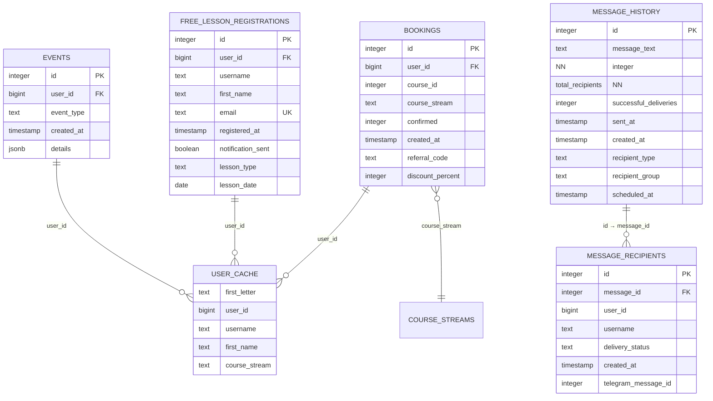

# Data Model

<cite>
**Referenced Files in This Document**   
- [db.ts](file://lib/db.ts)
- [queries.ts](file://lib/queries.ts)
- [DATABASE_MIGRATION_LOG.md](file://DATABASE_MIGRATION_LOG.md)
- [userCache.ts](file://lib/userCache.ts)
- [route.ts](file://app/api/users/search/route.ts)
</cite>

## Table of Contents
1. [Introduction](#introduction)
2. [Core Entities](#core-entities)
3. [Entity Relationships](#entity-relationships)
4. [Database Schema Diagram](#database-schema-diagram)
5. [Data Access Patterns](#data-access-patterns)
6. [Query Logic and Business Rules](#query-logic-and-business-rules)
7. [Performance Optimization](#performance-optimization)
8. [Data Lifecycle and Migration History](#data-lifecycle-and-migration-history)
9. [Sample Data](#sample-data)

## Introduction
This document provides comprehensive documentation of the data model for the hsl-dashboard application. The system tracks user interactions across multiple educational offerings including course bookings, free lesson registrations, and various events. The data model is designed to support analytics, user management, and messaging functionality for the platform. The primary entities include Users, CourseStreams, Bookings, FreeLessonRegistrations, Messages, and Events, with relationships established through shared user identifiers and foreign key constraints. The database schema has evolved through structured migrations, with recent additions supporting message broadcasting functionality.

## Core Entities

The hsl-dashboard application is built around several core entities that represent users and their interactions with the educational platform. These entities are implemented as database tables with specific fields, data types, and constraints to ensure data integrity.

### Users
The User entity is not represented as a standalone table but is derived from multiple sources including bookings, free lesson registrations, and events. User data is unified through the `user_id` field which serves as the primary identifier across all interactions.

**Key Fields:**
- `user_id`: BIGINT, NOT NULL - Unique Telegram user identifier
- `username`: TEXT - Telegram username (nullable)
- `first_name`: TEXT - User's first name (nullable)
- `course_stream`: TEXT - Current course stream assignment

**Constraints:**
- `user_id` must be present in at least one of the source tables (bookings, free_lesson_registrations, or events)
- Username and first_name are used for display purposes and search functionality

**Data Validation:**
- User data is deduplicated by `user_id` when retrieved
- The system prioritizes non-null and non-empty values for username and first_name
- User records are considered active if they have any interaction in the system

### CourseStreams
CourseStreams represent different cohorts or sessions of the "Вайб кодинг" (Vibe Coding) course. Currently, the system supports three streams: 3rd_stream, 4th_stream, and 5th_stream.

**Key Fields:**
- `course_stream`: TEXT, NOT NULL - Stream identifier (e.g., '3rd_stream')
- `course_id`: INTEGER, NOT NULL - Foreign key to course (currently only course_id 1: 'Вайб кодинг')

**Constraints:**
- `course_stream` values are validated against the predefined list of valid streams
- Only users with confirmed bookings (confirmed = 2) are considered active members of a stream

### Bookings
The Bookings entity tracks user registrations for paid courses, specifically the "Вайб кодинг" course.

**Key Fields:**
- `id`: SERIAL, PRIMARY KEY - Unique booking identifier
- `user_id`: BIGINT, NOT NULL - Foreign key to user
- `course_id`: INTEGER, NOT NULL - Identifier for the booked course
- `course_stream`: TEXT - Assigned course stream
- `confirmed`: INTEGER - Booking status (-1 = cancelled, 1 = pending, 2 = confirmed)
- `created_at`: TIMESTAMP WITH TIME ZONE - Booking creation timestamp
- `referral_code`: TEXT - Referral code used for discount
- `discount_percent`: INTEGER - Discount percentage applied

**Constraints:**
- `confirmed` field uses integer values to represent booking status
- Composite uniqueness is maintained through the combination of user_id and booking context
- Bookings without a user_id are excluded from user-related queries

### FreeLessonRegistrations
This entity tracks user registrations for free introductory lessons, serving as a lead generation mechanism.

**Key Fields:**
- `id`: SERIAL, PRIMARY KEY - Unique registration identifier
- `user_id`: BIGINT, NOT NULL - Foreign key to user
- `username`: TEXT - User's Telegram username
- `first_name`: TEXT - User's first name
- `email`: TEXT - User's email address
- `registered_at`: TIMESTAMP WITH TIME ZONE - Registration timestamp
- `notification_sent`: BOOLEAN - Flag indicating if registration confirmation was sent
- `lesson_type`: TEXT - Type of free lesson registered for
- `lesson_date`: DATE - Scheduled date for the free lesson

**Constraints:**
- Email field is required for free lesson registrations
- Each registration is uniquely identified by its `id`
- The combination of user_id and lesson_type may be used to prevent duplicate registrations

### Messages
The Messages system consists of two related tables that support broadcast messaging functionality through the Telegram bot.

#### MessageHistory
**Key Fields:**
- `id`: SERIAL, PRIMARY KEY - Unique message identifier
- `message_text`: TEXT, NOT NULL - Content of the broadcast message
- `total_recipients`: INTEGER, NOT NULL, DEFAULT 0 - Number of users the message was sent to
- `successful_deliveries`: INTEGER, DEFAULT 0 - Count of successfully delivered messages
- `sent_at`: TIMESTAMP WITH TIME ZONE, DEFAULT CURRENT_TIMESTAMP - When the message was sent
- `created_at`: TIMESTAMP WITH TIME ZONE, DEFAULT CURRENT_TIMESTAMP - Record creation timestamp
- `recipient_type`: TEXT - 'individual' or 'group'
- `recipient_group`: TEXT - Target group for group messages
- `scheduled_at`: TIMESTAMP WITH TIME ZONE - When the message is scheduled to be sent

**Constraints:**
- `message_text` cannot be null
- `total_recipients` defaults to 0 to prevent null values in analytics
- `sent_at` and `created_at` use database timestamps for consistency

#### MessageRecipients
**Key Fields:**
- `id`: SERIAL, PRIMARY KEY - Unique recipient record identifier
- `message_id`: INTEGER, NOT NULL - Foreign key to message_history
- `user_id`: BIGINT, NOT NULL - Recipient's user identifier
- `username`: TEXT - Recipient's username at time of sending
- `delivery_status`: TEXT, DEFAULT 'pending' - Delivery status ('pending', 'sent', 'failed')
- `created_at`: TIMESTAMP WITH TIME ZONE, DEFAULT CURRENT_TIMESTAMP - Record creation timestamp
- `telegram_message_id`: INTEGER - Telegram's message identifier for delivery tracking

**Constraints:**
- Foreign key constraint: `message_id` references `message_history.id` with CASCADE DELETE
- Composite index on `message_id` and `delivery_status` for delivery statistics
- `delivery_status` defaults to 'pending' for new recipient records

### Events
The Events entity captures various user interactions and system events.

**Key Fields:**
- `id`: SERIAL, PRIMARY KEY - Unique event identifier
- `user_id`: BIGINT, NOT NULL - Foreign key to user
- `event_type`: TEXT - Type of event (e.g., 'lesson_link_clicked')
- `created_at`: TIMESTAMP WITH TIME ZONE - Event timestamp
- `details`: JSONB - Additional event-specific data

**Constraints:**
- `event_type` categorizes the nature of the user interaction
- `details` field stores structured data as JSON, allowing flexible event tracking
- Events are linked to users through the `user_id` field

**Section sources**
- [queries.ts](file://lib/queries.ts#L76-L81)
- [DATABASE_MIGRATION_LOG.md](file://DATABASE_MIGRATION_LOG.md#L33-L67)

## Entity Relationships

The data model establishes relationships between entities primarily through the `user_id` field, which serves as a unifying identifier across multiple tables. These relationships enable comprehensive user tracking and analytics across different touchpoints in the educational platform.

### Primary Relationships
- **Users to Bookings**: One-to-many relationship where a user can have multiple bookings, but each booking belongs to one user
- **Users to FreeLessonRegistrations**: One-to-many relationship where a user can register for multiple free lessons
- **Users to Events**: One-to-many relationship where a user can generate multiple events
- **CourseStreams to Bookings**: One-to-many relationship where a stream contains multiple bookings
- **Messages to MessageRecipients**: One-to-many relationship where a message has multiple recipients

### Relationship Cardinality
- **User : Bookings** - One-to-Many (1:N)
- **User : FreeLessonRegistrations** - One-to-Many (1:N)
- **User : Events** - One-to-Many (1:N)
- **CourseStream : Bookings** - One-to-Many (1:N)
- **MessageHistory : MessageRecipients** - One-to-Many (1:N)
- **User : MessageRecipients** - One-to-Many (1:N)

### Foreign Key Constraints
The model implements referential integrity through foreign key constraints:
- `message_recipients.message_id` references `message_history.id` with CASCADE DELETE
- All user-related tables (bookings, free_lesson_registrations, events, message_recipients) reference users through `user_id`

### Data Integrity Rules
- A user must exist in at least one source table (bookings, free_lesson_registrations, or events) to be considered active
- When a message is deleted, all associated message_recipients records are automatically deleted (CASCADE)
- Booking status is validated through the `confirmed` field values (-1, 1, 2)
- Course stream assignments are validated against the predefined list of valid streams

**Section sources**
- [queries.ts](file://lib/queries.ts#L544-L573)
- [queries.ts](file://lib/queries.ts#L576-L599)
- [queries.ts](file://lib/queries.ts#L602-L641)

## Database Schema Diagram



**Diagram sources**
- [DATABASE_MIGRATION_LOG.md](file://DATABASE_MIGRATION_LOG.md#L0-L31)
- [DATABASE_MIGRATION_LOG.md](file://DATABASE_MIGRATION_LOG.md#L33-L67)

## Data Access Patterns

The application implements several key data access patterns to support its functionality, with a focus on user search, analytics, and messaging operations.

### User Search Functionality
The user search functionality is a critical access pattern that enables administrators to find users across multiple data sources. This complex query combines results from bookings and free lesson registrations:

```sql
SELECT DISTINCT user_id, username, first_name
FROM (
  SELECT user_id, username, first_name 
  FROM bookings 
  WHERE LOWER(username) LIKE $1 OR LOWER(first_name) LIKE $1
  UNION
  SELECT user_id, username, first_name 
  FROM free_lesson_registrations 
  WHERE LOWER(username) LIKE $1 OR LOWER(first_name) LIKE $1
) AS users
WHERE user_id IS NOT NULL
ORDER BY username, first_name
LIMIT 50
```

This query pattern:
- Uses UNION to combine results from multiple tables
- Applies case-insensitive search using LOWER() function
- Ensures user_id is not null to prevent invalid references
- Limits results to 50 entries for performance
- Orders results by username and first_name for consistent presentation

The search functionality is enhanced by the UserCacheService, which maintains an in-memory index of users organized by the first letter of their username or first name, enabling faster lookups.

### Analytics Queries
The system implements several analytical queries that aggregate data across entities:

**Dashboard Statistics:**
```sql
SELECT COUNT(DISTINCT user_id) as count FROM (
  SELECT user_id FROM bookings
  UNION
  SELECT user_id FROM events
  UNION
  SELECT user_id FROM free_lesson_registrations
) AS all_users
```

This query pattern uses UNION to count unique users across all interaction types, ensuring accurate user metrics.

**Course Stream Statistics:**
```sql
SELECT 
  course_id,
  course_stream,
  COUNT(*) as total,
  SUM(CASE WHEN confirmed = 2 THEN 1 ELSE 0 END) as confirmed,
  SUM(CASE WHEN confirmed = 1 THEN 1 ELSE 0 END) as pending,
  SUM(CASE WHEN confirmed = -1 THEN 1 ELSE 0 END) as cancelled
FROM bookings
WHERE course_id = 1 AND course_stream IS NOT NULL
GROUP BY course_id, course_stream
```

This analytical pattern groups bookings by course and stream, using conditional aggregation to count bookings by status.

### Messaging Access Patterns
The messaging system implements a two-phase access pattern:

1. **Message Creation:**
   - Insert into message_history to create the broadcast record
   - Insert multiple records into message_recipients for each recipient

2. **Delivery Tracking:**
   - Update message_recipients records with delivery status
   - Update message_history with successful_deliveries count

This pattern ensures that delivery statistics are accurate and can be queried efficiently.

**Section sources**
- [queries.ts](file://lib/queries.ts#L643-L672)
- [userCache.ts](file://lib/userCache.ts#L2-L212)
- [route.ts](file://app/api/users/search/route.ts#L0-L36)

## Query Logic and Business Rules

The data model incorporates several business rules and logic patterns through the query implementations in the application.

### User Deduplication Logic
When retrieving user data, the system applies deduplication logic to ensure each user appears only once in results:

```sql
SELECT DISTINCT ON (user_id) user_id, username, first_name
FROM (
  SELECT user_id, username, first_name 
  FROM bookings 
  WHERE user_id IS NOT NULL
  UNION
  SELECT user_id, username, first_name 
  FROM free_lesson_registrations 
  WHERE user_id IS NOT NULL
) AS users
ORDER BY user_id, 
         CASE WHEN username IS NOT NULL AND username != '' THEN 1 ELSE 2 END,
         CASE WHEN first_name IS NOT NULL AND first_name != '' THEN 1 ELSE 2 END
```

This logic:
- Uses DISTINCT ON (user_id) to eliminate duplicates
- Prioritizes records with non-null username and first_name values
- Ensures consistent user representation across the application

### Course Stream Management
The system implements business logic for managing user course stream assignments:

```sql
UPDATE bookings 
SET course_stream = $1
WHERE id = $2
```

This update targets the most recent active booking for a user, ensuring that stream changes are applied to the correct booking record.

### Lesson Conversion Tracking
The application calculates lesson conversion rates by joining registration and attendance data:

```sql
WITH registrations AS (
  SELECT 
    lesson_type,
    COUNT(*) as registration_count
  FROM free_lesson_registrations
  GROUP BY lesson_type
),
attendances AS (
  SELECT 
    details->>'lesson_type' as lesson_type,
    COUNT(*) as attendance_count
  FROM events
  WHERE event_type = 'lesson_link_clicked'
    AND details->>'lesson_type' IS NOT NULL
  GROUP BY details->>'lesson_type'
)
SELECT 
  COALESCE(r.lesson_type, a.lesson_type) as lesson_type,
  COALESCE(r.registration_count, 0) as registrations,
  COALESCE(a.attendance_count, 0) as attendances,
  CASE 
    WHEN COALESCE(r.registration_count, 0) = 0 THEN 0
    ELSE ROUND((COALESCE(a.attendance_count, 0)::decimal / r.registration_count::decimal) * 100, 1)
  END as conversion_rate
FROM registrations r
FULL OUTER JOIN attendances a ON r.lesson_type = a.lesson_type
```

This complex query:
- Uses CTEs (Common Table Expressions) to organize the logic
- Performs a FULL OUTER JOIN to include all lesson types
- Calculates conversion rate as a percentage
- Handles division by zero cases

### User Categorization
The system categorizes users based on their engagement level:

```sql
SELECT DISTINCT ON (user_id) user_id, username, first_name
FROM (
  SELECT user_id, username, first_name
  FROM events
  WHERE user_id IS NOT NULL
  UNION
  SELECT user_id, username, first_name
  FROM free_lesson_registrations
  WHERE user_id IS NOT NULL
  UNION
  SELECT user_id, username, first_name
  FROM bookings
  WHERE user_id IS NOT NULL
) AS all_users
WHERE user_id NOT IN (
  SELECT DISTINCT user_id
  FROM bookings
  WHERE confirmed = 2
    AND user_id IS NOT NULL
)
```

This query identifies users who have interacted with the system but have not made a confirmed payment for a course.

**Section sources**
- [queries.ts](file://lib/queries.ts#L544-L573)
- [queries.ts](file://lib/queries.ts#L602-L641)
- [queries.ts](file://lib/queries.ts#L428-L471)

## Performance Optimization

The data model incorporates several performance optimization strategies to ensure efficient query execution and responsive user experience.

### Indexing Strategy
The system implements a comprehensive indexing strategy to optimize query performance:

**Message Recipients Indexes:**
- `idx_message_recipients_message_id`: Index on `message_id` for fast lookups when retrieving message recipients
- `idx_message_recipients_status`: Composite index on `message_id` and `delivery_status` for delivery statistics calculations
- `idx_message_recipients_user_id`: Index on `user_id` for fast user lookups

These indexes support the messaging functionality by enabling:
- Fast retrieval of all recipients for a specific message
- Efficient counting of successful deliveries by status
- Quick lookups of messages sent to a specific user

### Caching Mechanism
The application implements an in-memory caching layer through the UserCacheService to optimize user search and retrieval operations:

**Cache Components:**
- **User Index**: Map of first letters to user arrays for fast prefix search
- **Stream Cache**: Pre-loaded users by course stream for group messaging
- **Non-Course Users**: Cache of users who haven't paid for courses
- **All Users**: Complete user list for reference

**Cache Configuration:**
- TTL (Time to Live): 5 minutes to balance freshness and performance
- Lazy initialization: Cache loads on first access to reduce startup time
- Background refresh: Cache updates automatically when expired

The caching strategy reduces database load for frequently accessed user data, particularly for search operations and messaging workflows.

### Query Optimization Techniques
The system employs several query optimization techniques:

**Efficient User Search:**
- Uses UNION instead of JOIN to combine results from multiple tables
- Applies filters before the UNION operation to reduce result set size
- Limits results to 50 entries to prevent excessive data transfer
- Orders results consistently for predictable presentation

**Analytical Query Optimization:**
- Uses CTEs (Common Table Expressions) to organize complex analytical logic
- Applies appropriate filtering before aggregation to reduce processing
- Uses conditional aggregation (CASE statements) to calculate multiple metrics in a single pass
- Leverages database functions like COALESCE and ROUND for data transformation

**Data Retrieval Patterns:**
- Implements pagination where appropriate
- Uses parameterized queries to prevent SQL injection
- Releases database clients promptly to maintain connection pool health
- Handles errors gracefully to prevent cascading failures

**Section sources**
- [DATABASE_MIGRATION_LOG.md](file://DATABASE_MIGRATION_LOG.md#L68-L78)
- [userCache.ts](file://lib/userCache.ts#L2-L212)

## Data Lifecycle and Migration History

The data model has evolved through structured migrations, with a recent significant addition to support messaging functionality.

### Migration History
**Date:** 2025-09-02  
**Migration Type:** Create missing tables for message broadcasting functionality  
**Status:** COMPLETED SUCCESSFULLY

**Tables Created:**
- `message_history`: Stores broadcast message records with delivery statistics
- `message_recipients`: Tracks individual message delivery status for each recipient

**Migration Implementation:**
- Used existing database connection and Next.js API structure
- Implemented through secure transaction-based DDL execution
- Validated through comprehensive testing

**Rollback Plan:**
```sql
-- Drop tables in correct order (foreign key dependencies)
DROP TABLE IF EXISTS message_recipients CASCADE;
DROP TABLE IF EXISTS message_history CASCADE;
```

The migration was completed in approximately 15 minutes, under the original 20-30 minute estimate, demonstrating efficient implementation.

### Data Lifecycle Policies
The system implements the following data lifecycle considerations:

**Message Data Retention:**
- Message history is retained indefinitely for audit and analytics purposes
- Delivery status updates are preserved to maintain accurate statistics
- No automatic purging mechanism is currently implemented

**User Data Retention:**
- User data is retained as long as they have any interaction with the system
- Even if a user cancels a booking, their registration history is preserved
- Free lesson registration data is retained to track lead conversion

**Event Data Retention:**
- Events are retained for analytical purposes
- Historical event data supports user behavior analysis
- No current mechanism for event data archival

The data lifecycle policies prioritize data retention for analytics and user relationship management over data minimization.

**Section sources**
- [DATABASE_MIGRATION_LOG.md](file://DATABASE_MIGRATION_LOG.md#L0-L172)

## Sample Data

The following sample data illustrates the structure and relationships within the data model.

### Sample User
```json
{
  "user_id": 123456789,
  "username": "alex_smith",
  "first_name": "Alex",
  "course_stream": "3rd_stream"
}
```

### Sample Booking
```json
{
  "id": 1001,
  "user_id": 123456789,
  "course_id": 1,
  "course_stream": "3rd_stream",
  "confirmed": 2,
  "created_at": "2025-09-01T10:30:00Z",
  "referral_code": "FRIEND20",
  "discount_percent": 20
}
```

### Sample Free Lesson Registration
```json
{
  "id": 5001,
  "user_id": 987654321,
  "username": "maria_jones",
  "first_name": "Maria",
  "email": "maria@example.com",
  "registered_at": "2025-09-02T14:15:00Z",
  "notification_sent": true,
  "lesson_type": "intro_to_python",
  "lesson_date": "2025-09-05"
}
```

### Sample Message History
```json
{
  "id": 2001,
  "message_text": "Don't forget about tomorrow's coding session!",
  "total_recipients": 45,
  "successful_deliveries": 43,
  "sent_at": "2025-09-02T18:00:00Z",
  "created_at": "2025-09-02T17:55:00Z",
  "recipient_type": "group",
  "recipient_group": "3rd_stream"
}
```

### Sample Message Recipient
```json
{
  "id": 3001,
  "message_id": 2001,
  "user_id": 123456789,
  "username": "alex_smith",
  "delivery_status": "sent",
  "created_at": "2025-09-02T17:55:01Z",
  "telegram_message_id": 5001
}
```

### Sample Event
```json
{
  "id": 4001,
  "user_id": 123456789,
  "event_type": "lesson_link_clicked",
  "created_at": "2025-09-02T19:30:00Z",
  "details": {
    "lesson_type": "advanced_python",
    "link_url": "https://example.com/lessons/advanced_python"
  }
}
```

These sample records demonstrate the interconnected nature of the data model, where user interactions are tracked across multiple entities while maintaining referential integrity through the `user_id` field.

**Section sources**
- [queries.ts](file://lib/queries.ts#L393-L426)
- [queries.ts](file://lib/queries.ts#L797-L818)