# Events Table

<cite>
**Referenced Files in This Document**   
- [db-schema/route.ts](file://app/api/db-schema/route.ts)
- [queries.ts](file://lib/queries.ts)
- [events/route.ts](file://app/api/events/route.ts)
- [debug-events/route.ts](file://app/api/debug-events/route.ts)
- [RecentEventsTable.tsx](file://components/RecentEventsTable.tsx)
- [UserDetailsDialog.tsx](file://components/UserDetailsDialog.tsx)
- [user-activity/route.ts](file://app/api/user-activity/route.ts)
- [db.ts](file://lib/db.ts)
</cite>

## Table of Contents
1. [Introduction](#introduction)
2. [Field Definitions](#field-definitions)
3. [Relationships](#relationships)
4. [Data Access Patterns](#data-access-patterns)
5. [Sample Data](#sample-data)
6. [Performance Considerations](#performance-considerations)
7. [Lead Scoring System](#lead-scoring-system)
8. [Integration with Analytics Dashboard](#integration-with-analytics-dashboard)
9. [Conclusion](#conclusion)

## Introduction
The Events table in the hsl-dashboard application serves as the central repository for tracking user interactions within the system. It captures various types of user activities, enabling comprehensive analysis of user behavior patterns and engagement levels. The table is designed with flexibility in mind, using a JSONB field to store variable metadata associated with different event types. This documentation provides a detailed overview of the table structure, relationships, data access patterns, and its role in driving business intelligence through the analytics dashboard and lead scoring system.

**Section sources**
- [db-schema/route.ts](file://app/api/db-schema/route.ts)
- [queries.ts](file://lib/queries.ts)

## Field Definitions
The Events table consists of four primary fields that capture essential information about user interactions:

- **event_type (VARCHAR)**: A string field that categorizes the type of user interaction. Common event types include "lesson_link_clicked", "course_enrolled", "free_lesson_registered", and "webinar_joined". This field enables filtering and aggregation of events by their nature, facilitating analysis of specific user behaviors.

- **details (JSONB)**: A flexible field that stores additional metadata about the event in JSON format. This allows for the storage of variable information depending on the event type, such as lesson type, referral source, or course information. The JSONB format enables efficient querying and indexing of nested data.

- **user_id (BIGINT)**: A numeric identifier that establishes a foreign key relationship with the users table. This field links each event to a specific user, enabling user-level activity tracking and personalization of analytics.

- **created_at (TIMESTAMP)**: A timestamp field that records when the event occurred. This enables time-series analysis of user activity, allowing for the identification of trends and patterns over time.

**Section sources**
- [db-schema/route.ts](file://app/api/db-schema/route.ts)
- [queries.ts](file://lib/queries.ts)

## Relationships
The Events table maintains a foreign key relationship with the users table through the user_id field. This relationship enables the system to associate each event with a specific user, facilitating user-level activity tracking and personalized analytics. The relationship is leveraged in various queries to join event data with user information, such as username and first name, to provide context for user interactions.


**Diagram sources**
- [db-schema/route.ts](file://app/api/db-schema/route.ts)
- [queries.ts](file://lib/queries.ts)

## Data Access Patterns
The application employs several data access patterns to extract insights from the Events table:

- **Aggregating daily user activity**: The system uses the getDailyStats function to aggregate events by date, providing insights into daily user engagement levels. This pattern is used to generate time-series charts in the analytics dashboard.

- **Identifying top user events**: The getTopEvents function retrieves the most frequent event types, enabling the identification of popular user interactions and content. This information is displayed in the analytics dashboard to highlight trending activities.

- **Retrieving recent events**: The getRecentEvents function fetches the most recent user activities, which are displayed in the RecentEventsTable component to provide a real-time view of user engagement.

**Section sources**
- [events/route.ts](file://app/api/events/route.ts)
- [queries.ts](file://lib/queries.ts)
- [RecentEventsTable.tsx](file://components/RecentEventsTable.tsx)

## Sample Data
The Events table contains various types of user interactions with associated metadata:

- **Lesson link clicked**: 
```json
{
  "event_type": "lesson_link_clicked",
  "details": {
    "lesson_type": "vibe_coding",
    "source": "telegram_bot"
  },
  "user_id": 123456,
  "created_at": "2025-09-01T10:30:00Z"
}
```

- **Course enrolled**:
```json
{
  "event_type": "course_enrolled",
  "details": {
    "course_id": 1,
    "course_stream": "3rd_stream",
    "referral_code": "VIBE2025"
  },
  "user_id": 123456,
  "created_at": "2025-09-01T11:15:00Z"
}
```

- **Free lesson registered**:
```json
{
  "event_type": "free_lesson_registered",
  "details": {
    "lesson_type": "intro_to_coding",
    "email": "user@example.com"
  },
  "user_id": 789012,
  "created_at": "2025-09-01T09:45:00Z"
}
```

**Section sources**
- [debug-events/route.ts](file://app/api/debug-events/route.ts)
- [UserDetailsDialog.tsx](file://components/UserDetailsDialog.tsx)

## Performance Considerations
To ensure efficient querying and analysis of event data, the system implements several performance optimizations:

- **Indexing on event_type**: An index on the event_type field enables fast filtering and aggregation of events by type, improving the performance of queries that analyze specific user behaviors.

- **Indexing on created_at**: An index on the created_at field facilitates efficient time-series analysis, allowing for quick retrieval of events within specific date ranges.

- **Indexing on user_id**: An index on the user_id field optimizes queries that retrieve user-specific event histories, enhancing the performance of user activity analysis.

These indexes are crucial for supporting the application's analytics capabilities, particularly when processing large volumes of event data for time-series analysis and user behavior pattern identification.

**Section sources**
- [db-schema/route.ts](file://app/api/db-schema/route.ts)
- [queries.ts](file://lib/queries.ts)

## Lead Scoring System
The event data drives the lead scoring system, which categorizes users into four tiers based on their engagement levels:

- **Hot**: Users with 20+ events and 5+ active days within the last 7 days
- **Warm**: Users with 10+ events and 3+ active days within the last 7 days  
- **Cool**: Users with 5+ events within the last 7 days
- **Cold**: Users with fewer than 5 events within the last 7 days

The user-activity API endpoint calculates these scores by analyzing event frequency and active days, providing a quantitative measure of user engagement. This scoring system is used to prioritize outreach efforts and personalize user interactions.

```mermaid
flowchart TD
Start([User Activity]) --> CountEvents["Count Total Events"]
CountEvents --> CountDays["Count Active Days"]
CountDays --> CheckHot{"Events >= 20 AND Days >= 5?"}
CheckHot --> |Yes| Hot["Lead Score: Hot 🔥"]
CheckHot --> |No| CheckWarm{"Events >= 10 AND Days >= 3?"}
CheckWarm --> |Yes| Warm["Lead Score: Warm 🟡"]
CheckWarm --> |No| CheckCool{"Events >= 5?"}
CheckCool --> |Yes| Cool["Lead Score: Cool 🔵"]
CheckCool --> |No| Cold["Lead Score: Cold ❄️"]
Hot --> End([Score Assigned])
Warm --> End
Cool --> End
Cold --> End
```



**Diagram sources**
- [user-activity/route.ts](file://app/api/user-activity/route.ts)
- [HotLeads.tsx](file://components/HotLeads.tsx)

## Integration with Analytics Dashboard
The Events table is tightly integrated with the analytics dashboard, providing the foundation for user behavior pattern identification. The dashboard consumes event data through several API endpoints:

- **Daily statistics**: The /api/events?type=daily endpoint provides aggregated daily event counts, which are visualized in time-series charts to show trends in user engagement.

- **Top events**: The default /api/events endpoint returns the most frequent event types, which are displayed in pie charts to illustrate the distribution of user activities.

- **Recent events**: The /api/events?type=recent endpoint supplies data for the RecentEventsTable component, offering a real-time view of user interactions.

These integrations enable the dashboard to provide comprehensive insights into user behavior, supporting data-driven decision-making for marketing and product teams.

**Section sources**
- [events/route.ts](file://app/api/events/route.ts)
- [analytics/page.tsx](file://app/analytics/page.tsx)
- [EventsChart.tsx](file://components/EventsChart.tsx)

## Conclusion
The Events table is a critical component of the hsl-dashboard application, serving as the foundation for user behavior analysis and business intelligence. Its flexible design, with a JSONB field for storing variable metadata, allows for the capture of diverse user interactions while maintaining query efficiency through strategic indexing. The table's integration with the lead scoring system and analytics dashboard enables the organization to identify high-value users, understand engagement patterns, and make data-driven decisions to optimize user experience and conversion rates.