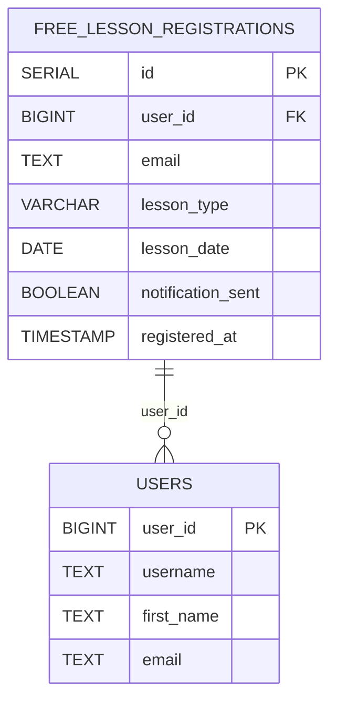
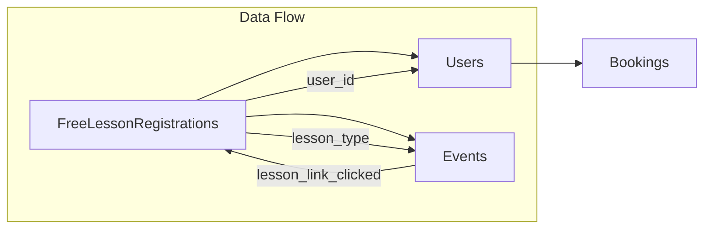
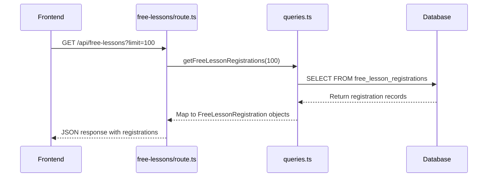
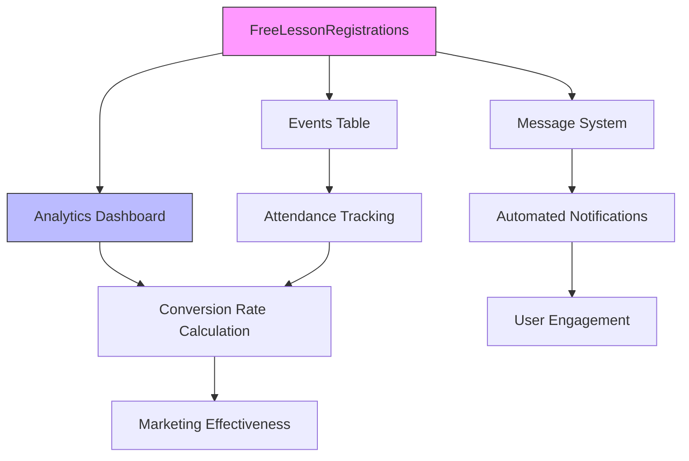

# Free Lesson Registrations Table

<cite>
**Referenced Files in This Document**   
- [queries.ts](file://lib/queries.ts)
- [free-lessons/route.ts](file://app/api/free-lessons/route.ts)
- [free-lessons-conversion/route.ts](file://app/api/free-lessons-conversion/route.ts)
- [FreeLessonsTable.tsx](file://components/FreeLessonsTable.tsx)
- [UnifiedLessonBreakdown.tsx](file://components/UnifiedLessonBreakdown.tsx)
- [LessonTypeByDateBreakdown.tsx](file://components/LessonTypeByDateBreakdown.tsx)
- [free-lessons/page.tsx](file://app/free-lessons/page.tsx)
</cite>

## Table of Contents
1. [Introduction](#introduction)
2. [Data Model Definition](#data-model-definition)
3. [Field Definitions](#field-definitions)
4. [Relationships](#relationships)
5. [Business Logic](#business-logic)
6. [Data Access Patterns](#data-access-patterns)
7. [Sample Data](#sample-data)
8. [Performance Considerations](#performance-considerations)
9. [Integration Points](#integration-points)
10. [Analytics and Reporting](#analytics-and-reporting)

## Introduction
The FreeLessonRegistrations table is a core component of the hsl-dashboard application, serving as the primary data store for tracking user registrations in the free lesson funnel. This table captures essential information about users who sign up for free lessons, enabling the system to monitor conversion rates, analyze registration trends, and measure marketing effectiveness. The data model is designed to support comprehensive analytics while maintaining efficient data access patterns for both real-time dashboard displays and historical analysis.

**Section sources**
- [queries.ts](file://lib/queries.ts#L33-L43)
- [free-lessons/page.tsx](file://app/free-lessons/page.tsx#L12-L22)

## Data Model Definition
The FreeLessonRegistrations table implements a structured data model to track free lesson registrations with comprehensive metadata. The table schema includes both user identification fields and lesson-specific information, enabling detailed analysis of the registration funnel. The data model is defined through the FreeLessonRegistration interface in the application codebase, which specifies the structure of records retrieved from the database.



**Diagram sources**
- [queries.ts](file://lib/queries.ts#L33-L43)
- [lib/db.ts](file://lib/db.ts)

## Field Definitions
The FreeLessonRegistrations table contains the following fields, each serving a specific purpose in the registration tracking system:

| Field Name | Data Type | Description | Source |
|------------|-----------|-------------|--------|
| id | SERIAL | Auto-incrementing primary key that uniquely identifies each registration record | [queries.ts](file://lib/queries.ts#L34) |
| user_id | BIGINT | Foreign key reference to the users table, identifying the user who registered for the free lesson | [queries.ts](file://lib/queries.ts#L35) |
| email | TEXT | Email address of the user at the time of registration, used for communication and identification | [queries.ts](file://lib/queries.ts#L38) |
| lesson_type | VARCHAR | Type of free lesson registered for (e.g., "vibe coding", "workshop"), used for categorization and analysis | [queries.ts](file://lib/queries.ts#L41) |
| lesson_date | DATE | Scheduled date of the free lesson, enabling time-based analysis and scheduling | [queries.ts](file://lib/queries.ts#L42) |
| notification_sent | BOOLEAN | Flag indicating whether the registration confirmation notification has been sent to the user | [queries.ts](file://lib/queries.ts#L39) |
| registered_at | TIMESTAMP | Timestamp when the registration was created, used for trend analysis and chronological ordering | [queries.ts](file://lib/queries.ts#L37) |
| username | TEXT | Telegram username of the user, used for direct communication and identification | [queries.ts](file://lib/queries.ts#L36) |
| first_name | TEXT | First name of the user, used for personalized communication and display | [queries.ts](file://lib/queries.ts#L37) |

**Section sources**
- [queries.ts](file://lib/queries.ts#L33-L43)
- [FreeLessonsTable.tsx](file://components/FreeLessonsTable.tsx#L10-L19)

## Relationships
The FreeLessonRegistrations table maintains a critical relationship with the users table through the user_id foreign key. This relationship enables the system to link registration data with comprehensive user profiles, including contact information and activity history. The foreign key constraint ensures data integrity by preventing orphaned registration records and facilitating efficient joins for data retrieval.



**Diagram sources**
- [queries.ts](file://lib/queries.ts#L35)
- [lib/db.ts](file://lib/db.ts)

## Business Logic
The FreeLessonRegistrations table serves as the foundation for calculating key business metrics, particularly the conversion rate from registration to attendance. The conversion rate is calculated using the formula (Attendances / Registrations) * 100, where attendances are counted from events with event_type 'lesson_link_clicked' in the events table. This business logic is implemented in the getLessonConversion function, which performs a full outer join between registration counts and attendance counts grouped by lesson_type.

```mermaid
flowchart TD
A[Free Lesson Registrations] --> B[Count Registrations by Lesson Type]
C[Events Table] --> D[Filter by lesson_link_clicked]
D --> E[Count Attendances by Lesson Type]
B --> F[Calculate Conversion Rate]
E --> F
F --> G[Conversion Rate = (Attendances / Registrations) * 100]
G --> H[Return Lesson Conversion Statistics]
```

**Diagram sources**
- [queries.ts](file://lib/queries.ts#L428-L471)
- [free-lessons-conversion/route.ts](file://app/api/free-lessons-conversion/route.ts)

## Data Access Patterns
The application implements several data access patterns for the FreeLessonRegistrations table to support different analytical use cases. Registration trend analysis is performed by querying records ordered by registered_at, enabling time-series visualization of registration volume. Lesson type performance comparison is achieved by grouping registrations by lesson_type and joining with attendance data from the events table. The primary access point is through the getFreeLessonRegistrations function, which retrieves records with optional limiting and orders them by registration timestamp.



**Diagram sources**
- [free-lessons/route.ts](file://app/api/free-lessons/route.ts)
- [queries.ts](file://lib/queries.ts#L393-L426)

## Sample Data
The following sample data illustrates typical records in the FreeLessonRegistrations table, showing various lesson types and registration dates:

| id | user_id | email | lesson_type | lesson_date | notification_sent | registered_at |
|----|---------|-------|-------------|-------------|-------------------|---------------|
| 1001 | 555123 | user1@example.com | vibe coding | 2025-09-15 | true | 2025-09-01T10:30:00Z |
| 1002 | 555124 | user2@example.com | workshop | 2025-09-20 | true | 2025-09-02T14:15:00Z |
| 1003 | 555125 | user3@example.com | vibe coding | 2025-09-15 | false | 2025-09-03T09:45:00Z |
| 1004 | 555126 | user4@example.com | masterclass | 2025-09-25 | true | 2025-09-04T16:20:00Z |
| 1005 | 555127 | user5@example.com | workshop | 2025-09-20 | true | 2025-09-05T11:10:00Z |

**Section sources**
- [FreeLessonsTable.tsx](file://components/FreeLessonsTable.tsx)
- [UnifiedLessonBreakdown.tsx](file://components/UnifiedLessonBreakdown.tsx)

## Performance Considerations
The FreeLessonRegistrations table is optimized for time-series analysis and frequent querying through strategic indexing and data access patterns. An index on the lesson_date column enables efficient filtering and grouping operations for date-based analysis. The registered_at timestamp is indexed to support fast retrieval of recent registrations for dashboard displays. The table design avoids unnecessary columns and uses appropriate data types to minimize storage overhead while maintaining query performance. The application implements pagination through the limit parameter in the getFreeLessonRegistrations function to prevent excessive data transfer.

**Section sources**
- [queries.ts](file://lib/queries.ts#L393-L426)
- [DATABASE_MIGRATION_LOG.md](file://DATABASE_MIGRATION_LOG.md)

## Integration Points
The FreeLessonRegistrations table integrates with multiple system components to enable automated workflows and comprehensive analytics. The messaging system uses the notification_sent flag to track and trigger automated notifications to registered users. When a new registration is recorded, the system can initiate a message to confirm the registration and provide lesson details. The analytics dashboard consumes data from this table to display registration trends, lesson performance metrics, and conversion rates. The integration with the events table through the lesson_type field enables the calculation of attendance and conversion metrics, creating a complete picture of the free lesson funnel performance.



**Diagram sources**
- [messageScheduler.ts](file://lib/messageScheduler.ts)
- [free-lessons/page.tsx](file://app/free-lessons/page.tsx)
- [queries.ts](file://lib/queries.ts)

## Analytics and Reporting
The FreeLessonRegistrations table serves as a foundational data source for the analytics dashboard, enabling measurement of marketing effectiveness and funnel performance. The data feeds into multiple visualization components, including the UnifiedLessonBreakdown and LessonTypeByDateBreakdown charts, which display registration patterns by lesson type and date. The RegistrationTrendChart component uses the registered_at timestamp to show temporal trends in registration volume. These analytics enable the team to identify high-performing lesson types, optimize scheduling, and refine marketing strategies based on conversion metrics. The integration with user activity data allows for lead scoring and identification of hot leads, further enhancing the marketing and sales funnel.

**Section sources**
- [free-lessons/page.tsx](file://app/free-lessons/page.tsx)
- [UnifiedLessonBreakdown.tsx](file://components/UnifiedLessonBreakdown.tsx)
- [RegistrationTrendChart.tsx](file://components/RegistrationTrendChart.tsx)