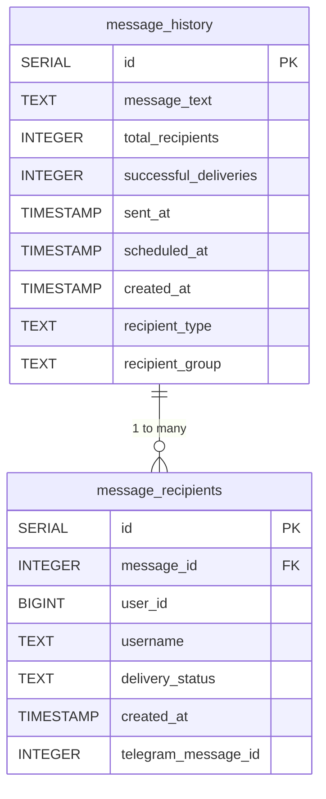
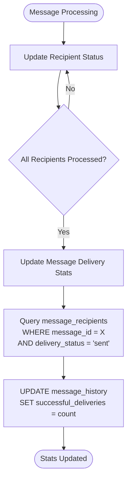
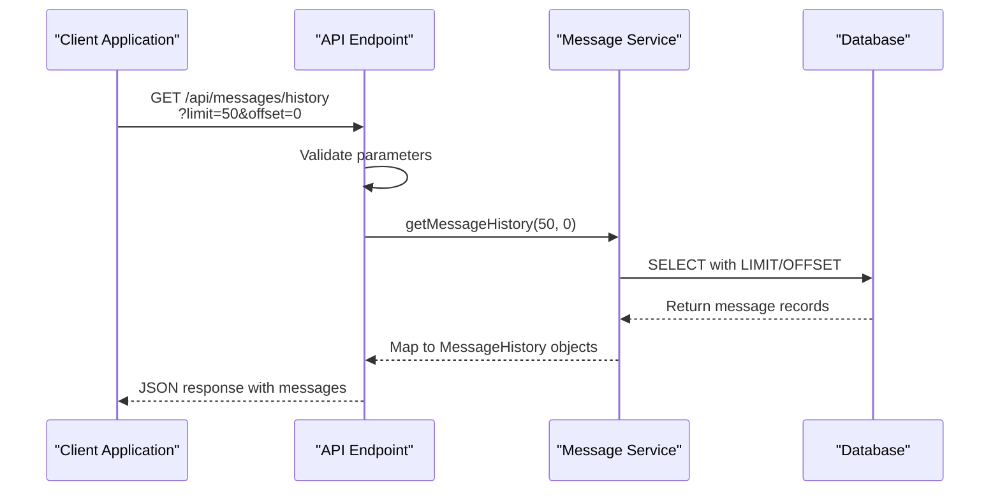

# Message History Table

<cite>
**Referenced Files in This Document**   
- [DATABASE_MIGRATION_LOG.md](file://DATABASE_MIGRATION_LOG.md)
- [queries.ts](file://lib/queries.ts)
- [messageScheduler.ts](file://lib/messageScheduler.ts)
- [route.ts](file://app/api/messages/history/route.ts)
</cite>

## Table of Contents
1. [Introduction](#introduction)
2. [Data Model Definition](#data-model-definition)
3. [Field Definitions](#field-definitions)
4. [Primary Key and Indexing Strategy](#primary-key-and-indexing-strategy)
5. [Business Logic for Delivery Statistics](#business-logic-for-delivery-statistics)
6. [Data Access Patterns](#data-access-patterns)
7. [Integration with Message Recipients](#integration-with-message-recipients)
8. [Performance Considerations](#performance-considerations)
9. [Sample Data Scenarios](#sample-data-scenarios)
10. [Conclusion](#conclusion)

## Introduction

The MessageHistory table is a core component of the hsl-dashboard application's messaging system, designed to store broadcast message records with comprehensive delivery statistics. This table serves as the central repository for tracking all messages sent through the application, whether immediate or scheduled, and provides essential data for campaign analytics and delivery tracking. The table was implemented as part of a database migration to support Telegram bot message broadcasting functionality, enabling administrators to monitor message performance and recipient engagement.

**Section sources**
- [DATABASE_MIGRATION_LOG.md](file://DATABASE_MIGRATION_LOG.md#L0-L31)

## Data Model Definition

The MessageHistory table is structured to capture essential information about broadcast messages, including content, recipient counts, delivery statistics, and timing information. The table schema was created to support both immediate and scheduled message broadcasting, with fields that track when messages were sent and when they were scheduled for delivery. The table is designed to work in conjunction with the message_recipients table, which tracks individual delivery statuses for each recipient.



**Diagram sources **
- [DATABASE_MIGRATION_LOG.md](file://DATABASE_MIGRATION_LOG.md#L0-L31)
- [DATABASE_MIGRATION_LOG.md](file://DATABASE_MIGRATION_LOG.md#L33-L67)

**Section sources**
- [DATABASE_MIGRATION_LOG.md](file://DATABASE_MIGRATION_LOG.md#L0-L67)

## Field Definitions

The MessageHistory table contains several key fields that capture different aspects of message broadcasting:

- **id (SERIAL)**: Auto-incrementing primary key that uniquely identifies each message record
- **message_text (TEXT)**: The content of the broadcast message, stored as text to accommodate messages of varying lengths
- **total_recipients (INTEGER)**: The total number of users the message was sent to, capturing the scope of each broadcast
- **successful_deliveries (INTEGER)**: A count of successful message deliveries, updated dynamically based on recipient status updates
- **sent_at (TIMESTAMP)**: The timestamp indicating when the message was actually sent to recipients
- **scheduled_at (TIMESTAMP)**: The timestamp indicating when the message was scheduled to be sent, allowing for delayed broadcasting
- **created_at (TIMESTAMP)**: The timestamp when the message record was created in the database
- **recipient_type (TEXT)**: Indicates whether the message was sent to 'individual' users or a 'group' of users
- **recipient_group (TEXT)**: Specifies the target group for group messages, such as '3rd_stream', '4th_stream', or '5th_stream'

**Section sources**
- [DATABASE_MIGRATION_LOG.md](file://DATABASE_MIGRATION_LOG.md#L0-L31)

## Primary Key and Indexing Strategy

The MessageHistory table uses a simple yet effective primary key strategy with the `id` field defined as SERIAL, which automatically generates a unique identifier for each new record. This primary key ensures data integrity and provides an efficient mechanism for referencing specific messages across the application. While the table itself does not have explicit indexes mentioned in the migration log, the related message_recipients table has been optimized with several indexes to support efficient querying:

- **idx_message_recipients_message_id**: Enables fast lookups by message_id for retrieving all recipients of a specific message
- **idx_message_recipients_status**: A composite index that supports efficient counting of delivery statuses by message
- **idx_message_recipients_user_id**: Facilitates fast user lookups to determine a user's message history

These indexing strategies ensure that operations related to message delivery tracking and recipient management perform efficiently even as the volume of messages grows.

**Section sources**
- [DATABASE_MIGRATION_LOG.md](file://DATABASE_MIGRATION_LOG.md#L67-L77)

## Business Logic for Delivery Statistics

The business logic for updating delivery statistics is implemented through a combination of database queries and application-level functions. The `successful_deliveries` count is not manually updated but is instead calculated dynamically based on the delivery statuses of individual recipients in the message_recipients table. When a message is processed, the system updates the delivery status of each recipient to 'sent', 'failed', or 'pending'. The `updateMessageDeliveryStats` function then queries the message_recipients table to count all recipients with a 'sent' status for a given message_id and updates the successful_deliveries field in the message_history table accordingly.

This approach ensures that delivery statistics are always accurate and consistent with the actual delivery outcomes. The update process is transactional and occurs after message delivery attempts, guaranteeing that the statistics reflect the final state of the delivery process. This logic is particularly important for scheduled messages, where delivery may occur minutes or hours after the message was initially created.



**Diagram sources **
- [queries.ts](file://lib/queries.ts#L733-L748)

**Section sources**
- [queries.ts](file://lib/queries.ts#L733-L748)

## Data Access Patterns

The MessageHistory table is accessed through well-defined data access patterns that support pagination and filtering. The primary access pattern is implemented in the `getMessageHistory` function, which retrieves message records with support for pagination via limit and offset parameters. This function allows clients to retrieve message history in manageable chunks, with a default limit of 50 records per request and a maximum limit of 100 to prevent excessive data transfer.

The data access layer also supports filtering by recipient type ('individual' or 'group') and by recipient group (specific course streams). These filters enable users to focus on specific categories of messages, such as broadcasts sent to particular student cohorts. The API endpoint at `/api/messages/history` validates these parameters and enforces business rules, such as restricting recipient_group values to valid course streams.

All queries are ordered by the sent_at timestamp in descending order, ensuring that the most recent messages appear first in the results. This ordering supports the typical use case of monitoring recent broadcast activity. The data access pattern is designed to be efficient, leveraging database indexing and parameterized queries to prevent SQL injection attacks.



**Diagram sources **
- [route.ts](file://app/api/messages/history/route.ts#L0-L65)
- [queries.ts](file://lib/queries.ts#L751-L795)

**Section sources**
- [route.ts](file://app/api/messages/history/route.ts#L0-L65)
- [queries.ts](file://lib/queries.ts#L751-L795)

## Integration with Message Recipients

The MessageHistory table is tightly integrated with the message_recipients table through a foreign key relationship, where the message_id field in message_recipients references the id field in message_history with CASCADE DELETE behavior. This relationship ensures data consistency by automatically removing recipient records when a message is deleted. The integration enables comprehensive delivery tracking, as each message in the history table can be associated with multiple recipient records that track individual delivery statuses.

This two-table design follows a master-detail pattern, where the message_history table serves as the master record containing summary information, and the message_recipients table serves as the detail records containing individual delivery outcomes. This separation of concerns allows for efficient storage and querying of both aggregate statistics and individual recipient data. The relationship supports various analytics use cases, such as calculating delivery success rates, identifying users who consistently fail to receive messages, and generating detailed reports on message campaign performance.

**Section sources**
- [DATABASE_MIGRATION_LOG.md](file://DATABASE_MIGRATION_LOG.md#L33-L67)

## Performance Considerations

The MessageHistory table and its associated functionality have been designed with performance in mind. The indexing strategy on the message_recipients table ensures that queries for recipient lookups and status counting perform efficiently. The MessageSchedulerService queries for due messages using the condition `scheduled_at <= NOW()` to identify messages that are ready for delivery, and this query benefits from the natural ordering of timestamps.

For scheduled message processing, the system implements batching with a 1-second delay between batches of 10 messages to prevent overwhelming external services and to comply with rate limiting. The message scheduler runs every minute, checking for messages where `scheduled_at <= NOW()` and `successful_deliveries = 0`, ensuring that messages are delivered promptly when their scheduled time arrives.

The pagination implementation in the data access layer prevents performance degradation with large datasets by limiting result sets and using offset-based navigation. The API enforces reasonable limits on the number of records returned in a single request, balancing usability with system performance. Additionally, the use of parameterized queries and connection pooling helps maintain database performance under load.

```mermaid
graph TD
A[MessageSchedulerService] --> B[Check every minute]
B --> C{scheduled_at <= NOW()?}
C --> |Yes| D[Process message]
C --> |No| E[Wait for next cycle]
D --> F[Batch recipients]
F --> G[Send in batches of 10]
G --> H[1 second delay]
H --> I[Next batch]
I --> J{All batches sent?}
J --> |No| G
J --> |Yes| K[Update delivery stats]
K --> L[Log completion]
```

**Diagram sources **
- [messageScheduler.ts](file://lib/messageScheduler.ts#L107-L149)

**Section sources**
- [messageScheduler.ts](file://lib/messageScheduler.ts#L107-L149)

## Sample Data Scenarios

The MessageHistory table supports both immediate and scheduled message scenarios. For an immediate message, the scheduled_at field would be NULL, and the sent_at field would be populated when the message is dispatched. For example:

```json
{
  "id": 1,
  "message_text": "Hello everyone! This is an immediate broadcast.",
  "total_recipients": 150,
  "successful_deliveries": 148,
  "sent_at": "2025-09-02T10:30:00Z",
  "scheduled_at": null,
  "created_at": "2025-09-02T10:29:55Z",
  "recipient_type": "individual",
  "recipient_group": null
}
```

For a scheduled message, both scheduled_at and sent_at fields would be populated, with scheduled_at indicating the planned delivery time and sent_at indicating the actual delivery time:

```json
{
  "id": 2,
  "message_text": "Reminder: Tomorrow's workshop starts at 10 AM.",
  "total_recipients": 75,
  "successful_deliveries": 75,
  "sent_at": "2025-09-03T09:00:00Z",
  "scheduled_at": "2025-09-03T09:00:00Z",
  "created_at": "2025-09-02T15:00:00Z",
  "recipient_type": "group",
  "recipient_group": "3rd_stream"
}
```

These sample scenarios demonstrate how the table captures different types of broadcast messages and their delivery characteristics, providing valuable data for monitoring and analytics.

**Section sources**
- [DATABASE_MIGRATION_LOG.md](file://DATABASE_MIGRATION_LOG.md#L79-L123)

## Conclusion

The MessageHistory table is a well-designed component of the hsl-dashboard application that effectively supports message broadcasting functionality with comprehensive delivery tracking. Its integration with the message_recipients table through a foreign key relationship enables detailed delivery analytics while maintaining data integrity. The table's fields capture essential information about message content, timing, and delivery statistics, supporting both immediate and scheduled messaging use cases.

The implementation includes thoughtful performance optimizations through indexing and efficient data access patterns with pagination and filtering. The business logic for updating delivery statistics ensures accuracy by dynamically calculating successful deliveries based on individual recipient statuses. The MessageSchedulerService leverages the scheduled_at field to deliver messages at their designated times, enhancing the application's functionality for time-sensitive communications.

Overall, the MessageHistory table provides a robust foundation for message campaign management and analytics, enabling administrators to monitor broadcast performance and make data-driven decisions about their communication strategies.

**Section sources**
- [DATABASE_MIGRATION_LOG.md](file://DATABASE_MIGRATION_LOG.md#L0-L172)
- [queries.ts](file://lib/queries.ts#L675-L795)
- [messageScheduler.ts](file://lib/messageScheduler.ts#L0-L280)
- [route.ts](file://app/api/messages/history/route.ts#L0-L65)