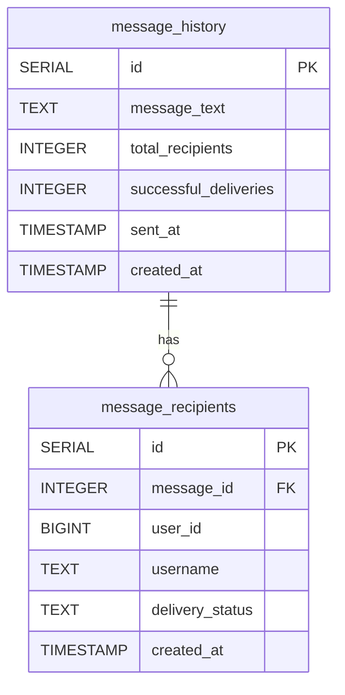
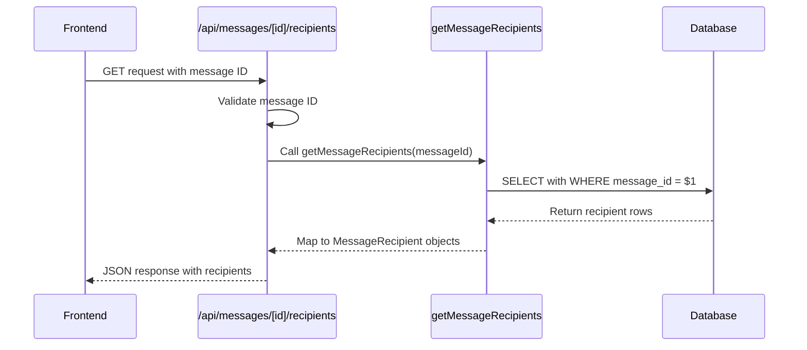

# Message Recipients Table

<cite>
**Referenced Files in This Document**   
- [DATABASE_MIGRATION_LOG.md](file://DATABASE_MIGRATION_LOG.md)
- [lib/queries.ts](file://lib/queries.ts)
- [app/api/messages/[id]/recipients/route.ts](file://app/api/messages/[id]/recipients/route.ts)
- [lib/messageScheduler.ts](file://lib/messageScheduler.ts)
</cite>

## Table of Contents
1. [Introduction](#introduction)
2. [Field Definitions](#field-definitions)
3. [Relationships and Constraints](#relationships-and-constraints)
4. [Delivery Status Business Logic](#delivery-status-business-logic)
5. [Data Access Patterns](#data-access-patterns)
6. [Sample Data](#sample-data)
7. [Performance Considerations](#performance-considerations)
8. [Duplicate Prevention and Batch Processing](#duplicate-prevention-and-batch-processing)
9. [Conclusion](#conclusion)

## Introduction
The `message_recipients` table in the hsl-dashboard application serves as a critical component for tracking the delivery status of broadcast messages sent through the Telegram bot system. This table maintains individual recipient records linked to messages stored in the `message_history` table, enabling detailed tracking of message delivery outcomes. The design supports efficient querying for message status monitoring, delivery analytics, and message management operations including deletion of previously sent messages. This documentation provides a comprehensive overview of the table's structure, relationships, business logic, and operational patterns.

**Section sources**
- [DATABASE_MIGRATION_LOG.md](file://DATABASE_MIGRATION_LOG.md#L33-L53)

## Field Definitions
The `message_recipients` table contains the following fields that capture essential information about each message recipient:

- **id**: SERIAL PRIMARY KEY - A unique auto-incrementing identifier for each recipient record, ensuring each row can be uniquely referenced.
- **message_id**: INTEGER NOT NULL - A foreign key reference to the `id` field in the `message_history` table, establishing the relationship between a recipient and its parent message.
- **user_id**: BIGINT NOT NULL - The Telegram user ID of the recipient, stored as a BIGINT to accommodate the full range of possible Telegram user identifiers.
- **username**: TEXT - The Telegram username of the recipient, which may be null if the user has not set a username in their Telegram profile.
- **delivery_status**: TEXT DEFAULT 'pending' - The current status of message delivery to this recipient, with a default value of 'pending' indicating the message has been queued but not yet sent.
- **created_at**: TIMESTAMP WITH TIME ZONE DEFAULT CURRENT_TIMESTAMP - The timestamp when the recipient record was created, automatically set to the current time upon insertion.

These fields collectively provide a complete record of who received a message, when they were added to the delivery queue, and the outcome of the delivery attempt.

**Section sources**
- [DATABASE_MIGRATION_LOG.md](file://DATABASE_MIGRATION_LOG.md#L33-L53)

## Relationships and Constraints
The `message_recipients` table maintains a critical relationship with the `message_history` table through a foreign key constraint on the `message_id` field. This relationship ensures referential integrity between messages and their recipients. The foreign key is defined with CASCADE DELETE behavior, meaning that when a message record in `message_history` is deleted, all corresponding recipient records in `message_recipients` are automatically removed. This cascade operation prevents orphaned recipient records and maintains data consistency across the messaging system.

The CASCADE DELETE constraint is particularly important for maintaining a clean database state, especially when messages are removed from the system. This relationship ensures that cleanup operations are handled automatically by the database, reducing the risk of data inconsistencies and simplifying application logic. The constraint is implemented at the database level, providing a reliable mechanism for data integrity regardless of the application layer implementation.

**Diagram sources**
- [DATABASE_MIGRATION_LOG.md](file://DATABASE_MIGRATION_LOG.md#L33-L53)

**Section sources**
- [DATABASE_MIGRATION_LOG.md](file://DATABASE_MIGRATION_LOG.md#L33-L53)

## Delivery Status Business Logic
The `delivery_status` field implements a state machine that tracks the lifecycle of message delivery to individual recipients. The field can have one of four values, each representing a distinct stage in the delivery process:

- **pending**: The initial state when a recipient is added to a message broadcast. This indicates the message has been queued for delivery but has not yet been sent.
- **sent**: The state after a message has been successfully delivered to the recipient via the Telegram API. This status is updated immediately upon successful API response.
- **failed**: The state when an attempt to deliver the message has failed, typically due to issues such as the recipient blocking the bot or invalid user IDs.
- **deleted**: A special state indicating that a previously sent message has been deleted from the recipient's chat, either manually by the user or through system operations.

The state transitions are managed through application logic in the `updateRecipientStatus` function, which updates the status based on the outcome of delivery attempts. The 'deleted' status is particularly important for tracking message lifecycle beyond initial delivery, allowing the system to reflect changes in message visibility even after successful delivery.

**Section sources**
- [lib/queries.ts](file://lib/queries.ts#L711-L730)
- [lib/queries.ts](file://lib/queries.ts#L914-L927)

## Data Access Patterns
The application implements specific data access patterns for retrieving recipient information efficiently. The primary access pattern involves loading all recipients for a specific message, which is accomplished through the `getMessageRecipients` function. This function queries the database using the `message_id` as a filter, returning a complete list of recipients with their delivery statuses. The results are ordered by the `id` field to ensure consistent pagination and display.

Another important access pattern is tracking individual recipient status, which is used when updating delivery outcomes or checking the status of a specific user. This is typically done using queries that filter by both `message_id` and `user_id`. The API endpoint at `/api/messages/[id]/recipients` provides a RESTful interface for accessing recipient data, handling input validation and error reporting. This endpoint is consumed by the frontend to display recipient lists in the message history interface, showing usernames, user IDs, and delivery statuses with appropriate visual indicators.

**Diagram sources**
- [app/api/messages/[id]/recipients/route.ts](file://app/api/messages/[id]/recipients/route.ts#L0-L27)
- [lib/queries.ts](file://lib/queries.ts#L798-L818)

**Section sources**
- [app/api/messages/[id]/recipients/route.ts](file://app/api/messages/[id]/recipients/route.ts#L0-L27)
- [lib/queries.ts](file://lib/queries.ts#L798-L818)

## Sample Data
The following sample data illustrates typical records in the `message_recipients` table, demonstrating the various delivery statuses and their practical implications:

| id | message_id | user_id | username | delivery_status | created_at |
|----|------------|---------|----------|-----------------|------------|
| 1 | 101 | 123456789 | alex_smith | sent | 2025-09-02 10:30:00 |
| 2 | 101 | 987654321 | user_jane | failed | 2025-09-02 10:30:00 |
| 3 | 101 | 456123789 | bob_wilson | pending | 2025-09-02 10:30:00 |
| 4 | 102 | 123456789 | alex_smith | deleted | 2025-09-02 11:15:00 |

This sample shows a message (ID: 101) sent to three recipients with different outcomes: one successful delivery, one failure, and one still pending. Another message (ID: 102) shows a recipient whose message was later deleted. The `telegram_message_id` field (not shown) would contain the actual Telegram message identifier for the successfully sent messages, enabling operations like message deletion.

**Section sources**
- [DATABASE_MIGRATION_LOG.md](file://DATABASE_MIGRATION_LOG.md#L33-L53)

## Performance Considerations
The `message_recipients` table is optimized for performance through strategic indexing that supports the primary query patterns. Three indexes have been created to ensure efficient data retrieval:

- **idx_message_recipients_message_id**: A single-column index on `message_id` that accelerates queries filtering by message, such as retrieving all recipients for a specific message.
- **idx_message_recipients_status**: A composite index on `message_id` and `delivery_status` that optimizes counting operations for delivery statistics, particularly when calculating the number of successfully delivered messages.
- **idx_message_recipients_user_id**: An index on `user_id` that enables fast lookups by recipient, useful for checking the status of a specific user across messages.

The composite index on `message_id` and `delivery_status` is particularly important for the application's delivery counting functionality, as it allows the database to quickly aggregate delivery statistics without full table scans. These indexes ensure that even as the table grows with message volume, query performance remains consistent for both individual message tracking and system-wide analytics.

**Section sources**
- [DATABASE_MIGRATION_LOG.md](file://DATABASE_MIGRATION_LOG.md#L55-L66)

## Duplicate Prevention and Batch Processing
The system prevents duplicate messaging through the use of DISTINCT queries in the message scheduling process. When retrieving pending recipients for a message, the application uses `DISTINCT ON (user_id)` in its SQL queries to ensure each user receives a message only once, even if they appear multiple times in the underlying data sources. This deduplication occurs at the database level, providing a reliable mechanism for preventing duplicate deliveries.

Messages are sent in batches of 10 recipients as part of the batch processing system implemented in the message scheduler. This batching strategy balances delivery speed with API rate limiting considerations, preventing overwhelming the Telegram API while maintaining reasonable delivery times for large recipient lists. After each batch, a one-second delay is introduced before processing the next batch, further ensuring compliance with API usage guidelines. This approach allows the system to handle large-scale message broadcasts efficiently while maintaining reliability and respecting external API constraints.

**Section sources**
- [lib/messageScheduler.ts](file://lib/messageScheduler.ts#L151-L184)
- [lib/messageScheduler.ts](file://lib/messageScheduler.ts#L225-L245)

## Conclusion
The `message_recipients` table is a fundamental component of the hsl-dashboard messaging system, providing reliable tracking of message delivery outcomes for individual recipients. Its design incorporates important data integrity features through foreign key constraints with CASCADE DELETE, ensuring consistent state between messages and their recipients. The table supports comprehensive delivery tracking through its status field, which captures the complete lifecycle of message delivery from pending to sent, failed, or deleted states. With optimized indexing for common query patterns and integration with batch processing logic, the table efficiently supports the application's messaging workflow while preventing duplicates and maintaining performance at scale.