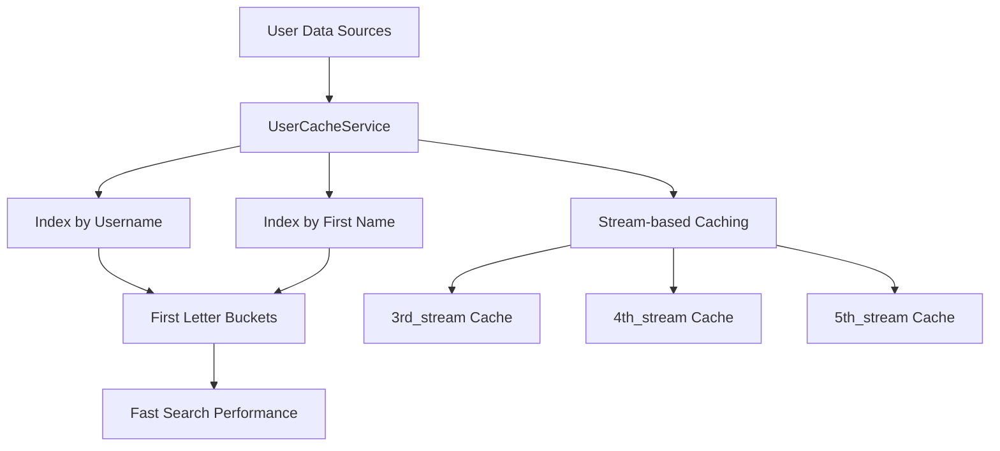
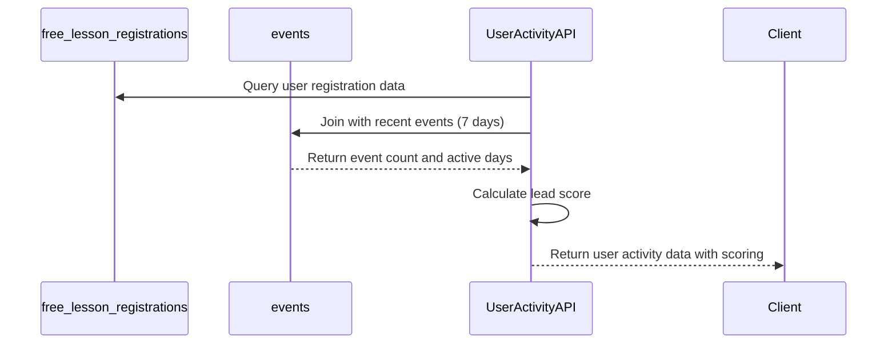
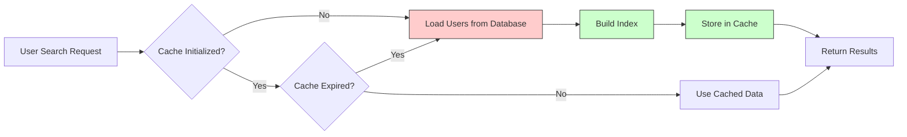

# Users Table

<cite>
**Referenced Files in This Document**   
- [DATABASE_MIGRATION_LOG.md](file://DATABASE_MIGRATION_LOG.md)
- [lib/queries.ts](file://lib/queries.ts)
- [lib/userCache.ts](file://lib/userCache.ts)
- [app/api/users/search/route.ts](file://app/api/users/search/route.ts)
- [app/api/users/by-stream/route.ts](file://app/api/users/by-stream/route.ts)
- [app/api/user-activity/route.ts](file://app/api/user-activity/route.ts)
</cite>

## Table of Contents
1. [Introduction](#introduction)
2. [Field Definitions](#field-definitions)
3. [Primary Key and Foreign Key Constraints](#primary-key-and-foreign-key-constraints)
4. [Indexing Strategy](#indexing-strategy)
5. [User Segmentation by Course Stream](#user-segmentation-by-course-stream)
6. [User Activity Tracking](#user-activity-tracking)
7. [Sample Data](#sample-data)
8. [Data Validation Rules](#data-validation-rules)
9. [Performance Considerations](#performance-considerations)
10. [Deduplication Algorithms](#deduplication-algorithms)
11. [Data Integrity and Migration](#data-integrity-and-migration)

## Introduction
The Users table in the hsl-dashboard application serves as a central data store for user information, primarily sourced from Telegram interactions and course booking activities. This documentation provides a comprehensive overview of the Users table structure, its relationships with other tables, indexing strategies, business logic implementations, and performance optimizations. The data model supports key application features including user search, messaging, segmentation, and analytics.

**Section sources**
- [lib/queries.ts](file://lib/queries.ts#L76-L81)
- [DATABASE_MIGRATION_LOG.md](file://DATABASE_MIGRATION_LOG.md#L33-L67)

## Field Definitions
The Users table contains the following fields as revealed through the application's data access patterns and interface definitions:

- **user_id (BIGINT)**: Unique identifier for each user, corresponding to Telegram user IDs. This field serves as the primary key and is used across the system for user identification.
- **username (TEXT)**: The Telegram username of the user, which may be null if not provided. Used for user identification and display purposes.
- **first_name (TEXT)**: The user's first name as provided in Telegram, used for personalization and display. This field may also be null.
- **course_stream (VARCHAR)**: Indicates the course stream to which the user belongs (3rd_stream, 4th_stream, or 5th_stream). This field enables user segmentation for targeted messaging and analytics.

These fields are defined in the TelegramUser interface used throughout the application and are populated from multiple sources including bookings, free lesson registrations, and events tables.

**Section sources**
- [lib/queries.ts](file://lib/queries.ts#L76-L81)
- [lib/userCache.ts](file://lib/userCache.ts#L76-L81)

## Primary Key and Foreign Key Constraints
The user_id field serves as the primary key for user identification across the system. Although not explicitly defined in a standalone Users table, the user_id functions as a de facto primary key in multiple tables where user data is stored.

The user_id field also serves as a foreign key in several related tables, establishing relationships that maintain data integrity:

- In the **bookings** table, user_id links users to their course bookings, enabling tracking of enrollment and payment status.
- In the **message_recipients** table, user_id establishes a foreign key relationship with the message_history table, allowing for tracking of message delivery status per user.

The foreign key constraint in the message_recipients table is explicitly defined with CASCADE DELETE behavior, ensuring that when a message is deleted, all corresponding recipient records are automatically removed to prevent orphaned records.

**Section sources**
- [DATABASE_MIGRATION_LOG.md](file://DATABASE_MIGRATION_LOG.md#L33-L67)
- [lib/queries.ts](file://lib/queries.ts#L76-L81)

## Indexing Strategy
The application implements an optimized indexing strategy to support efficient user search functionality through the UserCacheService. While database-level indexes are not explicitly defined in the migration logs, the application implements a sophisticated in-memory indexing system:

- **Username Indexing**: The UserCacheService builds an index based on the first letter of usernames, enabling fast prefix-based searches.
- **First Name Indexing**: Similarly, an index is created based on the first letter of first names, allowing for efficient searching by user first names.
- **Stream-based Indexing**: Separate caches are maintained for each course stream (3rd_stream, 4th_stream, 5th_stream), optimizing group messaging operations.

The cache service organizes users into "letter buckets" based on the first character of their username or first name, significantly reducing search time complexity. This indexing strategy supports the application's requirement for instant search results in the user interface.



**Diagram sources**
- [lib/userCache.ts](file://lib/userCache.ts#L20-L45)
- [lib/userCache.ts](file://lib/userCache.ts#L100-L130)

**Section sources**
- [lib/userCache.ts](file://lib/userCache.ts#L20-L130)
- [docs/prd.md](file://docs/prd.md#L160-L165)

## User Segmentation by Course Stream
The application implements user segmentation based on course stream membership, which is a critical business requirement for targeted messaging and analytics. The three streams supported are:

- **3rd Stream**: Entry-level course participants
- **4th Stream**: Intermediate-level course participants
- **5th Stream**: Advanced-level course participants

User segmentation is implemented through the getUsersByStream function, which queries the bookings table for users enrolled in confirmed bookings (confirmed = 2) within a specific stream. This segmentation enables the marketing team to send targeted messages to specific course cohorts, track stream-specific performance metrics, and analyze conversion rates by stream.

The segmentation logic is integrated with the messaging system, allowing administrators to select users by stream for group messaging operations. The system automatically handles deduplication when users might appear in multiple query results.

**Section sources**
- [lib/queries.ts](file://lib/queries.ts#L575-L599)
- [app/api/users/by-stream/route.ts](file://app/api/users/by-stream/route.ts#L10-L47)

## User Activity Tracking
User activity is tracked through event logging in the events table, which captures various user interactions with the system. The application calculates a lead scoring system based on user activity patterns over a 7-day window:

- **Hot Leads**: Users with 20+ events and active on 5+ days
- **Warm Leads**: Users with 10+ events and active on 3+ days
- **Cool Leads**: Users with 5+ events
- **Cold Leads**: All other users

The user activity tracking system joins data from free_lesson_registrations and events tables to calculate metrics including total events, active days, and last activity timestamp. This information is used to prioritize follow-up communications and measure user engagement levels.



**Diagram sources**
- [app/api/user-activity/route.ts](file://app/api/user-activity/route.ts#L10-L50)
- [lib/queries.ts](file://lib/queries.ts#L315-L353)

**Section sources**
- [app/api/user-activity/route.ts](file://app/api/user-activity/route.ts#L10-L50)
- [docs/prd.md](file://docs/prd.md#L267-L272)

## Sample Data
Typical user records in the system contain the following data structure:

```json
{
  "user_id": 123456789,
  "username": "johndoe",
  "first_name": "John",
  "course_stream": "3rd_stream"
}
```

Another example:
```json
{
  "user_id": 987654321,
  "username": null,
  "first_name": "Jane",
  "course_stream": "4th_stream"
}
```

These records are sourced from multiple tables including bookings, free_lesson_registrations, and events, with data consolidated through DISTINCT ON (user_id) queries to prevent duplicates. Users may have incomplete profile information (null username) but are always identified by their unique user_id.

**Section sources**
- [lib/queries.ts](file://lib/queries.ts#L575-L599)
- [lib/queries.ts](file://lib/queries.ts#L1337-L1387)

## Data Validation Rules
The application implements several data validation rules during user-related operations:

- **User Existence Verification**: Before sending messages, the system validates that user IDs exist in the database by checking against bookings, free_lesson_registrations, and events tables.
- **Required Field Validation**: Username or first_name is required for user identification, with fallback logic to use available information.
- **Stream Validation**: Course stream values are validated against the allowed set (3rd_stream, 4th_stream, 5th_stream).
- **Message Content Validation**: Text messages are limited to 4096 characters, while media captions are limited to 1024 characters.
- **Recipient Validation**: The system verifies that at least one valid recipient exists before sending a message.

The validateUserIds function implements comprehensive user validation, checking user IDs across multiple tables and returning both valid users and invalid IDs for error handling.

**Section sources**
- [lib/queries.ts](file://lib/queries.ts#L820-L861)
- [app/api/messages/send/route.ts](file://app/api/messages/send/route.ts#L150-L200)

## Performance Considerations
The application implements several performance optimizations for user data operations:

- **5-minute TTL Cache**: The UserCacheService implements a 5-minute time-to-live (TTL) cache for user search operations, ensuring that search results are refreshed periodically while maintaining high performance.
- **Lazy Initialization**: The cache is initialized on first access and only refreshed when the TTL expires, reducing database load.
- **Indexed Search**: The in-memory index by first letter of username and first name enables O(1) lookup for the initial character, followed by O(n) filtering within the letter bucket.
- **Batch Processing**: User searches are limited to 50 results to maintain response times.
- **Connection Pooling**: The application uses PostgreSQL connection pooling to efficiently manage database connections.

The cache service logs performance metrics including query execution time, cache age, and result counts, enabling monitoring of search performance.



**Diagram sources**
- [lib/userCache.ts](file://lib/userCache.ts#L50-L70)
- [app/api/users/search/route.ts](file://app/api/users/search/route.ts#L10-L36)

**Section sources**
- [lib/userCache.ts](file://lib/userCache.ts#L50-L70)
- [docs/prd.md](file://docs/prd.md#L310-L315)

## Deduplication Algorithms
The application implements deduplication algorithms to prevent duplicate messaging and ensure data consistency:

- **DISTINCT ON (user_id)**: Database queries use DISTINCT ON (user_id) to eliminate duplicate user records when consolidating data from multiple sources (bookings, free_lesson_registrations, events).
- **Recipient Deduplication**: The messaging system validates user IDs and removes duplicates before sending messages.
- **Stream-based Selection**: When selecting users by stream, the system automatically handles cases where users might be eligible for multiple streams.
- **Cache Deduplication**: The UserCacheService checks for existing users in index buckets before adding them, preventing duplicates in search results.

These deduplication mechanisms ensure that users receive messages only once even when they qualify for multiple recipient groups, maintaining a professional communication experience and conserving messaging resources.

**Section sources**
- [lib/queries.ts](file://lib/queries.ts#L575-L599)
- [docs/prd.md](file://docs/prd.md#L310-L315)

## Data Integrity and Migration
Data integrity is maintained through foreign key constraints and proper database migration practices as documented in DATABASE_MIGRATION_LOG.md. The message_recipients table includes a foreign key constraint on message_id that references message_history(id) with CASCADE DELETE behavior, ensuring referential integrity.

The migration process follows best practices:
- Transactions (BEGIN/COMMIT/ROLLBACK) are used to ensure atomicity
- All SQL is parameterized to prevent injection attacks
- Foreign key constraints prevent orphaned records
- CASCADE DELETE ensures data consistency across related tables

Database migrations are performed through a secure API endpoint that validates and executes migration scripts, with comprehensive logging and error handling to ensure data safety during schema changes.

**Section sources**
- [DATABASE_MIGRATION_LOG.md](file://DATABASE_MIGRATION_LOG.md#L146-L152)
- [app/api/db-migrate/route.ts](file://app/api/db-migrate/route.ts#L10-L54)