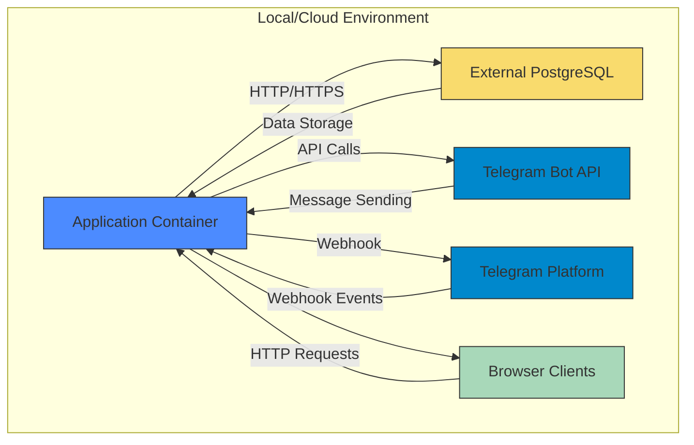

# Deployment Architecture

<cite>
**Referenced Files in This Document**   
- [Dockerfile](file://Dockerfile)
- [docker-compose.yml](file://docker-compose.yml)
- [README.md](file://README.md)
- [lib/db.ts](file://lib/db.ts)
- [lib/messageScheduler.ts](file://lib/messageScheduler.ts)
- [app/api/telegram/webhook/route.ts](file://app/api/telegram/webhook/route.ts)
- [package.json](file://package.json)
</cite>

## Table of Contents
1. [Containerization Strategy](#containerization-strategy)
2. [Multi-Container Setup](#multi-container-setup)
3. [Environment Configuration](#environment-configuration)
4. [Deployment Topology](#deployment-topology)
5. [Infrastructure Requirements](#infrastructure-requirements)
6. [Scalability Considerations](#scalability-considerations)
7. [Deployment Platforms](#deployment-platforms)
8. [System Resilience](#system-resilience)
9. [Build Process and Optimization](#build-process-and-optimization)

## Containerization Strategy

The hsl-dashboard application employs a multi-stage Docker build process to create optimized container images. The Dockerfile defines three distinct build stages: deps, builder, and runner, each serving a specific purpose in the containerization workflow.

The first stage (deps) focuses on dependency installation by copying package.json files and running npm ci to install production and development dependencies. This separation allows Docker to cache dependencies independently from application code, significantly improving build efficiency when code changes occur without dependency updates.

The second stage (builder) handles application compilation. It inherits the installed dependencies from the deps stage and copies the complete application source code. The build process is triggered through npm run build, which generates the Next.js application artifacts. This stage includes environment variables NEXT_TELEMETRY_DISABLED=1 and SKIP_APP_INIT=1 to disable telemetry and skip application initialization during the build phase.

The final stage (runner) creates the production-ready image by copying only essential runtime components from previous stages. It installs production dependencies with npm ci --omit=dev, copies the compiled Next.js application (.next directory), and exposes port 3000. The container starts with npm run start, launching the Next.js production server.

This multi-stage approach results in a minimal production image that contains only necessary runtime dependencies, reducing attack surface and image size while maintaining build efficiency through layer caching.

**Section sources**
- [Dockerfile](file://Dockerfile#L1-L28)
- [package.json](file://package.json#L1-L45)

## Multi-Container Setup

The application utilizes Docker Compose to orchestrate a multi-container deployment environment. The docker-compose.yml configuration defines a single service named "dashboard" that represents the main application container.

The dashboard service is built from the Dockerfile in the project root directory and tagged as hsl-dashboard:latest. It exposes port 3000, mapping the container's port 3000 to the host machine, making the Next.js application accessible at http://localhost:3000. The service configuration includes environment settings with NODE_ENV set to production mode.

A key aspect of the multi-container setup is the integration with external services rather than bundling all components within Docker Compose. The application is designed to connect to a PostgreSQL database hosted externally, specifically on Railway as mentioned in the documentation. This architectural decision separates database management from application deployment, allowing independent scaling and maintenance of database resources.

The application also integrates with Telegram services through API endpoints, particularly the webhook handler at /api/telegram/webhook. This endpoint receives updates from Telegram, including video messages and other events, demonstrating the integration with external messaging services.

The current docker-compose.yml does not include a database container, indicating that the PostgreSQL dependency is expected to be provided as an external managed service rather than a co-located container. This approach reduces operational complexity by leveraging cloud database services while maintaining the simplicity of the local development and deployment configuration.

**Section sources**
- [docker-compose.yml](file://docker-compose.yml#L1-L14)
- [lib/db.ts](file://lib/db.ts#L1-L53)
- [app/api/telegram/webhook/route.ts](file://app/api/telegram/webhook/route.ts#L1-L96)

## Environment Configuration

The application relies on environment variables for configuration, with a clear separation between development and production settings. The primary configuration mechanism uses a .env file that is loaded through the env_file directive in docker-compose.yml, allowing centralized management of sensitive and environment-specific settings.

Critical database connection parameters include POSTGRES_HOST, POSTGRES_PORT, POSTGRES_DB, POSTGRES_USER, and POSTGRES_PASSWORD, which are required for establishing connections to the PostgreSQL database. The application implements a graceful degradation strategy when these environment variables are missing, creating a stub connection proxy that throws descriptive errors while allowing build-time tasks to proceed in development environments.

For Telegram integration, the application requires BOT_TOKEN to authenticate with the Telegram Bot API and TELEGRAM_WEBHOOK_SECRET for securing webhook endpoints. The webhook secret is used to validate incoming requests to the /api/telegram/webhook endpoint, preventing unauthorized access to the message processing system.

Additional operational flags include SKIP_APP_INIT and SKIP_MESSAGE_SCHEDULER, which allow conditional disabling of application initialization and message scheduling services. These flags provide flexibility in different deployment scenarios, such as when running migration tasks or when certain services are not required.

The application also sets NEXT_TELEMETRY_DISABLED=1 to disable Next.js telemetry in both build and runtime environments, respecting user privacy and reducing external network calls. The NODE_ENV variable is explicitly set to production in the container environment to ensure optimal performance and security settings.

**Section sources**
- [README.md](file://README.md#L1-L170)
- [lib/db.ts](file://lib/db.ts#L1-L53)
- [lib/messageScheduler.ts](file://lib/messageScheduler.ts#L1-L281)
- [app/api/telegram/webhook/route.ts](file://app/api/telegram/webhook/route.ts#L1-L96)

## Deployment Topology

**Diagram sources**
- [docker-compose.yml](file://docker-compose.yml#L1-L14)
- [lib/db.ts](file://lib/db.ts#L1-L53)
- [app/api/telegram/webhook/route.ts](file://app/api/telegram/webhook/route.ts#L1-L96)

The deployment topology illustrates the relationships between the hsl-dashboard application container and external services. The core application runs within a Docker container, exposing HTTP port 3000 for web access. This container maintains a direct connection to an external PostgreSQL database instance, which is hosted on Railway as specified in the documentation.

The application integrates with Telegram services through two primary channels: the Telegram Bot API and webhook endpoints. The MessageSchedulerService uses the BOT_TOKEN to send scheduled messages to users through the Telegram Bot API, while the application exposes a webhook endpoint (/api/telegram/webhook) that receives incoming messages and events from the Telegram platform.

Client access occurs through standard web browsers that connect to the application container's exposed port. The application serves a Next.js frontend that provides the dashboard interface for viewing analytics, course statistics, and user information.

This topology demonstrates a hybrid deployment model where the application container is lightweight and focused on business logic, while data storage and messaging capabilities are delegated to specialized external services. This separation of concerns enhances reliability, as database and messaging infrastructure can be independently maintained and scaled.

## Infrastructure Requirements

The hsl-dashboard application has modest infrastructure requirements suitable for deployment on entry-level cloud instances. The containerized nature of the application allows for efficient resource utilization and predictable performance characteristics.

For CPU requirements, a single core is sufficient for typical operation, as the application primarily handles HTTP requests and database queries rather than compute-intensive tasks. The Next.js server efficiently serves pre-rendered content with minimal processing overhead. During peak loads or when processing scheduled message batches, CPU utilization may increase temporarily but should remain within single-core capacity for typical user volumes.

Memory requirements are moderate, with 512MB to 1GB of RAM recommended for production deployment. The Node.js runtime, Next.js server, and database connection pool collectively consume memory resources. The application's use of connection pooling helps minimize memory overhead from database connections. Additional memory may be required if the application processes large datasets or handles high concurrent user loads.

Storage requirements are minimal for the application container itself, as it does not store persistent data locally. The container image size is optimized through the multi-stage build process, resulting in a lean runtime image. Persistent storage requirements are delegated to the external PostgreSQL database on Railway, which manages data storage independently.

Network bandwidth requirements depend on usage patterns but are generally low, as the application primarily serves text-based dashboard content and JSON API responses. Image and video content is not stored or served by this application, reducing bandwidth demands. The webhook endpoint may receive video metadata from Telegram, but actual media files are not processed or stored by this service.

**Section sources**
- [Dockerfile](file://Dockerfile#L1-L28)
- [package.json](file://package.json#L1-L45)
- [lib/db.ts](file://lib/db.ts#L1-L53)

## Scalability Considerations

The hsl-dashboard architecture incorporates several scalability considerations to handle increased user loads and database growth. The application design follows a stateless service model, where the containerized application does not maintain local state, enabling horizontal scaling through multiple container instances if needed.

Database scalability is addressed through the use of an external PostgreSQL instance on Railway, which provides managed database services with built-in scaling capabilities. The application's database connection management uses connection pooling to efficiently manage database resources and prevent connection exhaustion under load. The connection pool configuration includes SSL settings with rejectUnauthorized: false to accommodate Railway's SSL requirements.

For handling increased user loads, the application implements a tiered data loading strategy in the frontend to prioritize critical information. The main dashboard loads data in three tiers: critical stats (Tier 1), current state data (Tier 2), and analytics data (Tier 3), with appropriate loading states to maintain responsiveness. This approach ensures that essential metrics are displayed quickly while less critical analytics load in the background.

The message scheduling system includes built-in safeguards for scalability. The MessageSchedulerService processes scheduled messages in batches with a configurable batch size (currently 10 messages per batch) and includes delays between batches to prevent overwhelming external services. The cron job runs every minute to check for scheduled messages, providing timely delivery while maintaining predictable resource usage.

Database growth is managed through selective data retrieval and appropriate indexing on external database tables. The application queries are designed to retrieve only necessary data, with pagination and limiting applied where appropriate (e.g., recent events limited to 30 records). The separation of the database to an external managed service allows independent scaling of storage and performance resources as data volume grows.

**Section sources**
- [lib/db.ts](file://lib/db.ts#L1-L53)
- [lib/messageScheduler.ts](file://lib/messageScheduler.ts#L1-L281)
- [app/page.tsx](file://app/page.tsx#L1-L269)

## Deployment Platforms

The hsl-dashboard application is designed for flexible deployment across various platforms, with specific guidance provided for Railway deployment. The containerization strategy using Docker and Docker Compose enables consistent deployment across different environments, from local development to production cloud platforms.

For Railway deployment, the application leverages Railway's PostgreSQL database service as the primary data store. The deployment process involves configuring environment variables through Railway's interface or configuration files, including database connection parameters and Telegram integration tokens. The application's design to use external database services aligns perfectly with Railway's managed database offerings.

The deployment workflow supports both manual and automated approaches. Manual deployment can be performed using standard Docker commands: building the image with docker build and running it with docker run, passing environment variables through --env-file. Alternatively, Docker Compose provides a streamlined deployment process with docker compose up --build, which automatically builds the image and starts the container with configuration from docker-compose.yml.

The application's Next.js foundation provides additional deployment flexibility, as it can be deployed on various platform-as-a-service (PaaS) providers beyond containerized environments. However, the provided Docker configuration indicates a preference for container-based deployment, ensuring consistency across development, staging, and production environments.

Platform-specific considerations include setting appropriate environment variables for each deployment target and ensuring network connectivity between the application container and external services like the PostgreSQL database and Telegram API. Health checks and monitoring should be configured according to the specific platform's capabilities to ensure application reliability.

**Section sources**
- [README.md](file://README.md#L1-L170)
- [docker-compose.yml](file://docker-compose.yml#L1-L14)
- [Dockerfile](file://Dockerfile#L1-L28)

## System Resilience

The hsl-dashboard implementation incorporates several features to enhance system resilience and reliability. The application includes comprehensive error handling and graceful degradation mechanisms to maintain functionality during partial failures.

The database connection logic implements a robust fallback strategy when configuration is incomplete. When required environment variables are missing, the application creates a proxy connection object that throws descriptive errors rather than crashing, allowing build processes to complete while clearly indicating configuration issues. This approach prevents deployment failures due to missing configuration while providing clear diagnostic information.

For message processing, the application includes retry logic and error isolation. The MessageSchedulerService processes messages in batches with individual error handling for each recipient, ensuring that failures to deliver to one user do not prevent delivery to others. Detailed error logging captures Telegram API error codes (such as 403 for blocked bots or 400 for invalid users), enabling effective troubleshooting and monitoring.

The webhook endpoint includes authentication through a secret token (TELEGRAM_WEBHOOK_SECRET), protecting against unauthorized access and potential denial-of-service attacks. Input validation and error handling in the webhook route ensure that malformed requests do not crash the application, with appropriate HTTP status codes returned for different error conditions.

The container configuration includes a restart policy of "unless-stopped" in docker-compose.yml, ensuring that the application automatically recovers from crashes or system restarts. This policy maintains service availability while allowing intentional shutdowns for maintenance.

Monitoring is facilitated through comprehensive logging at various levels, including debug information for message scheduling, database operations, and webhook events. These logs provide visibility into application behavior and assist in diagnosing issues in production environments.

**Section sources**
- [lib/db.ts](file://lib/db.ts#L1-L53)
- [lib/messageScheduler.ts](file://lib/messageScheduler.ts#L1-L281)
- [app/api/telegram/webhook/route.ts](file://app/api/telegram/webhook/route.ts#L1-L96)
- [docker-compose.yml](file://docker-compose.yml#L1-L14)

## Build Process and Optimization

The build process for hsl-dashboard is optimized for efficiency and security through a multi-stage Docker approach that separates concerns and minimizes the final image size. The Dockerfile implements a three-stage build process that maximizes layer caching and produces a lean production image.

The first stage (deps) focuses exclusively on dependency installation by copying package.json files and running npm ci. This separation allows Docker to cache dependencies independently, meaning subsequent builds can reuse this layer when package.json files remain unchanged, significantly reducing build times during development.

The second stage (builder) handles application compilation. It inherits the installed dependencies from the deps stage and copies the complete source code. The build process runs npm run build to generate the Next.js application artifacts. This stage includes environment variables to disable telemetry and skip initialization, optimizing the build process for containerized environments.

The final stage (runner) creates the production image by copying only essential runtime components. It installs production dependencies with npm ci --omit=dev, which excludes development dependencies to reduce image size and potential security vulnerabilities. The stage copies the compiled Next.js application (.next directory) and public assets from the builder stage, then cleans the npm cache to further minimize image size.

Image optimization techniques include using the Alpine Linux base image (node:20-alpine), which provides a minimal operating system footprint. The final image exposes only the necessary port (3000) and runs with production environment settings. The multi-stage build process ensures that development tools, source maps, and other non-essential files are excluded from the final image, resulting in a secure, efficient container optimized for production deployment.

**Section sources**
- [Dockerfile](file://Dockerfile#L1-L28)
- [package.json](file://package.json#L1-L45)
- [README.md](file://README.md#L1-L170)