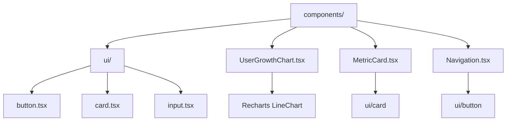

# Directory Structure

<cite>
**Referenced Files in This Document**   
- [app/page.tsx](file://app/page.tsx)
- [app/layout.tsx](file://app/layout.tsx)
- [app/globals.css](file://app/globals.css)
- [components/UserGrowthChart.tsx](file://components/UserGrowthChart.tsx)
- [components/ui/button.tsx](file://components/ui/button.tsx)
- [components/MetricCard.tsx](file://components/MetricCard.tsx)
- [components/Navigation.tsx](file://components/Navigation.tsx)
- [lib/queries.ts](file://lib/queries.ts)
- [lib/db.ts](file://lib/db.ts)
- [lib/utils.ts](file://lib/utils.ts)
- [app/api/users/list/route.ts](file://app/api/users/list/route.ts)
- [app/api/bookings/route.ts](file://app/api/bookings/route.ts)
</cite>

## Table of Contents
1. [App Directory](#app-directory)
2. [Components Directory](#components-directory)
3. [Lib Directory](#lib-directory)
4. [Key Files Overview](#key-files-overview)
5. [App Router and Routing Structure](#app-router-and-routing-structure)
6. [API Routes Structure](#api-routes-structure)
7. [Component Organization](#component-organization)
8. [Adding New Pages and API Routes](#adding-new-pages-and-api-routes)
9. [Common Issues and Best Practices](#common-issues-and-best-practices)

## App Directory

The `app/` directory serves as the core of the Next.js application, housing all page components and API routes. It follows the App Router pattern introduced in Next.js 13, where file-based routing is automatically handled by the framework. Each subdirectory within `app/` represents a route segment, and `page.tsx` files define the UI for those routes. Special directories like `api/` are used to define server-side endpoints.

**Section sources**
- [app/page.tsx](file://app/page.tsx#L1-L268)
- [app/layout.tsx](file://app/layout.tsx#L1-L25)

## Components Directory

The `components/` directory contains all reusable UI elements across the application. It is organized into two main sections: base UI components under `ui/` and complex dashboard-specific components. The `ui/` folder contains primitive elements like buttons, cards, and inputs that follow a consistent design system, while higher-level components such as `UserGrowthChart.tsx` and `MetricCard` encapsulate specific dashboard functionality.

**Section sources**
- [components/UserGrowthChart.tsx](file://components/UserGrowthChart.tsx#L1-L86)
- [components/ui/button.tsx](file://components/ui/button.tsx#L1-L59)
- [components/MetricCard.tsx](file://components/MetricCard.tsx#L1-L47)
- [components/Navigation.tsx](file://components/Navigation.tsx#L1-L60)

## Lib Directory

The `lib/` directory contains business logic, utility functions, and database-related code. Files like `db.ts` manage the PostgreSQL connection pool, `queries.ts` houses all database query functions, and `utils.ts` provides shared utilities such as the `cn` function for conditional class merging. This separation ensures that data access and business logic are decoupled from the UI layer, promoting maintainability and testability.

**Section sources**
- [lib/db.ts](file://lib/db.ts#L1-L52)
- [lib/queries.ts](file://lib/queries.ts#L295-L319)
- [lib/utils.ts](file://lib/utils.ts#L1-L6)

## Key Files Overview

### page.tsx (Main Dashboard)
The `app/page.tsx` file serves as the main dashboard entry point, rendering key metrics, user growth charts, and recent activity data. It orchestrates data fetching from multiple API endpoints in a tiered approach—prioritizing critical stats first, followed by current state and analytics data. The component uses React's `useState` and `useEffect` hooks to manage loading states and error handling.

**Section sources**
- [app/page.tsx](file://app/page.tsx#L1-L268)

### layout.tsx (UI Shell)
The `app/layout.tsx` file defines the root layout for the application, including metadata and the persistent navigation bar. It wraps all pages with a consistent UI shell, importing the `Navigation` component and applying global styles. The layout uses Next.js metadata configuration to set the page title and description.

**Section sources**
- [app/layout.tsx](file://app/layout.tsx#L1-L25)

### globals.css (Global Styles)
The `app/globals.css` file contains global styling using Tailwind CSS and custom CSS variables. It defines a comprehensive theme system with light and dark mode support through CSS variables like `--background`, `--foreground`, and color-specific tokens. The file also sets base styles for elements and applies border and outline defaults.

**Section sources**
- [app/globals.css](file://app/globals.css#L1-L122)

## App Router and Routing Structure

The App Router organizes routes based on the file system under the `app/` directory. Each folder corresponds to a URL segment, and `page.tsx` files render the content for that route. For example, `app/users/page.tsx` maps to `/users`, while `app/analytics/page.tsx` maps to `/analytics`. Dynamic routes are supported using bracket syntax, such as `[id]` in `app/users/[id]/route.ts`, enabling parameterized API endpoints.

```mermaid
graph TB
A[app/] --> B[page.tsx]
A --> C[layout.tsx]
A --> D[analytics/page.tsx]
A --> E[free-lessons/page.tsx]
A --> F[messages/send/page.tsx]
A --> G[users/page.tsx]
A --> H[workshops/page.tsx]
B --> I[/]
D --> J[/analytics]
E --> K[/free-lessons]
F --> L[/messages/send]
G --> M[/users]
H --> N[/workshops]
```

**Diagram sources**
- [app/page.tsx](file://app/page.tsx#L1-L268)
- [app/layout.tsx](file://app/layout.tsx#L1-L25)

## API Routes Structure

API routes are structured under `app/api/`, with each subdirectory representing an endpoint. Files named `route.ts` export HTTP method handlers (e.g., `GET`, `POST`) using Next.js route handlers. For example, `app/api/stats/route.ts` handles requests to `/api/stats`. Nested routes support complex structures, such as `app/api/messages/[id]/recipients/route.ts` for parameterized endpoints. These routes import query functions from `lib/queries.ts` to interact with the database.

```mermaid
graph TB
A[app/api/] --> B[bookings/route.ts]
A --> C[course-streams/route.ts]
A --> D[courses/route.ts]
A --> E[users/]
E --> F[list/route.ts]
E --> G[search/route.ts]
E --> H[[id]/route.ts]
B --> I[GET /api/bookings]
F --> J[GET /api/users/list]
H --> K[GET /api/users/{id}]
```

**Diagram sources**
- [app/api/bookings/route.ts](file://app/api/bookings/route.ts#L1-L17)
- [app/api/users/list/route.ts](file://app/api/users/list/route.ts#L1-L34)

## Component Organization

Components are organized by abstraction level and reusability. The `ui/` subdirectory contains base primitives like `button.tsx` and `card.tsx` that are reused across the application. These follow a consistent API and styling system using Tailwind and `class-variance-authority`. Higher-level components such as `UserGrowthChart.tsx` and `MetricCard.tsx` combine these primitives to create dashboard-specific visualizations. This layered approach ensures consistency and reduces duplication.



**Diagram sources**
- [components/UserGrowthChart.tsx](file://components/UserGrowthChart.tsx#L1-L86)
- [components/MetricCard.tsx](file://components/MetricCard.tsx#L1-L47)
- [components/ui/button.tsx](file://components/ui/button.tsx#L1-L59)

## Adding New Pages and API Routes

### Creating a New Page
To add a new page, create a directory under `app/` with the desired route name and add a `page.tsx` file. For example, to create a `/reports` page:
```
app/
└── reports/
    └── page.tsx
```
The `page.tsx` should export a default component that renders the page content.

### Creating a New API Route
To create a new API endpoint, add a directory under `app/api/` and include a `route.ts` file. For a `/api/reports` endpoint:
```
app/
└── api/
    └── reports/
        └── route.ts
```
In `route.ts`, export a `GET` (or other HTTP method) handler function that returns a `NextResponse`.

**Section sources**
- [app/page.tsx](file://app/page.tsx#L1-L268)
- [app/api/bookings/route.ts](file://app/api/bookings/route.ts#L1-L17)

## Common Issues and Best Practices

### Common Issues
- **Incorrect File Placement**: Placing UI components in `app/` instead of `components/` breaks reusability.
- **Missing Dynamic Route Syntax**: Forgetting brackets in dynamic routes (e.g., `users/[id]`) prevents parameter capture.
- **Improper API Response Handling**: Not using `NextResponse.json()` correctly can lead to malformed responses.

### Best Practices
- **Separate Concerns**: Keep UI, business logic, and data access in separate directories (`app`, `components`, `lib`).
- **Use Consistent Naming**: Follow PascalCase for component files and lowercase for API route directories.
- **Leverage Reusable Components**: Always check `components/ui/` before creating new primitive elements.
- **Error Handling in API Routes**: Wrap API logic in try-catch blocks and return appropriate status codes.
- **Optimize Data Fetching**: Use streaming or tiered loading (as in `page.tsx`) to prioritize critical content.

**Section sources**
- [app/page.tsx](file://app/page.tsx#L1-L268)
- [app/api/users/list/route.ts](file://app/api/users/list/route.ts#L1-L34)
- [lib/queries.ts](file://lib/queries.ts#L1048-L1196)