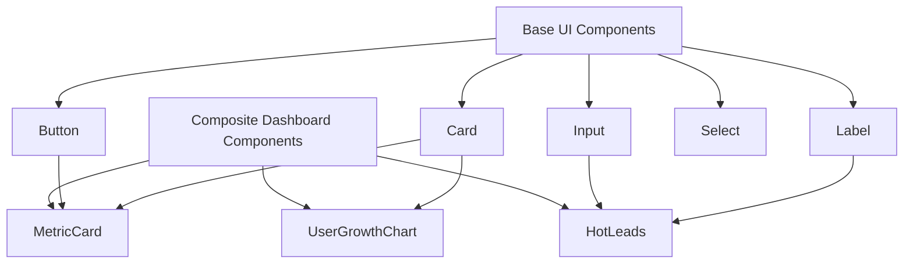
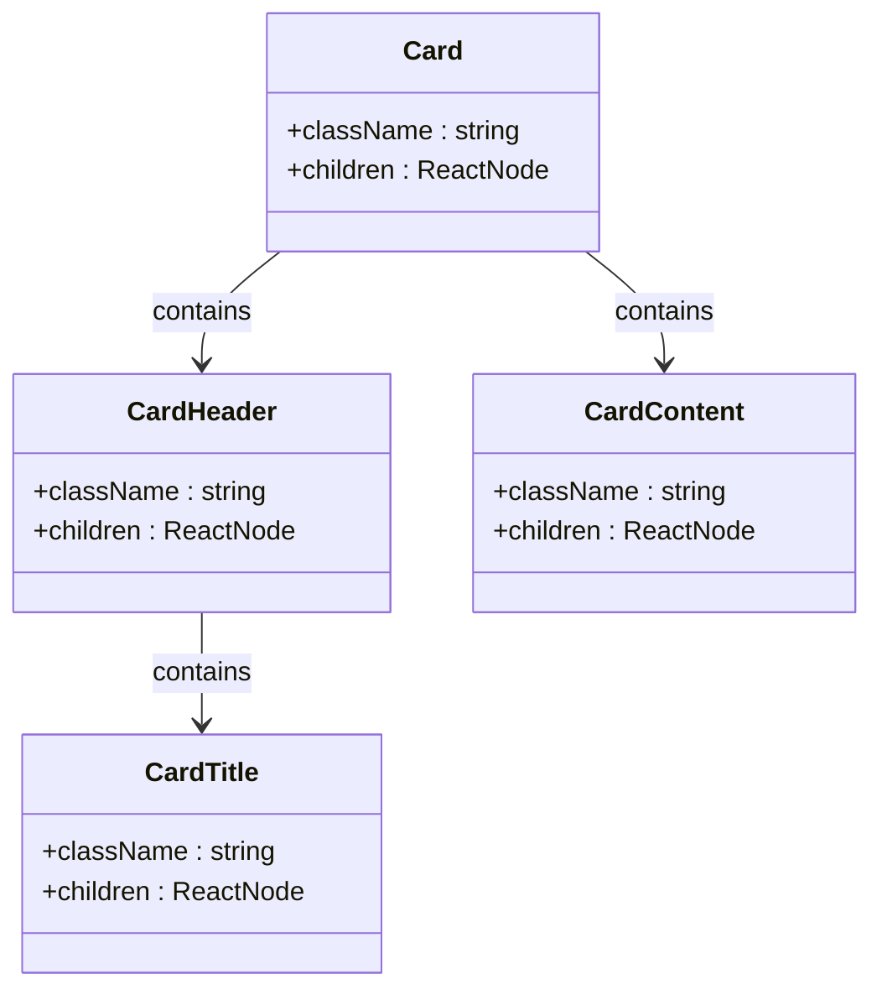
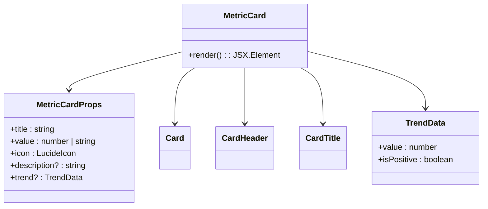
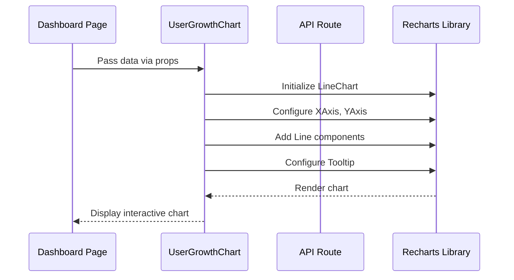

# Component Architecture

<cite>
**Referenced Files in This Document**   
- [components/ui/button.tsx](file://components/ui/button.tsx)
- [components/ui/card.tsx](file://components/ui/card.tsx)
- [components/ui/input.tsx](file://components/ui/input.tsx)
- [components/ui/label.tsx](file://components/ui/label.tsx)
- [components/MetricCard.tsx](file://components/MetricCard.tsx)
- [components/UserGrowthChart.tsx](file://components/UserGrowthChart.tsx)
- [components/HotLeads.tsx](file://components/HotLeads.tsx)
- [lib/utils.ts](file://lib/utils.ts)
</cite>

## Table of Contents
1. [Introduction](#introduction)
2. [Two-Tier Component System](#two-tier-component-system)
3. [Base UI Components and Headless UI Pattern](#base-ui-components-and-headless-ui-pattern)
4. [Composite Dashboard Components](#composite-dashboard-components)
5. [React Server Components vs Client Components](#react-server-components-vs-client-components)
6. [Component Creation Guidelines](#component-creation-guidelines)
7. [Common Issues and Solutions](#common-issues-and-solutions)
8. [Conclusion](#conclusion)

## Introduction
The hsl-dashboard employs a two-tier component architecture that separates reusable UI primitives from complex, domain-specific dashboard components. This documentation details the component system, focusing on the relationship between base UI components in `components/ui/` and composite dashboard components. The architecture leverages React Server Components for data fetching and Client Components for interactive elements, with styling implemented through Tailwind CSS classes.

## Two-Tier Component System
The component architecture follows a clear two-tier structure:

1. **Base UI Components**: Located in `components/ui/`, these include fundamental elements like Button, Card, Input, Label, and other reusable primitives
2. **Composite Dashboard Components**: Higher-level components such as MetricCard, UserGrowthChart, and HotLeads that combine multiple base components to create domain-specific functionality

This separation enables consistent styling across the application while allowing complex dashboard components to focus on business logic rather than low-level UI concerns.



**Diagram sources**
- [components/ui/button.tsx](file://components/ui/button.tsx)
- [components/ui/card.tsx](file://components/ui/card.tsx)
- [components/ui/input.tsx](file://components/ui/input.tsx)
- [components/ui/label.tsx](file://components/ui/label.tsx)
- [components/MetricCard.tsx](file://components/MetricCard.tsx)
- [components/UserGrowthChart.tsx](file://components/UserGrowthChart.tsx)
- [components/HotLeads.tsx](file://components/HotLeads.tsx)

## Base UI Components and Headless UI Pattern
The base UI components in `components/ui/` follow the Headless UI pattern, providing unstyled functionality that is styled through Tailwind CSS classes. This approach separates behavior from presentation, allowing for maximum flexibility in styling while maintaining consistent functionality.

### Key Characteristics
- **Unstyled Functionality**: Components provide core functionality without predefined visual styling
- **Tailwind CSS Integration**: Styling is applied through Tailwind utility classes passed via the `className` prop
- **Accessibility**: Built-in accessibility attributes ensure components are usable by all users
- **Composability**: Designed to be easily combined with other components

### Example: Card Component
The Card component demonstrates the Headless UI pattern with its simple structure that relies on Tailwind classes for styling:



**Diagram sources**
- [components/ui/card.tsx](file://components/ui/card.tsx#L4-L55)

**Section sources**
- [components/ui/card.tsx](file://components/ui/card.tsx#L4-L55)

## Composite Dashboard Components
Composite dashboard components combine multiple base UI components to create complex, domain-specific functionality. These components are responsible for data presentation, user interaction, and business logic.

### MetricCard Component
The MetricCard component exemplifies the composition pattern, combining Card, CardHeader, CardTitle, and icon components to display key metrics:



**Diagram sources**
- [components/MetricCard.tsx](file://components/MetricCard.tsx#L3-L47)

**Section sources**
- [components/MetricCard.tsx](file://components/MetricCard.tsx#L3-L47)

### Composition Patterns
The composite components follow several key composition patterns:
- **Data-Driven Styling**: Conditional classes based on data values (e.g., positive/negative trends)
- **Prop-Based Configuration**: Flexible configuration through component props
- **Responsive Design**: Layouts that adapt to different screen sizes
- **Accessibility**: Semantic HTML and ARIA attributes for screen readers

## React Server Components vs Client Components
The architecture distinguishes between Server Components and Client Components based on their requirements:

### Server Components
- Handle data fetching from API routes
- Render static content
- Do not require client-side interactivity
- Can directly access server resources

### Client Components
- Require client-side interactivity
- Handle user events and state management
- Use client-side data fetching
- Contain interactive elements like charts

### Example: UserGrowthChart
The UserGrowthChart component is a Client Component that requires client-side interactivity for data visualization:



**Diagram sources**
- [components/UserGrowthChart.tsx](file://components/UserGrowthChart.tsx#L1-L86)

**Section sources**
- [components/UserGrowthChart.tsx](file://components/UserGrowthChart.tsx#L1-L86)

## Component Creation Guidelines
When creating new components, follow these guidelines to maintain consistency with the existing architecture:

### TypeScript Interfaces
Define clear interfaces for component props with appropriate types:

```typescript
interface NewComponentProps {
  requiredProp: string;
  optionalProp?: number;
  complexProp: {
    nestedValue: boolean;
    arrayValue: string[];
  };
}
```

### Accessibility Attributes
Include appropriate accessibility attributes:
- Use semantic HTML elements
- Add ARIA labels when necessary
- Ensure keyboard navigation support
- Provide sufficient color contrast

### Responsive Design
Implement responsive layouts using Tailwind CSS:
- Use responsive prefixes (sm:, md:, lg:)
- Implement mobile-first design
- Test across different screen sizes
- Consider touch targets for mobile devices

### Styling Approach
Follow the existing styling pattern:
- Use Tailwind utility classes
- Leverage the `cn()` utility for class merging
- Maintain consistent spacing and typography
- Follow the design system's color palette

## Common Issues and Solutions
### Hydration Errors
Hydration errors occur when there is a mismatch between server-rendered and client-rendered content.

**Common Causes:**
- Using browser-specific APIs in Server Components
- Conditional rendering based on client state
- Dynamic content that differs between server and client

**Solutions:**
1. Use the `'use client'` directive for components requiring client-side functionality
2. Implement proper loading states
3. Use `useEffect` for client-only operations
4. Ensure consistent initial rendering

### Data Fetching Patterns
Follow these patterns for efficient data fetching:
- Fetch data in Server Components when possible
- Use streaming for large datasets
- Implement proper error handling
- Add loading states for better UX

## Conclusion
The hsl-dashboard component architecture effectively separates concerns between base UI components and composite dashboard components. By following the Headless UI pattern and leveraging Tailwind CSS for styling, the system provides flexibility while maintaining consistency. The distinction between Server and Client Components optimizes performance and user experience. When creating new components, adhere to the established patterns for TypeScript interfaces, accessibility, and responsive design to ensure seamless integration with the existing codebase.