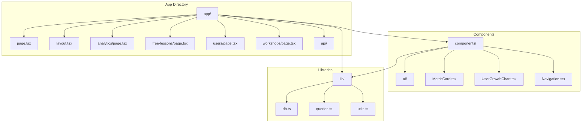
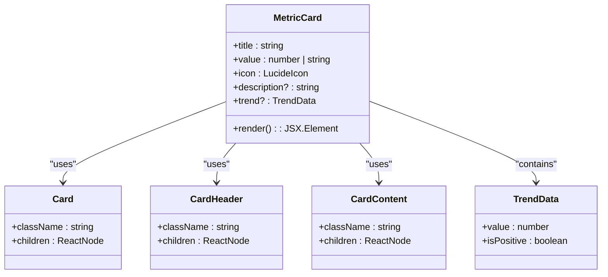
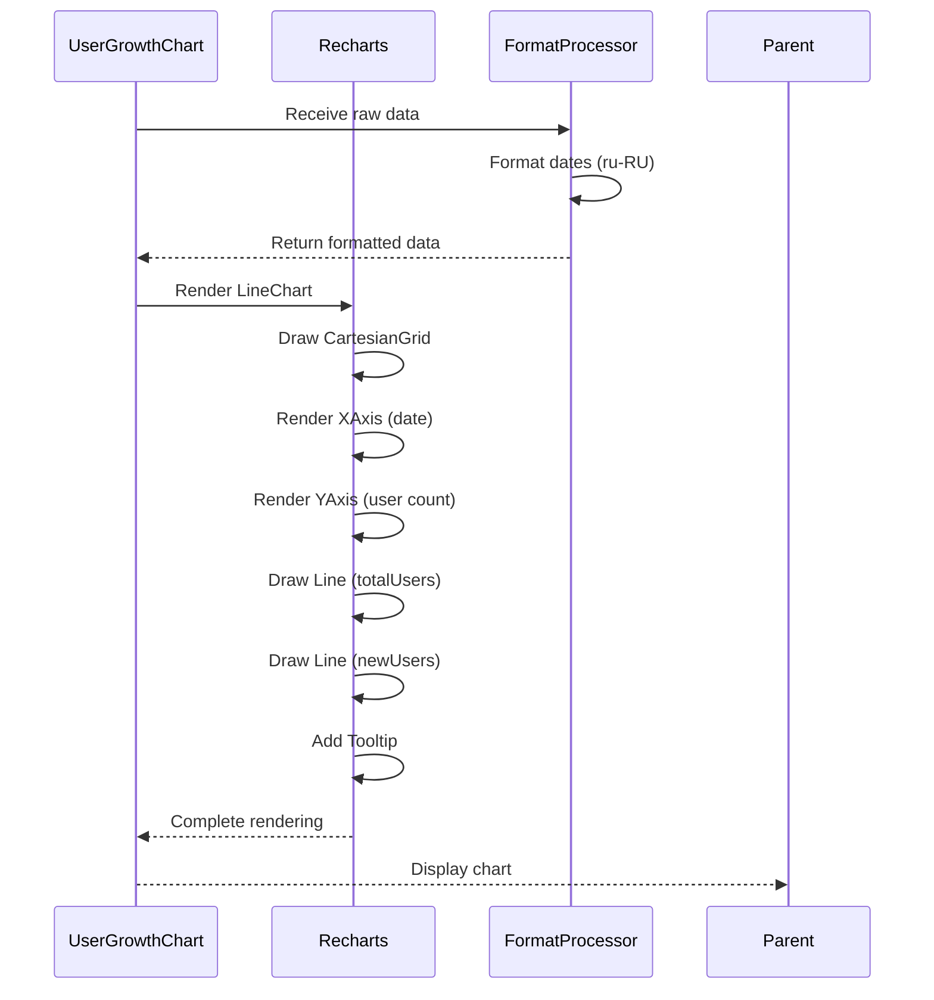
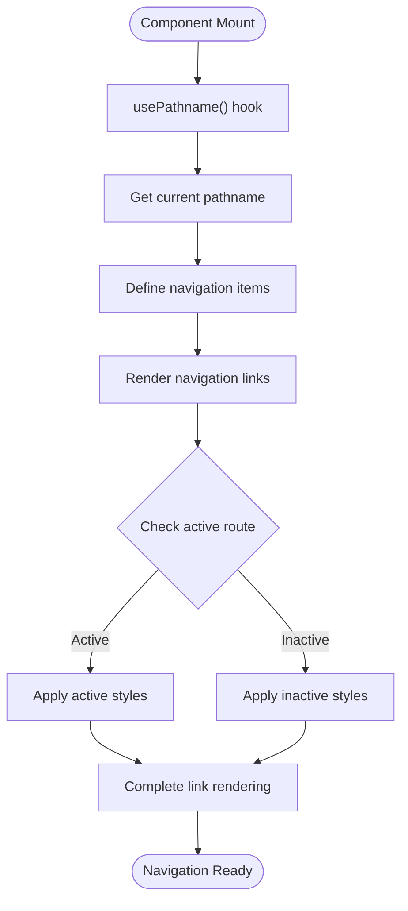
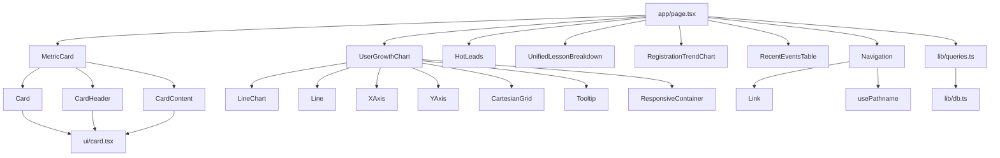

# Frontend Architecture

<cite>
**Referenced Files in This Document**   
- [app/page.tsx](file://app/page.tsx)
- [app/layout.tsx](file://app/layout.tsx)
- [components/MetricCard.tsx](file://components/MetricCard.tsx)
- [components/UserGrowthChart.tsx](file://components/UserGrowthChart.tsx)
- [components/Navigation.tsx](file://components/Navigation.tsx)
- [lib/queries.ts](file://lib/queries.ts)
- [lib/db.ts](file://lib/db.ts)
- [components/ui/card.tsx](file://components/ui/card.tsx)
</cite>

## Table of Contents
1. [Introduction](#introduction)
2. [Project Structure](#project-structure)
3. [Core Components](#core-components)
4. [Architecture Overview](#architecture-overview)
5. [Detailed Component Analysis](#detailed-component-analysis)
6. [Dependency Analysis](#dependency-analysis)
7. [Performance Considerations](#performance-considerations)
8. [Troubleshooting Guide](#troubleshooting-guide)
9. [Conclusion](#conclusion)

## Introduction
The hsl-dashboard frontend architecture is built on Next.js App Router with React Server Components, designed to efficiently handle data-heavy dashboard content. The application leverages server-side rendering to optimize performance and user experience, particularly for data-intensive operations. The architecture combines reusable UI primitives with composite dashboard components to create a cohesive and maintainable interface for monitoring key metrics and user activities.

## Project Structure

The project follows a standard Next.js App Router structure with clear separation of concerns:

**Diagram sources**
- [app/page.tsx](file://app/page.tsx)
- [components/MetricCard.tsx](file://components/MetricCard.tsx)
- [lib/queries.ts](file://lib/queries.ts)

**Section sources**
- [app/page.tsx](file://app/page.tsx)
- [components/](file://components/)
- [lib/](file://lib/)

## Core Components

The frontend architecture centers around reusable UI components and data visualization elements. The system utilizes React Server Components for data fetching and client components for interactive elements. Key components include MetricCard for displaying key performance indicators and UserGrowthChart for visualizing user acquisition trends. The Navigation component provides consistent navigation across the application, while the layout structure ensures a uniform user experience.

**Section sources**
- [components/MetricCard.tsx](file://components/MetricCard.tsx)
- [components/UserGrowthChart.tsx](file://components/UserGrowthChart.tsx)
- [components/Navigation.tsx](file://components/Navigation.tsx)

## Architecture Overview

The hsl-dashboard employs a hybrid rendering approach that combines the benefits of server-side rendering with client-side interactivity. The Next.js App Router enables server components to fetch data directly from API routes, reducing the need for client-side data fetching and improving initial load performance. Data flows from backend API routes through server components to UI elements, with client components handling user interactions and dynamic updates.

```mermaid
graph LR
A[API Routes] --> B[Server Components]
B --> C[Data Fetching]
C --> D[Server-Side Rendering]
D --> E[Client Components]
E --> F[User Interactions]
F --> G[State Updates]
G --> H[UI Rendering]
H --> I[Dashboard Display]
style A fill:#f9f,stroke:#333
style B fill:#bbf,stroke:#333
style C fill:#bbf,stroke:#333
style D fill:#bbf,stroke:#333
style E fill:#f96,stroke:#333
style F fill:#f96,stroke:#333
style G fill:#f96,stroke:#333
style H fill:#f96,stroke:#333
style I fill:#9f9,stroke:#333
```

**Diagram sources**
- [app/page.tsx](file://app/page.tsx)
- [lib/queries.ts](file://lib/queries.ts)
- [components/MetricCard.tsx](file://components/MetricCard.tsx)

## Detailed Component Analysis

### MetricCard Component Analysis
The MetricCard component is a reusable UI primitive designed to display key performance indicators in a consistent format. It accepts props for title, value, icon, description, and trend information, allowing for flexible usage across different dashboard sections.

**Diagram sources**
- [components/MetricCard.tsx](file://components/MetricCard.tsx)
- [components/ui/card.tsx](file://components/ui/card.tsx)

**Section sources**
- [components/MetricCard.tsx](file://components/MetricCard.tsx)

### UserGrowthChart Component Analysis
The UserGrowthChart component visualizes user growth data using Recharts for data visualization. As a client component, it renders a line chart showing total users and new users over time, with proper formatting for Russian locale dates.

**Diagram sources**
- [components/UserGrowthChart.tsx](file://components/UserGrowthChart.tsx)

**Section sources**
- [components/UserGrowthChart.tsx](file://components/UserGrowthChart.tsx)

### Navigation Component Analysis
The Navigation component provides the primary navigation interface for the dashboard, using Next.js navigation hooks to manage active states and route transitions.

**Diagram sources**
- [components/Navigation.tsx](file://components/Navigation.tsx)

**Section sources**
- [components/Navigation.tsx](file://components/Navigation.tsx)

## Dependency Analysis

The frontend architecture has a clear dependency hierarchy, with higher-level components depending on lower-level UI primitives and data utilities. The dependency structure ensures maintainability and reusability across the application.

**Diagram sources**
- [app/page.tsx](file://app/page.tsx)
- [components/MetricCard.tsx](file://components/MetricCard.tsx)
- [components/UserGrowthChart.tsx](file://components/UserGrowthChart.tsx)
- [components/Navigation.tsx](file://components/Navigation.tsx)
- [lib/queries.ts](file://lib/queries.ts)

**Section sources**
- [app/page.tsx](file://app/page.tsx)
- [lib/queries.ts](file://lib/queries.ts)
- [lib/db.ts](file://lib/db.ts)

## Performance Considerations

The application implements a tiered data loading strategy to prioritize critical information and improve perceived performance. The Home component fetches data in three tiers, with critical stats loaded first, followed by current state data, and finally analytics data. This approach ensures that essential metrics are displayed quickly while less critical information loads in the background.

The architecture also leverages server-side rendering to minimize client-side processing and reduce initial load times. Data fetching occurs on the server, with only the rendered HTML sent to the client. Client components are used judiciously for interactive elements, minimizing the JavaScript bundle size and improving runtime performance.

**Section sources**
- [app/page.tsx](file://app/page.tsx)

## Troubleshooting Guide

When encountering issues with data display or component rendering, verify the API route connectivity and data format compatibility. The application relies on consistent data structures from API endpoints, particularly for components like MetricCard and UserGrowthChart. Ensure that database connection variables are properly configured in the environment, as indicated by the db.ts file's configuration checks.

For navigation issues, confirm that the usePathname hook is functioning correctly and that route definitions in the Navigation component match actual page routes. When debugging data visualization components, verify that date formatting and data transformation functions are correctly processing the incoming data.

**Section sources**
- [lib/db.ts](file://lib/db.ts)
- [components/Navigation.tsx](file://components/Navigation.tsx)
- [app/page.tsx](file://app/page.tsx)

## Conclusion

The hsl-dashboard frontend architecture effectively combines Next.js App Router features with React Server Components to create a performant and maintainable dashboard application. The component-based design promotes reusability and consistency across the interface, while the tiered data loading strategy optimizes user experience. The clear separation between server and client components allows for efficient data fetching and interactive elements, making the dashboard responsive and reliable for monitoring key metrics.