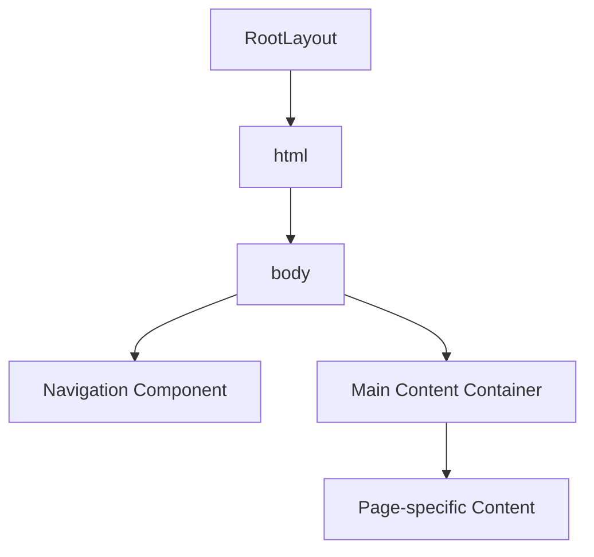

# Routing & Navigation

<cite>
**Referenced Files in This Document**   
- [app/layout.tsx](file://app/layout.tsx)
- [components/Navigation.tsx](file://components/Navigation.tsx)
- [app/page.tsx](file://app/page.tsx)
- [app/analytics/page.tsx](file://app/analytics/page.tsx)
- [app/messages/send/page.tsx](file://app/messages/send/page.tsx)
- [app/messages/history/page.tsx](file://app/messages/history/page.tsx)
- [app/users/page.tsx](file://app/users/page.tsx)
- [app/workshops/page.tsx](file://app/workshops/page.tsx)
</cite>

## Table of Contents
1. [Introduction](#introduction)
2. [Next.js App Router Structure](#nextjs-app-router-structure)
3. [Navigation Component Implementation](#navigation-component-implementation)
4. [Root Layout and Component Wrapping](#root-layout-and-component-wrapping)
5. [Dynamic Route Handling](#dynamic-route-handling)
6. [Adding New Routes](#adding-new-routes)
7. [Common Routing Issues](#common-routing-issues)
8. [Best Practices](#best-practices)

## Introduction
The hsl-dashboard application implements a robust routing and navigation system using Next.js App Router. This document details the file-based routing structure, navigation component implementation, and best practices for managing routes in the dashboard application. The system provides intuitive navigation between key sections including the funnel dashboard, analytics, messaging, user management, and workshops, with special handling for dynamic routes and nested pages.

## Next.js App Router Structure
The hsl-dashboard utilizes Next.js App Router for file-based routing, where the directory structure under the `app` folder directly maps to the application's URL structure. Each route is defined by creating a directory with a `page.tsx` file, which serves as the entry point for that route.

The application implements several key routes:
- `/` - The main funnel dashboard (Home)
- `/analytics` - Analytics and reporting section
- `/messages/send` - Message composition interface
- `/messages/history` - Message delivery history
- `/users` - User management interface
- `/workshops` - Workshop and course analytics

The routing structure follows a logical organization where related functionality is grouped under common parent routes. For example, all messaging functionality is nested under the `/messages` route, with `send` and `history` as child routes. This hierarchical organization improves maintainability and makes the URL structure intuitive for users.

```mermaid
graph TD
A[/] --> B[/analytics]
A --> C[/messages]
A --> D[/users]
A --> E[/workshops]
C --> F[/messages/send]
C --> G[/messages/history]
```

**Diagram sources**
- [app/page.tsx](file://app/page.tsx)
- [app/analytics/page.tsx](file://app/analytics/page.tsx)
- [app/messages/send/page.tsx](file://app/messages/send/page.tsx)
- [app/messages/history/page.tsx](file://app/messages/history/page.tsx)
- [app/users/page.tsx](file://app/users/page.tsx)
- [app/workshops/page.tsx](file://app/workshops/page.tsx)

**Section sources**
- [app/page.tsx](file://app/page.tsx)
- [app/analytics/page.tsx](file://app/analytics/page.tsx)
- [app/messages/send/page.tsx](file://app/messages/send/page.tsx)
- [app/messages/history/page.tsx](file://app/messages/history/page.tsx)
- [app/users/page.tsx](file://app/users/page.tsx)
- [app/workshops/page.tsx](file://app/workshops/page.tsx)

## Navigation Component Implementation
The Navigation component is a client-side component that provides consistent navigation across all pages in the application. It uses Next.js's `usePathname()` hook to determine the current route and highlight the active navigation item accordingly.

The component defines a static navigation configuration array that specifies the menu items, their display names, href attributes, and associated icons. Each navigation item is rendered as a Link component from Next.js, enabling client-side navigation without full page reloads.

A special case exists for the Messages route, which uses `pathname.startsWith('/messages')` to determine if the current route is under the messages section. This ensures that both `/messages/send` and `/messages/history` routes highlight the Messages navigation item as active, providing a cohesive user experience for related functionality.

The active state styling is implemented using a conditional className that applies different styles based on whether the route is active. Active items receive a background color and text color that distinguish them from inactive items, while inactive items display a muted appearance that changes on hover.

```mermaid
flowchart TD
A[Navigation Component] --> B[usePathname Hook]
B --> C{Current Pathname}
C --> D[Check Active Route]
D --> E[Messages Route Special Case]
E --> F[pathname.startsWith('/messages')]
D --> G[Standard Route Check]
G --> H[pathname === item.href]
F --> I[Apply Active Styles]
H --> I
I --> J[Render Navigation Links]
```

**Diagram sources**
- [components/Navigation.tsx](file://components/Navigation.tsx)

**Section sources**
- [components/Navigation.tsx](file://components/Navigation.tsx)

## Root Layout and Component Wrapping
The RootLayout component in `layout.tsx` serves as the common wrapper for all pages in the application. It provides a consistent structure by rendering the Navigation component at the top of every page, followed by the main content area that displays the current page's content via the `children` prop.

This layout approach ensures that the navigation is always accessible regardless of the current route, providing a seamless user experience. The layout also defines global metadata for the application, including the title and description, which are used for SEO and social sharing.

The layout implements a responsive design with a maximum width container (`max-w-7xl`) that centers the content on larger screens while providing appropriate padding on smaller devices. The main content area uses a consistent padding structure (`px-4 sm:px-6 lg:px-8 py-8`) to ensure adequate spacing around the content.



**Diagram sources**
- [app/layout.tsx](file://app/layout.tsx)

**Section sources**
- [app/layout.tsx](file://app/layout.tsx)

## Dynamic Route Handling
The application implements dynamic routing for specific use cases, particularly in the API routes. Dynamic segments are denoted by square brackets in the directory name, such as `[id]` in the users and messages API routes.

For example, the users API includes dynamic routes like `/api/users/[id]/route.ts` and `/api/users/[id]/bookings/route.ts`, which allow fetching data for specific users or their bookings. Similarly, the messages API includes `/api/messages/[id]/recipients/route.ts` for retrieving recipients of specific messages.

While the main navigation doesn't directly expose dynamic routes to users, the underlying API structure supports dynamic data retrieval based on parameters. This separation of concerns keeps the user interface simple while providing flexible data access patterns for the application's functionality.

The dynamic routing system works in conjunction with the App Router to automatically handle parameter extraction and route matching, reducing the need for manual route configuration and improving developer productivity.

**Section sources**
- [app/api/users/[id]/route.ts](file://app/api/users/[id]/route.ts)
- [app/api/users/[id]/bookings/route.ts](file://app/api/users/[id]/bookings/route.ts)
- [app/api/messages/[id]/recipients/route.ts](file://app/api/messages/[id]/recipients/route.ts)

## Adding New Routes
To add a new route to the application, create a new directory under the `app` folder with the desired route name, then add a `page.tsx` file within that directory. For example, to create a new `/reports` route, create the directory `app/reports` and add `page.tsx` inside it.

After creating the route, update the navigation configuration in `components/Navigation.tsx` by adding a new item to the navigation array. The item should include a name, href (matching the route path), and an appropriate icon from the Lucide React library.

For nested routes, create a parent directory and then create subdirectories for each child route. For example, to add a new `/settings/profile` route, create `app/settings/page.tsx` for the main settings page and `app/settings/profile/page.tsx` for the profile settings page.

When adding routes that should be grouped under an existing navigation item (like the Messages section), ensure the navigation logic accounts for the new route. For example, if adding a new `/messages/templates` route, the Messages navigation item should remain active when on this route by checking `pathname.startsWith('/messages')`.

**Section sources**
- [app/page.tsx](file://app/page.tsx)
- [components/Navigation.tsx](file://components/Navigation.tsx)

## Common Routing Issues
Several common routing issues may arise in the hsl-dashboard application:

**Page Loading States**: When navigating between routes, there may be a brief loading state while data is fetched. The application addresses this by implementing loading states within individual pages rather than at the routing level, providing a more granular user experience.

**Client-Side Navigation Performance**: As the application grows, client-side navigation performance may degrade due to increased JavaScript bundle size. This can be mitigated through code splitting and lazy loading of components that are not immediately visible.

**Nested Route Conflicts**: When implementing nested routes, care must be taken to avoid conflicts between similar route patterns. The App Router's file-based system generally prevents conflicts, but developers should be mindful of the directory structure.

**Active Route Detection**: The special case for the Messages route (`pathname.startsWith('/messages')`) could potentially match unintended routes if new routes are added with similar prefixes. Developers should be cautious when creating new routes that might conflict with existing active state logic.

**Scroll Position**: After client-side navigation, the scroll position may not reset to the top of the page. This can be addressed by using Next.js's built-in scroll restoration or implementing custom scroll behavior.

**Section sources**
- [components/Navigation.tsx](file://components/Navigation.tsx)
- [app/layout.tsx](file://app/layout.tsx)

## Best Practices
The following best practices are recommended for route organization and URL structure in the hsl-dashboard application:

**Logical Grouping**: Group related functionality under common parent routes (e.g., all messaging features under `/messages`). This creates an intuitive information architecture that users can easily understand.

**Consistent Naming**: Use consistent naming conventions for routes, preferably in English, to maintain clarity across the codebase. Avoid mixing languages in route names.

**Shallow Nesting**: Limit the depth of nested routes to improve usability and reduce complexity. Generally, no more than two levels of nesting should be used.

**Descriptive URLs**: Use descriptive, human-readable URLs that clearly indicate the content or functionality of the page. Avoid cryptic abbreviations or codes in route names.

**Route Prioritization**: Place the most frequently used routes at the top level (e.g., `/`, `/analytics`, `/users`) for easy access, while less common features can be nested under relevant sections.

**API Route Separation**: Keep API routes separate from UI routes by placing them in the `api` directory. This maintains a clear separation between data access and user interface concerns.

**Navigation Consistency**: Ensure that the navigation component provides consistent access to all major sections of the application, with clear visual indication of the current location.

**Performance Optimization**: Implement loading states and consider code splitting for large pages to maintain responsive navigation performance.

**Section sources**
- [app/page.tsx](file://app/page.tsx)
- [components/Navigation.tsx](file://components/Navigation.tsx)
- [app/layout.tsx](file://app/layout.tsx)