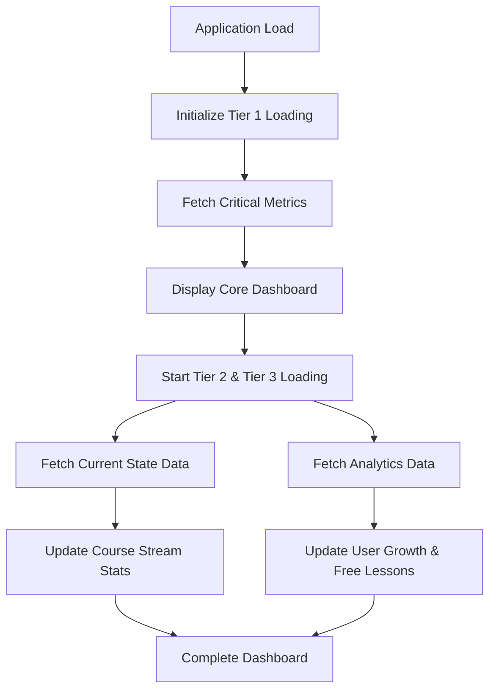
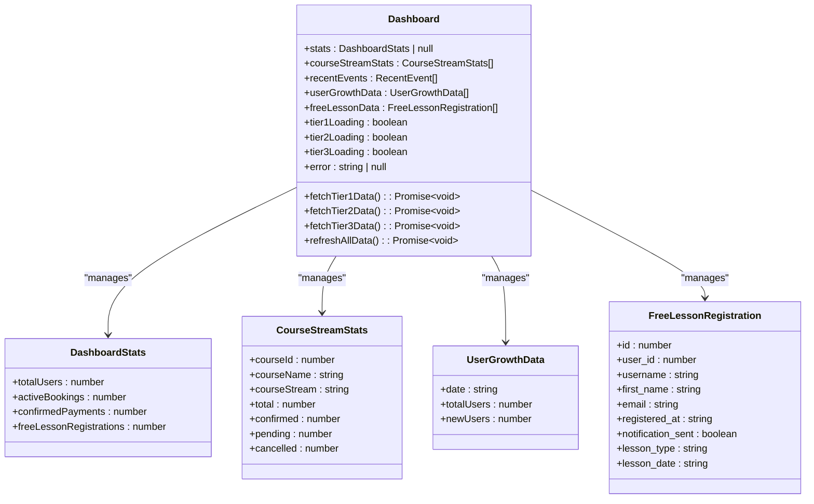
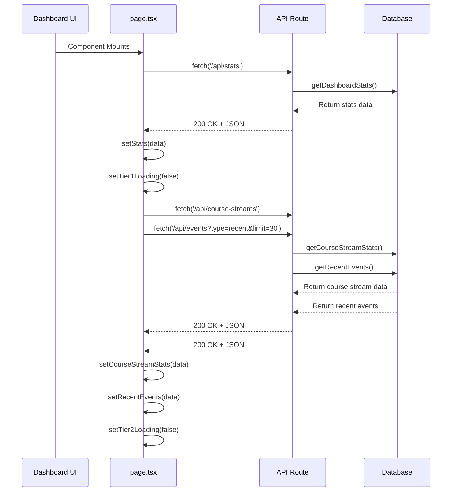
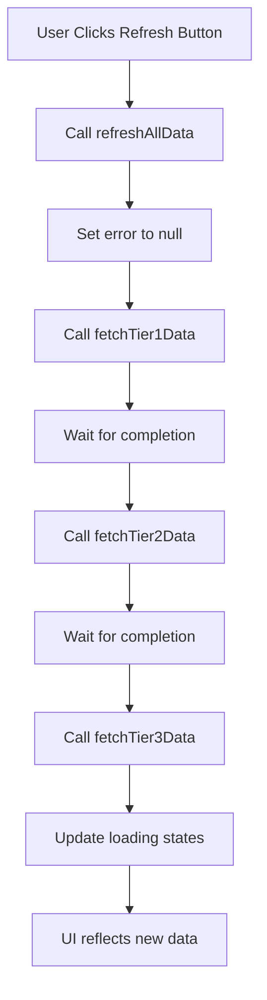
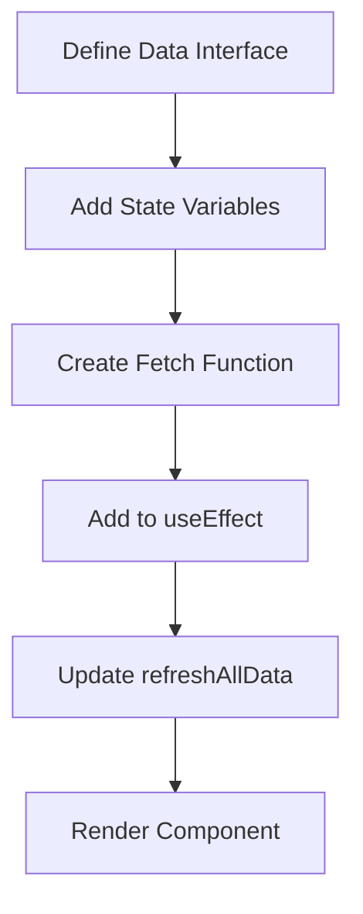

# State Management

<cite>
**Referenced Files in This Document**   
- [page.tsx](file://app/page.tsx)
- [lib/queries.ts](file://lib/queries.ts)
- [api/stats/route.ts](file://app/api/stats/route.ts)
- [api/course-streams/route.ts](file://app/api/course-streams/route.ts)
- [api/user-growth/route.ts](file://app/api/user-growth/route.ts)
- [api/free-lessons/route.ts](file://app/api/free-lessons/route.ts)
- [api/events/route.ts](file://app/api/events/route.ts)
- [components/UserGrowthChart.tsx](file://components/UserGrowthChart.tsx)
- [components/HotLeads.tsx](file://components/HotLeads.tsx)
</cite>

## Table of Contents
1. [Introduction](#introduction)
2. [Tiered Data Loading Strategy](#tiered-data-loading-strategy)
3. [State Management with useState and useEffect](#state-management-with-usestate-and-useeffect)
4. [Data Fetching Pattern](#data-fetching-pattern)
5. [Manual Refresh Functionality](#manual-refresh-functionality)
6. [Loading States and Error Boundaries](#loading-states-and-error-boundaries)
7. [Extending the State Management Pattern](#extending-the-state-management-pattern)
8. [Performance Considerations](#performance-considerations)
9. [Rationale for Client-Side State Management](#rationale-for-client-side-state-management)

## Introduction
The hsl-dashboard application implements a sophisticated client-side state management system focused on performance, user experience, and data prioritization. The core of this system is located in the main dashboard page (page.tsx), which orchestrates the loading of various data types through a tiered approach. This documentation details the state management architecture, explaining how React's useState and useEffect hooks are leveraged to manage different categories of data with varying priorities, how data is fetched from API routes with proper error handling, and how the UI communicates loading states and errors to users.

## Tiered Data Loading Strategy
The dashboard implements a three-tier data loading strategy to prioritize critical information and optimize user experience. This approach ensures that the most important metrics are displayed first, while less critical analytics data loads subsequently.

**Diagram sources**
- [page.tsx](file://app/page.tsx#L45-L150)

### Tier 1: Critical Metrics
Tier 1 contains the most critical dashboard statistics that form the foundation of the user interface. These metrics include total users, active bookings, confirmed payments, and free lesson registrations. This data is essential for the basic functionality of the dashboard and is loaded first to minimize the time to first meaningful paint.

**Section sources**
- [page.tsx](file://app/page.tsx#L20-L23)
- [lib/queries.ts](file://lib/queries.ts#L2-L7)
- [api/stats/route.ts](file://app/api/stats/route.ts)

### Tier 2: Current State Data
Tier 2 includes data that reflects the current state of the application, such as course stream statistics and recent events. This information provides context about ongoing activities and user engagement. Tier 2 data is loaded immediately after Tier 1 with a slight delay to ensure critical metrics are prioritized.

**Section sources**
- [page.tsx](file://app/page.tsx#L25-L30)
- [lib/queries.ts](file://lib/queries.ts#L18-L26)
- [api/course-streams/route.ts](file://app/api/course-streams/route.ts)
- [api/events/route.ts](file://app/api/events/route.ts)

### Tier 3: Analytics Data
Tier 3 comprises analytics and historical data that provides deeper insights but is less time-sensitive. This includes user growth trends and free lesson registration details. This data is loaded in parallel with Tier 2 but represents the final layer of information that completes the comprehensive dashboard view.

**Section sources**
- [page.tsx](file://app/page.tsx#L32-L37)
- [lib/queries.ts](file://lib/queries.ts#L52-L56)
- [api/user-growth/route.ts](file://app/api/user-growth/route.ts)
- [api/free-lessons/route.ts](file://app/api/free-lessons/route.ts)

## State Management with useState and useEffect
The dashboard leverages React's useState and useEffect hooks to manage component state for different data types, implementing a clean separation of concerns and efficient re-rendering.

**Diagram sources**
- [page.tsx](file://app/page.tsx#L14-L39)

### State Initialization
The component initializes separate state variables for each data category and corresponding loading states. This granular approach allows for precise control over the UI and prevents unnecessary re-renders when only specific data changes.

**Section sources**
- [page.tsx](file://app/page.tsx#L20-L39)

### useEffect Hook Implementation
The useEffect hook is used to trigger data loading when the component mounts. It implements the tiered loading strategy by first fetching Tier 1 data immediately, then using a setTimeout to introduce a slight delay before loading Tier 2 and Tier 3 data in parallel.

**Section sources**
- [page.tsx](file://app/page.tsx#L152-L160)

## Data Fetching Pattern
The application uses native fetch with API routes to retrieve data from the backend, implementing proper error handling and response validation.

**Diagram sources**
- [page.tsx](file://app/page.tsx#L45-L150)
- [api/stats/route.ts](file://app/api/stats/route.ts)
- [api/course-streams/route.ts](file://app/api/course-streams/route.ts)
- [api/events/route.ts](file://app/api/events/route.ts)

### Error Handling
Each fetch operation is wrapped in a try-catch block to handle potential errors. The component maintains a single error state that captures the most critical error encountered during data loading, ensuring users are informed of issues while still displaying any successfully loaded data.

**Section sources**
- [page.tsx](file://app/page.tsx#L45-L58)
- [page.tsx](file://app/page.tsx#L75-L85)
- [page.tsx](file://app/page.tsx#L102-L112)

### API Route Integration
The frontend fetches data from API routes that serve as an abstraction layer between the client and database. Each API route imports corresponding query functions from lib/queries.ts, which contain the actual database logic.

**Section sources**
- [api/stats/route.ts](file://app/api/stats/route.ts)
- [api/course-streams/route.ts](file://app/api/course-streams/route.ts)
- [api/user-growth/route.ts](file://app/api/user-growth/route.ts)
- [api/free-lessons/route.ts](file://app/api/free-lessons/route.ts)

## Manual Refresh Functionality
The dashboard provides users with the ability to manually refresh all data through a refresh button in the UI. This functionality is implemented through the refreshAllData function, which sequentially calls the fetch functions for all three tiers.

**Diagram sources**
- [page.tsx](file://app/page.tsx#L142-L150)

The refresh function also manages the loading state across all tiers, disabling the refresh button while data is being loaded and displaying a spinning animation to provide visual feedback.

**Section sources**
- [page.tsx](file://app/page.tsx#L142-L150)

## Loading States and Error Boundaries
The application implements comprehensive loading states and error boundaries to provide a smooth user experience during data retrieval.

### Initial Loading State
When the component first loads and no data is available, a simple loading message is displayed. This state is determined by checking if tier1Loading is true and the stats state is null.

**Section sources**
- [page.tsx](file://app/page.tsx#L162-L168)

### Error State
If an error occurs during data loading, particularly in Tier 1 which is critical for the dashboard, an error message is displayed. The component uses a single error state that captures the most significant error encountered.

**Section sources**
- [page.tsx](file://app/page.tsx#L170-L176)

### Component-Level Loading
For components that depend on specific data, conditional rendering is used to only display them when data is available. This prevents rendering issues when data is still loading.

**Section sources**
- [page.tsx](file://app/page.tsx#L192-L194)
- [page.tsx](file://app/page.tsx#L200-L202)
- [page.tsx](file://app/page.tsx#L214-L216)

## Extending the State Management Pattern
The current state management pattern can be extended to accommodate new data types by following the established conventions.

### Adding a New Data Type
To add a new data type, developers should:

1. Define the interface for the new data type in lib/queries.ts or page.tsx
2. Create a new state variable and loading state using useState
3. Implement a fetch function that retrieves the data from the appropriate API route
4. Add the fetch call to the appropriate tier in the useEffect hook
5. Update the refreshAllData function to include the new fetch operation

**Diagram sources**
- [page.tsx](file://app/page.tsx#L20-L39)

### Example: Adding Course Conversion Data
As an example, adding course conversion data would involve creating a CourseConversionData interface, adding courseConversionData and tier4Loading state variables, implementing a fetchTier4Data function that calls /api/course-conversion, and integrating it into the data loading sequence.

**Section sources**
- [page.tsx](file://app/page.tsx#L20-L39)

## Performance Considerations
The state management implementation addresses several key performance considerations to ensure a responsive user experience.

### Request Batching
Tier 2 and Tier 3 data fetching operations use Promise.all to batch multiple requests, reducing overall latency by allowing parallel execution of independent API calls.

**Section sources**
- [page.tsx](file://app/page.tsx#L75-L85)
- [page.tsx](file://app/page.tsx#L102-L112)

### Loading State Management
Granular loading states (tier1Loading, tier2Loading, tier3Loading) allow the UI to provide specific feedback about which data is currently being loaded, improving perceived performance.

**Section sources**
- [page.tsx](file://app/page.tsx#L23-L24)
- [page.tsx](file://app/page.tsx#L29-L30)
- [page.tsx](file://app/page.tsx#L36-L37)

### Preventing Unnecessary Re-renders
The implementation minimizes unnecessary re-renders through several strategies:
- Using separate state variables for different data types
- Conditional rendering based on data availability
- Avoiding inline function definitions in render methods
- Using React's built-in memoization patterns

**Section sources**
- [page.tsx](file://app/page.tsx#L20-L39)

## Rationale for Client-Side State Management
The application employs client-side state management using React's built-in hooks rather than a global state solution like Redux for several architectural reasons.

### Application Scope and Complexity
The hsl-dashboard is a relatively focused application with state that is primarily localized to the main dashboard component. The data flow is straightforward, moving from API endpoints to component state to UI presentation, without the complex cross-component interactions that would justify a global state management solution.

### Performance Optimization
The tiered loading strategy is tightly coupled to the component lifecycle and rendering process. Implementing this with React's native hooks allows for fine-grained control over when data is fetched and how loading states are managed, resulting in optimal performance.

### Simplicity and Maintainability
Using useState and useEffect keeps the state management logic co-located with the component that uses it, making the code easier to understand and maintain. This approach reduces the cognitive overhead associated with global state management patterns.

### Data Freshness Requirements
The dashboard data has varying freshness requirements, with Tier 1 data being the most time-sensitive. The current implementation allows for precise control over data refresh cycles, including the ability to refresh specific data tiers independently if needed in the future.

### Bundle Size Considerations
By avoiding additional dependencies like Redux, the application maintains a smaller bundle size, which contributes to faster load times and improved performance, particularly on mobile devices or slower connections.