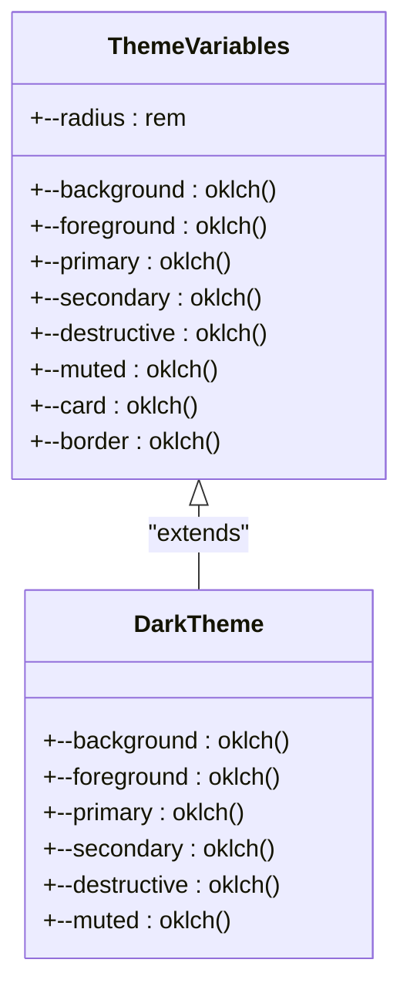
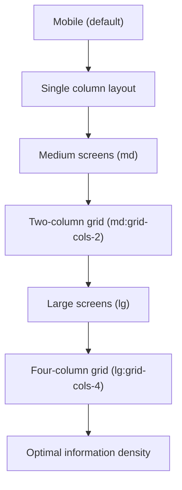
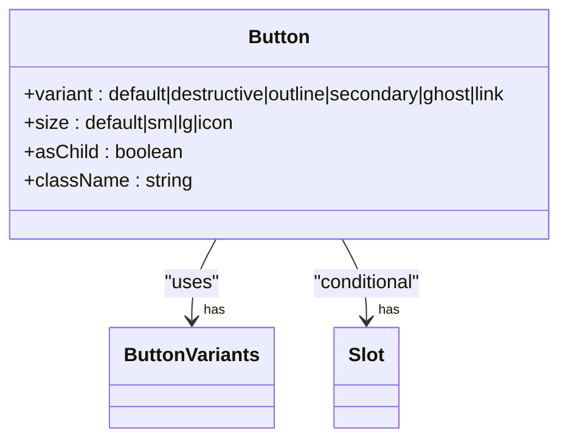
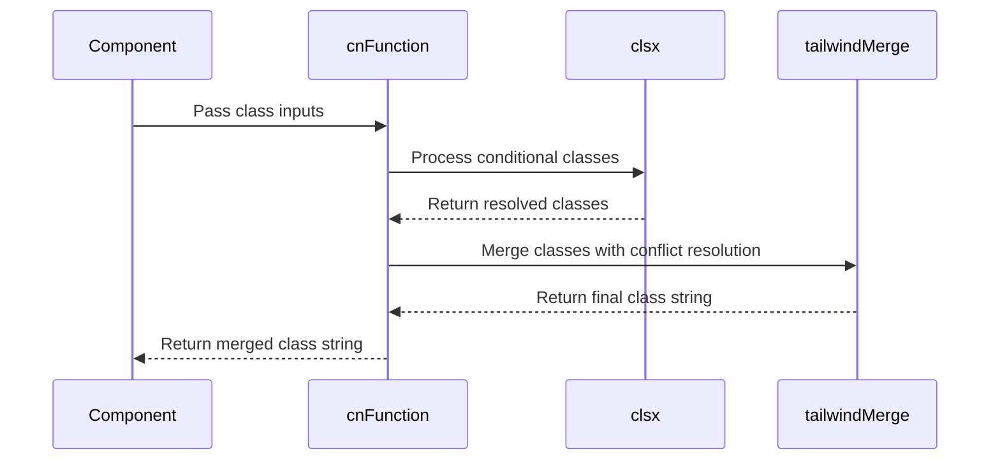

# Styling Strategy

<cite>
**Referenced Files in This Document**   
- [globals.css](file://app/globals.css)
- [utils.ts](file://lib/utils.ts)
- [button.tsx](file://components/ui/button.tsx)
- [card.tsx](file://components/ui/card.tsx)
- [table.tsx](file://components/ui/table.tsx)
- [page.tsx](file://app/page.tsx)
- [MetricCard.tsx](file://components/MetricCard.tsx)
- [Navigation.tsx](file://components/Navigation.tsx)
</cite>

## Table of Contents
1. [Introduction](#introduction)
2. [Tailwind CSS v4 Implementation](#tailwind-css-v4-implementation)
3. [CSS Variables and Theming](#css-variables-and-theming)
4. [Utility-First Class Patterns](#utility-first-class-patterns)
5. [Responsive Design Strategy](#responsive-design-strategy)
6. [Component Styling Patterns](#component-styling-patterns)
7. [Conditional Class Composition](#conditional-class-composition)
8. [Accessibility and Interaction States](#accessibility-and-interaction-states)
9. [Design System Consistency](#design-system-consistency)
10. [Best Practices for New Components](#best-practices-for-new-components)

## Introduction
The hsl-dashboard implements a modern styling strategy centered around Tailwind CSS v4 with a utility-first approach. This documentation details the architecture of the styling system, focusing on how utility classes, CSS variables, and responsive design patterns work together to create a consistent and maintainable user interface. The system leverages Tailwind's capabilities while extending them with custom utilities and design patterns that ensure visual consistency across the dashboard's components.

**Section sources**
- [globals.css](file://app/globals.css#L1-L122)
- [utils.ts](file://lib/utils.ts#L1-L7)

## Tailwind CSS v4 Implementation
The dashboard utilizes Tailwind CSS v4 as its primary styling framework, configured through the PostCSS configuration and integrated into the Next.js application. The implementation follows a utility-first methodology where styles are applied directly through class names rather than custom CSS rules. This approach enables rapid development and ensures consistency by limiting the available design tokens to those defined in the Tailwind configuration.

The Tailwind framework is imported directly in the `globals.css` file, establishing the foundation for all styling across the application. This global import ensures that all utility classes are available throughout the component tree without requiring individual imports in each component file.

**Section sources**
- [globals.css](file://app/globals.css#L1-L2)
- [postcss.config.mjs](file://postcss.config.mjs#L1-L4)
- [package.json](file://package.json#L40-L41)

## CSS Variables and Theming
The styling system implements a comprehensive theming approach using CSS variables defined in the `:root` selector within `globals.css`. These variables establish a design system with consistent color palettes, typography, and spacing that can be easily maintained and updated. The theme includes light and dark mode variants, with the dark mode styles defined in the `.dark` class.

The color system uses the OKLCH color space for precise color definition, providing a perceptually uniform color representation that ensures consistent visual appearance across different devices. Key color roles are defined with semantic names such as `--primary`, `--secondary`, `--destructive`, and `--muted`, allowing components to reference these colors without hardcoding specific values.

**Diagram sources**
- [globals.css](file://app/globals.css#L30-L122)

**Section sources**
- [globals.css](file://app/globals.css#L30-L122)

## Utility-First Class Patterns
The application strictly follows the utility-first paradigm, where components are styled using Tailwind's atomic classes rather than custom CSS. This approach eliminates the need for component-specific stylesheets and ensures that all visual properties adhere to the predefined design system.

Key utility patterns include spacing (using `p-`, `m-`, `gap-` classes), typography (using `text-`, `font-` classes), layout (using `flex`, `grid`, `container` classes), and visual effects (using `shadow-`, `rounded-`, `border-` classes). The utility-first approach enables rapid iteration and reduces the cognitive load of managing CSS, as developers can focus on the available design tokens rather than creating new visual styles.

**Section sources**
- [page.tsx](file://app/page.tsx#L1-L269)
- [MetricCard.tsx](file://components/MetricCard.tsx#L1-L48)

## Responsive Design Strategy
The dashboard implements a responsive grid layout system using Tailwind's responsive prefixes to adapt the interface to different screen sizes. The primary layout pattern uses a responsive grid with `md:grid-cols-2` and `lg:grid-cols-4` classes, creating a flexible card-based interface that reorganizes based on available screen width.

The responsive strategy follows a mobile-first approach, with base styles applying to all screen sizes and progressively enhanced styles for larger viewports. This ensures optimal usability on mobile devices while taking advantage of additional screen real estate on desktop displays. The responsive breakpoints are defined by Tailwind's default configuration, with `md` representing medium screens (≥768px) and `lg` representing large screens (≥1024px).

**Diagram sources**
- [page.tsx](file://app/page.tsx#L158-L159)

**Section sources**
- [page.tsx](file://app/page.tsx#L158-L159)

## Component Styling Patterns
UI components in the dashboard follow consistent styling patterns that leverage Tailwind's utility classes while maintaining component-specific visual identities. Key components such as buttons, cards, and tables implement standardized designs that ensure visual consistency across the application.

### Button Component
The button component uses Tailwind's utility classes to define various visual states and variants. It implements hover, focus, and disabled states with appropriate visual feedback, ensuring accessibility and usability. The component supports multiple variants (default, destructive, outline, secondary, ghost, link) and sizes (default, sm, lg, icon), each with consistent styling applied through utility classes.

**Diagram sources**
- [button.tsx](file://components/ui/button.tsx#L1-L60)

**Section sources**
- [button.tsx](file://components/ui/button.tsx#L1-L60)

### Card Component
The card component implements a standardized container style with header, title, description, content, and footer sections. Each part of the card uses consistent spacing, typography, and border styling defined through utility classes. The card serves as a foundational container for various dashboard elements, providing visual hierarchy and separation of content.

**Section sources**
- [card.tsx](file://components/ui/card.tsx#L1-L56)

### Table Component
The table component implements responsive table styling with proper spacing, typography, and interactive states. It uses utility classes to ensure proper alignment, padding, and visual hierarchy within table cells. The component includes specialized styles for headers, rows, and cells, with hover states for better user interaction.

**Section sources**
- [table.tsx](file://components/ui/table.tsx#L1-L115)

## Conditional Class Composition
The styling system implements a robust solution for conditional class composition through the `cn` utility function defined in `utils.ts`. This function combines `clsx` for conditional class evaluation with `tailwind-merge` for proper class merging, ensuring that conflicting Tailwind classes are resolved correctly (with the last class taking precedence).

The `cn` function is essential for handling dynamic styling requirements where classes need to be conditionally applied based on component props or state. It enables clean, readable code for complex class compositions while preventing class conflicts that could occur when multiple utility classes target the same CSS property.

**Diagram sources**
- [utils.ts](file://lib/utils.ts#L3-L5)

**Section sources**
- [utils.ts](file://lib/utils.ts#L3-L5)

## Accessibility and Interaction States
The styling system prioritizes accessibility by implementing proper visual feedback for various interaction states. Components include focused styles with visible focus rings that meet WCAG contrast requirements, ensuring keyboard navigability. The focus styles use the `ring-ring/50` utility to create a semi-transparent ring around interactive elements.

Hover states are implemented consistently across interactive components, providing visual feedback that an element is clickable or interactive. Disabled states reduce opacity to 50% using the `disabled:opacity-50` class, clearly indicating non-interactive elements. The system also includes specific styling for invalid states, using the `aria-invalid` attribute with corresponding visual indicators in red tones.

**Section sources**
- [button.tsx](file://components/ui/button.tsx#L15-L20)
- [Navigation.tsx](file://components/Navigation.tsx#L38-L48)

## Design System Consistency
The dashboard maintains visual consistency through strict adherence to the defined design system. Spacing follows a consistent scale using Tailwind's spacing units (ranging from 0.5 to 16), ensuring harmonious layout relationships. Typography uses a limited set of font sizes and weights defined in the Tailwind configuration, creating a clear visual hierarchy.

Color usage is strictly controlled through the CSS variables, preventing the introduction of arbitrary colors that could disrupt the visual harmony. The system enforces the use of semantic color names rather than direct color values, making it easier to maintain consistency and update the color palette globally when needed.

**Section sources**
- [globals.css](file://app/globals.css#L30-L122)
- [page.tsx](file://app/page.tsx#L1-L269)

## Best Practices for New Components
When creating new components, developers should follow established patterns to maintain consistency with the existing design system:

1. **Use utility classes exclusively** - Avoid creating custom CSS and rely on Tailwind's utility classes
2. **Leverage existing components** - Extend or compose existing UI components rather than creating duplicates
3. **Follow responsive patterns** - Implement mobile-first responsive design using Tailwind's breakpoint prefixes
4. **Use the cn utility** - Compose classes using the `cn` function for conditional styling
5. **Adhere to color semantics** - Use CSS variables for colors rather than hardcoded values
6. **Maintain spacing consistency** - Use Tailwind's spacing scale (px-4, py-2, gap-6, etc.) for consistent layout
7. **Implement proper accessibility** - Include focus states and ensure sufficient color contrast

By following these practices, new components will integrate seamlessly with the existing dashboard interface, maintaining the visual and functional consistency that users expect.

**Section sources**
- [button.tsx](file://components/ui/button.tsx#L1-L60)
- [card.tsx](file://components/ui/card.tsx#L1-L56)
- [utils.ts](file://lib/utils.ts#L3-L5)