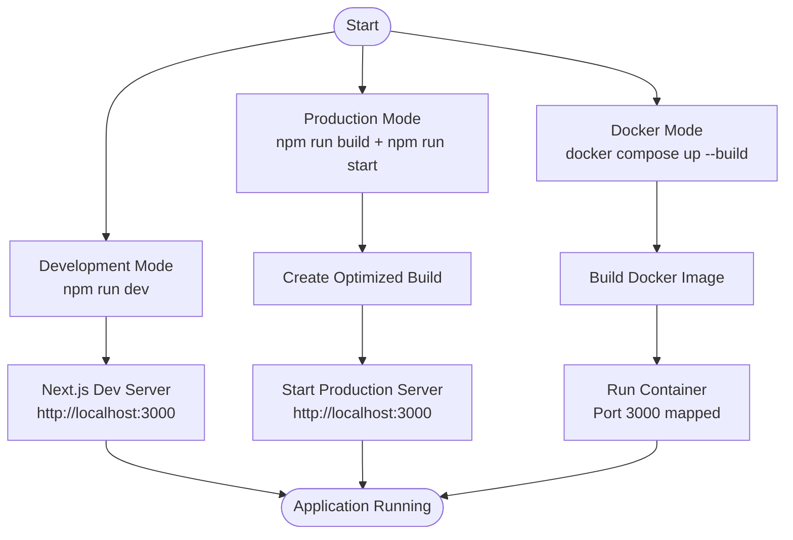
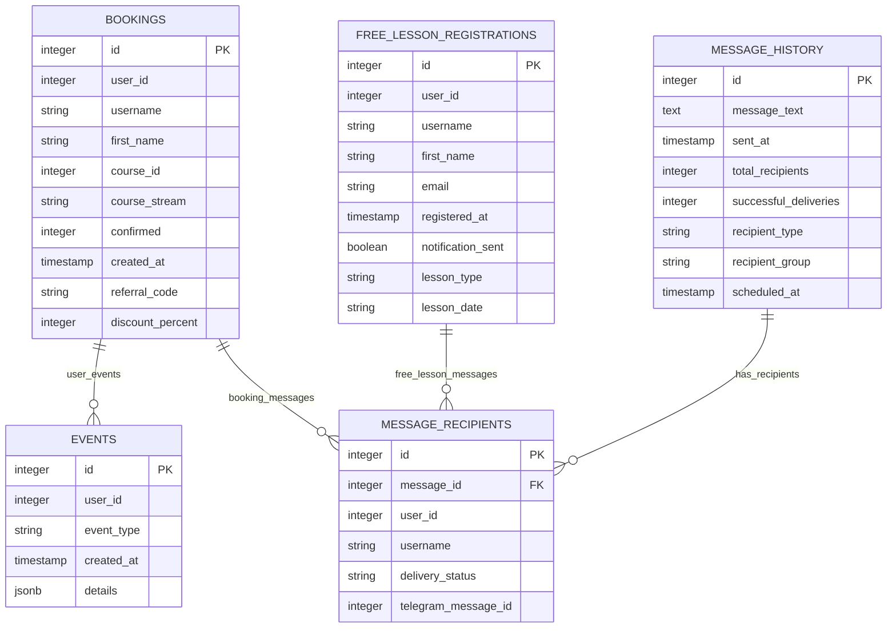
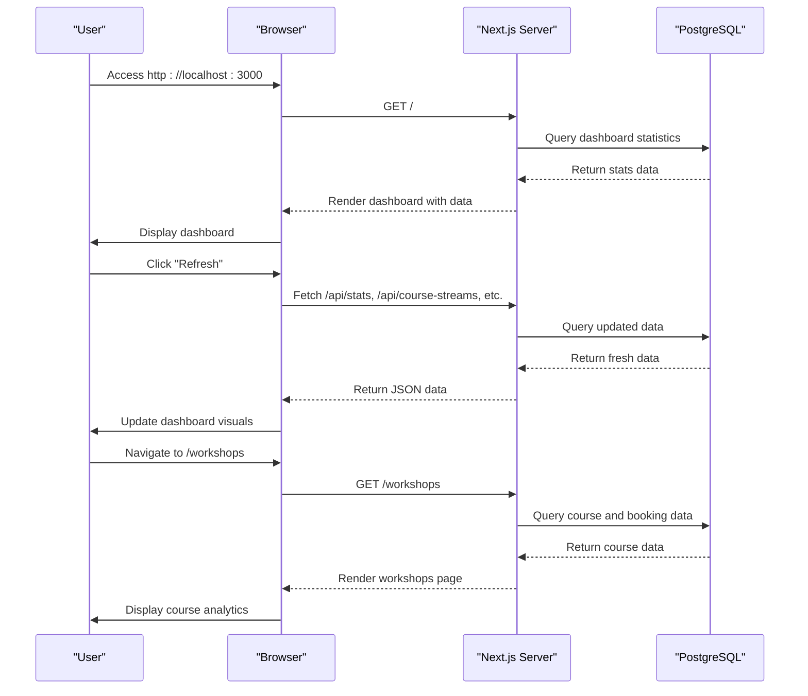

# Getting Started

<cite>
**Referenced Files in This Document**   
- [README.md](file://README.md)
- [package.json](file://package.json)
- [docker-compose.yml](file://docker-compose.yml)
- [Dockerfile](file://Dockerfile)
- [lib/db.ts](file://lib/db.ts)
- [lib/init.ts](file://lib/init.ts)
- [lib/queries.ts](file://lib/queries.ts)
- [lib/messageScheduler.ts](file://lib/messageScheduler.ts)
- [app/api/db-migrate/route.ts](file://app/api/db-migrate/route.ts)
- [app/api/db-schema/route.ts](file://app/api/db-schema/route.ts)
- [app/api/test-db/route.ts](file://app/api/test-db/route.ts)
- [app/page.tsx](file://app/page.tsx)
- [app/workshops/page.tsx](file://app/workshops/page.tsx)
</cite>

## Table of Contents
1. [Introduction](#introduction)
2. [Prerequisites](#prerequisites)
3. [Development Environment Setup](#development-environment-setup)
4. [Environment Configuration](#environment-configuration)
5. [Running the Application](#running-the-application)
6. [Database Setup and Management](#database-setup-and-management)
7. [API Endpoints](#api-endpoints)
8. [Quick Start Example](#quick-start-example)
9. [Troubleshooting Common Issues](#troubleshooting-common-issues)
10. [Conclusion](#conclusion)

## Introduction

The HSL Dashboard is a comprehensive analytics platform designed to visualize user interactions with a Telegram bot, track course registrations, monitor free lesson sign-ups, and analyze user growth patterns. Built with modern web technologies including Next.js 15, React 19, TypeScript 5, and PostgreSQL, the dashboard provides real-time insights into user engagement and conversion metrics. The application features multiple data visualization components, including charts for user growth trends, registration analytics, and course stream statistics. This guide provides comprehensive instructions for setting up and running the HSL Dashboard in both development and production environments.

**Section sources**
- [README.md](file://README.md#L1-L170)

## Prerequisites

Before setting up the HSL Dashboard, ensure your system meets the following requirements. The application requires Node.js version 20 or higher, as specified in the Docker configuration using the `node:20-alpine` base image. PostgreSQL version 10 or higher is required for database operations, with support for advanced SQL features used in the analytics queries. Docker and Docker Compose are optional but recommended for containerized deployment, with version 20.10.0+ for Docker and version 1.29.0+ for Docker Compose. For development purposes, a text editor or IDE with TypeScript support is recommended to leverage the full benefits of the type system. Additionally, access to a Telegram bot token is required for message scheduling functionality, and appropriate database credentials must be available for connecting to the PostgreSQL instance.

**Section sources**
- [Dockerfile](file://Dockerfile#L1-L29)
- [package.json](file://package.json#L1-L45)

## Development Environment Setup

To set up the development environment for the HSL Dashboard, begin by installing the required dependencies using npm. Execute the command `npm install` in the project root directory to install all dependencies specified in the package.json file, including Next.js 15, React 19, TypeScript 5, and various UI components from Radix UI. The application uses Tailwind CSS 4 for styling, Recharts 3.1 for data visualization, and Prisma ORM for database interactions. After installing dependencies, verify that Node.js version 20 is installed by running `node --version`. The development server can be started using the `npm run dev` command, which launches Next.js in development mode with hot reloading enabled. The application will be accessible at http://localhost:3000. For developers preferring containerized environments, Docker can be used to create a consistent development setup across different machines.

**Section sources**
- [README.md](file://README.md#L25-L35)
- [package.json](file://package.json#L6-L10)

## Environment Configuration

Configure the application environment by creating a `.env.local` file in the project root directory with the required database connection parameters. The essential environment variables include `POSTGRES_HOST`, `POSTGRES_PORT`, `POSTGRES_DB`, `POSTGRES_USER`, and `POSTGRES_PASSWORD` for database connectivity. For Telegram integration, set the `BOT_TOKEN` environment variable with your Telegram bot token and configure `TELEGRAM_WEBHOOK_SECRET` for webhook security. The application also supports optional configuration through `SKIP_APP_INIT` to disable background service initialization during build processes. When using Docker, these environment variables can be specified in a `.env` file that is automatically loaded by docker-compose.yml. The database connection is managed through the `lib/db.ts` module, which validates the presence of required environment variables and creates a connection pool using the pg library with SSL configuration for secure connections.

**Section sources**
- [README.md](file://README.md#L37-L50)
- [lib/db.ts](file://lib/db.ts#L1-L53)

## Running the Application

The HSL Dashboard can be run in both development and production modes using different npm scripts. For development, use `npm run dev` to start the Next.js development server with hot reloading and error reporting. This mode is optimized for rapid development and provides detailed error messages in the browser and console. For production deployment, first build the application using `npm run build`, which creates an optimized production build with code splitting and minification. After building, start the production server with `npm run start`, which runs the application in production mode using the Next.js server. Alternatively, the application can be containerized using Docker with the provided Dockerfile and docker-compose.yml files. To run with Docker Compose, execute `docker compose up --build`, which builds the image and starts the containerized application on port 3000. The Docker configuration uses multi-stage builds to optimize image size and includes proper environment variable handling.

**Diagram sources**
- [package.json](file://package.json#L6-L10)
- [Dockerfile](file://Dockerfile#L1-L29)
- [docker-compose.yml](file://docker-compose.yml#L1-L14)

**Section sources**
- [README.md](file://README.md#L52-L65)
- [package.json](file://package.json#L6-L10)
- [Dockerfile](file://Dockerfile#L1-L29)
- [docker-compose.yml](file://docker-compose.yml#L1-L14)

## Database Setup and Management

The HSL Dashboard relies on PostgreSQL for data storage and analytics, with a schema designed to track user interactions, course bookings, and messaging activities. Database initialization is handled through the `lib/db.ts` module, which establishes a connection pool using environment variables for configuration. The application provides API endpoints for database management, including `/api/test-db` for connection testing and `/api/db-schema` for retrieving the current database schema. Schema migrations can be performed using the `/api/db-migrate` endpoint, which accepts POST requests with SQL statements and executes them within a transaction. The database schema includes tables for bookings, events, free lesson registrations, message history, and message recipients, with appropriate indexes for query performance. For development purposes, the test-db endpoint can be accessed at http://localhost:3000/api/test-db to verify database connectivity and retrieve database version information.

**Diagram sources**
- [lib/db.ts](file://lib/db.ts#L1-L53)
- [lib/queries.ts](file://lib/queries.ts#L1-L799)
- [app/api/db-migrate/route.ts](file://app/api/db-migrate/route.ts#L1-L55)
- [app/api/db-schema/route.ts](file://app/api/db-schema/route.ts#L1-L71)
- [app/api/test-db/route.ts](file://app/api/test-db/route.ts#L1-L23)

**Section sources**
- [lib/db.ts](file://lib/db.ts#L1-L53)
- [lib/queries.ts](file://lib/queries.ts#L1-L799)
- [app/api/db-migrate/route.ts](file://app/api/db-migrate/route.ts#L1-L55)
- [app/api/db-schema/route.ts](file://app/api/db-schema/route.ts#L1-L71)
- [app/api/test-db/route.ts](file://app/api/test-db/route.ts#L1-L23)

## API Endpoints

The HSL Dashboard exposes a comprehensive set of API endpoints for retrieving analytics data and managing application functionality. The primary endpoints include `/api/stats` for overall dashboard statistics, `/api/courses` for course-specific metrics, `/api/course-streams` for stream-level course analytics, and `/api/events` for user interaction events. Additional endpoints provide data for free lesson registrations (`/api/free-lessons`), user growth trends (`/api/user-growth`), and booking details (`/api/bookings`). The application also includes management endpoints such as `/api/test-db` for database connectivity testing, `/api/db-schema` for retrieving database schema information, and `/api/db-migrate` for executing database migrations. Message-related functionality is exposed through endpoints like `/api/messages/send` for sending messages and `/api/messages/history` for retrieving message history. All API routes are implemented as Next.js API routes in the `app/api` directory and return JSON responses with appropriate error handling.

**Section sources**
- [README.md](file://README.md#L125-L135)
- [app/api](file://app/api)

## Quick Start Example

To quickly get started with the HSL Dashboard, follow these steps to launch the application and access key features. First, ensure Node.js and npm are installed, then run `npm install` to install dependencies. Create a `.env.local` file with your database connection details and any required API keys. Start the development server with `npm run dev` and navigate to http://localhost:3000 in your browser. The main dashboard displays key metrics including total users, active bookings, confirmed payments, and free lesson registrations. Use the refresh button to update data from the database. Navigate to the workshops page at `/workshops` to view detailed course statistics and booking information. The analytics page at `/analytics` provides user growth charts and registration trend data. For testing database connectivity, visit http://localhost:3000/api/test-db to verify the connection is working properly.

**Diagram sources**
- [app/page.tsx](file://app/page.tsx#L1-L269)
- [app/workshops/page.tsx](file://app/workshops/page.tsx#L1-L244)
- [lib/queries.ts](file://lib/queries.ts#L1-L799)

**Section sources**
- [app/page.tsx](file://app/page.tsx#L1-L269)
- [app/workshops/page.tsx](file://app/workshops/page.tsx#L1-L244)

## Troubleshooting Common Issues

When setting up the HSL Dashboard, several common issues may arise that can prevent successful operation. Database connection errors typically occur when environment variables are missing or incorrect; verify that `POSTGRES_HOST`, `POSTGRES_PASSWORD`, and other database credentials are properly set in the `.env.local` file. If encountering module installation issues, delete the `node_modules` directory and `package-lock.json` file, then run `npm install` again. For Docker-related problems, ensure Docker Desktop is running and that sufficient resources are allocated to the Docker daemon. If the application fails to start, check that Node.js version 20 is installed, as specified in the Dockerfile. When API endpoints return errors, verify database connectivity by accessing the `/api/test-db` endpoint. For issues with message scheduling, ensure the `BOT_TOKEN` environment variable is set and that the Telegram bot has the necessary permissions. Application initialization can be skipped by setting `SKIP_APP_INIT=1`, which is useful for build processes that don't require background services.

**Section sources**
- [lib/db.ts](file://lib/db.ts#L1-L53)
- [lib/init.ts](file://lib/init.ts#L1-L47)
- [lib/messageScheduler.ts](file://lib/messageScheduler.ts#L1-L281)
- [README.md](file://README.md#L145-L155)

## Conclusion

The HSL Dashboard provides a comprehensive solution for visualizing and analyzing user interactions with a Telegram bot, offering valuable insights into course registrations, free lesson sign-ups, and user engagement patterns. With its modern tech stack featuring Next.js 15, React 19, and TypeScript 5, the application delivers a responsive and intuitive user interface for data exploration. The setup process is streamlined through comprehensive documentation and support for both direct execution and containerized deployment via Docker. By following the steps outlined in this guide, developers can quickly configure the development environment, establish database connections, and begin exploring the dashboard's analytics capabilities. The application's modular architecture and well-defined API endpoints make it extensible for additional features and integrations, providing a solid foundation for future enhancements.