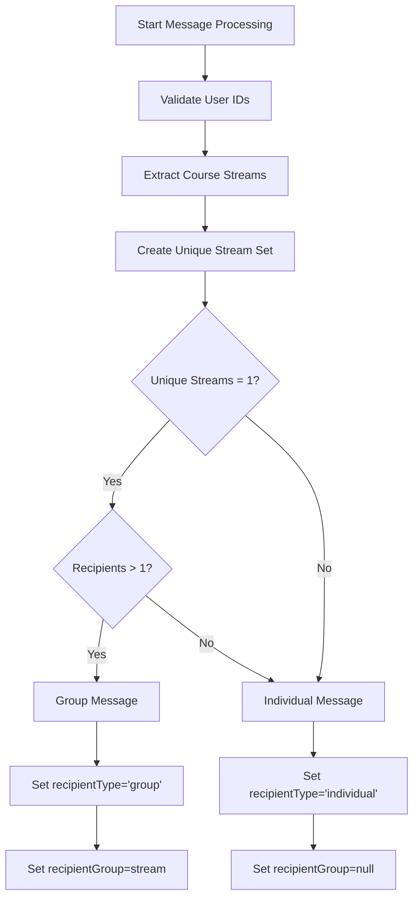
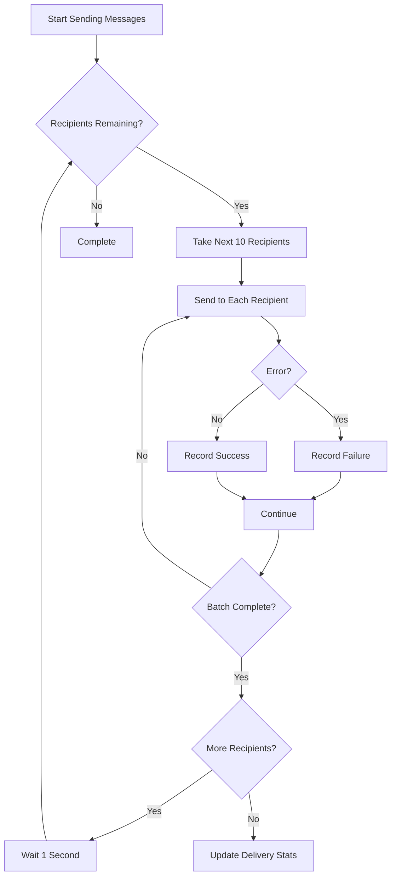

# Group Messaging

<cite>
**Referenced Files in This Document**   
- [app/api/messages/send/route.ts](file://app/api/messages/send/route.ts)
- [app/messages/send/page.tsx](file://app/messages/send/page.tsx)
- [lib/queries.ts](file://lib/queries.ts)
- [lib/messageScheduler.ts](file://lib/messageScheduler.ts)
- [DATABASE_MIGRATION_LOG.md](file://DATABASE_MIGRATION_LOG.md)
</cite>

## Table of Contents
1. [Introduction](#introduction)
2. [Frontend User Selection Interface](#frontend-user-selection-interface)
3. [Group Message Detection Logic](#group-message-detection-logic)
4. [Message History and Database Storage](#message-history-and-database-storage)
5. [Batch Processing and Rate Limiting](#batch-processing-and-rate-limiting)
6. [Error Handling and Troubleshooting](#error-handling-and-troubleshooting)
7. [Integration with User Data Models](#integration-with-user-data-models)

## Introduction
The hsl-dashboard provides administrators with a robust group messaging functionality that enables broadcasting messages to all users within a specific course stream. This system integrates frontend user interface components with backend API routes to facilitate efficient message delivery while respecting Telegram's rate limits. The messaging system supports both immediate and scheduled message sending, with comprehensive tracking of delivery status and recipient information. The implementation includes validation, error handling, and audit logging to ensure reliable operation at scale.

## Frontend User Selection Interface
Administrators can select users for group messaging through the frontend interface located at `/app/messages/send/page.tsx`. The interface provides multiple methods for recipient selection, including searching by username or name, selecting all non-course users, or choosing users from specific course streams (3rd_stream, 4th_stream, or 5th_stream). When a stream is selected, the frontend calls the `/api/users/by-stream?stream={stream}` API endpoint to retrieve users belonging to that stream. The selected users are stored in the component's state and displayed as badges for visual confirmation. The interface also supports message scheduling, media attachments, and inline buttons, with appropriate validation to prevent invalid inputs.

**Section sources**
- [app/messages/send/page.tsx](file://app/messages/send/page.tsx#L52-L1004)

## Group Message Detection Logic
The API route at `/app/api/messages/send/route.ts` contains logic to automatically detect whether a message should be classified as a group message based on recipient uniformity. After validating the user IDs against the database, the system analyzes the `course_stream` property of all recipients. It creates a set of unique streams from the validated recipients using `new Set(validatedRecipients.map(user => user.course_stream).filter(Boolean))`. A message is classified as a group message when two conditions are met: there is exactly one unique stream among all recipients (`uniqueStreams.length === 1`) and there are multiple recipients (`validatedRecipients.length > 1`). This detection logic ensures that only messages sent to all users within a single course stream are categorized as group messages.



**Diagram sources **
- [app/api/messages/send/route.ts](file://app/api/messages/send/route.ts#L127-L161)

**Section sources**
- [app/api/messages/send/route.ts](file://app/api/messages/send/route.ts#L127-L161)

## Message History and Database Storage
The system records message history with detailed metadata in the database. When a message is sent, the `createMessageHistory` function in `/lib/queries.ts` creates a record in the `message_history` table with the `recipient_type` field set to 'group' for group messages and 'individual' for single recipient messages. For group messages, the `recipientGroup` field stores the course stream identifier (e.g., '3rd_stream'). The `addMessageRecipients` function then creates individual records in the `message_recipients` table for each recipient, linking them to the message history record via the `message_id` foreign key. These tables were created as part of the database migration documented in `DATABASE_MIGRATION_LOG.md` and include appropriate indexes for performance optimization.

```mermaid
erDiagram
message_history {
id SERIAL PK
message_text TEXT NOT NULL
total_recipients INTEGER NOT NULL
successful_deliveries INTEGER
sent_at TIMESTAMP WITH TIME ZONE
created_at TIMESTAMP WITH TIME ZONE
recipient_type ENUM
recipient_group VARCHAR
scheduled_at TIMESTAMP WITH TIME ZONE
}
message_recipients {
id SERIAL PK
message_id INTEGER FK
user_id BIGINT
username TEXT
delivery_status TEXT
created_at TIMESTAMP WITH TIME ZONE
telegram_message_id INTEGER
}
message_history ||--o{ message_recipients : "1 to many"
```

**Diagram sources **
- [lib/queries.ts](file://lib/queries.ts#L674-L708)
- [DATABASE_MIGRATION_LOG.md](file://DATABASE_MIGRATION_LOG.md#L0-L31)

**Section sources**
- [lib/queries.ts](file://lib/queries.ts#L674-L708)
- [DATABASE_MIGRATION_LOG.md](file://DATABASE_MIGRATION_LOG.md#L0-L31)

## Batch Processing and Rate Limiting
To respect Telegram's rate limits and ensure reliable message delivery at scale, the system implements a batch processing mechanism. Messages are sent in batches of 10 recipients, with a 1-second delay between batches. This is implemented in the `POST` handler of `/app/api/messages/send/route.ts` using a for-loop with a step size of 10 and a `setTimeout` promise to create the delay. The batch size of 10 is chosen to stay well within Telegram's documented rate limits while maintaining reasonable delivery speed. For scheduled messages, the `messageScheduler.ts` service processes messages every minute, applying the same batch processing logic to ensure consistent behavior regardless of whether messages are sent immediately or scheduled.



**Diagram sources **
- [app/api/messages/send/route.ts](file://app/api/messages/send/route.ts#L280-L350)
- [lib/messageScheduler.ts](file://lib/messageScheduler.ts#L191-L230)

**Section sources**
- [app/api/messages/send/route.ts](file://app/api/messages/send/route.ts#L280-L350)
- [lib/messageScheduler.ts](file://lib/messageScheduler.ts#L191-L230)

## Error Handling and Troubleshooting
The system provides comprehensive error handling for partial delivery failures. When sending messages, each recipient is processed individually, and any failures are captured in an errors array that includes the user ID and error description. Common errors include "User blocked bot" (Telegram error 403) and "Invalid user or message" (Telegram error 400). The response payload includes a summary of sent and failed counts, along with detailed error information when failures occur. This allows administrators to identify and address delivery issues. The system also validates inputs before processing, returning appropriate error responses for invalid data such as missing recipients, empty messages, or future scheduling requirements.

**Section sources**
- [app/api/messages/send/route.ts](file://app/api/messages/send/route.ts#L300-L350)

## Integration with User Data Models
The group messaging functionality integrates closely with user data models and course stream tracking. The `TelegramUser` interface defined in `/lib/queries.ts` includes the `course_stream` property, which is essential for group message detection. User data is retrieved from multiple sources including bookings, free lesson registrations, and events tables, with the most complete information taking precedence through SQL JOIN operations. The system maintains consistency by using the same user data model across frontend and backend components, ensuring that course stream information is accurately reflected in the messaging interface. This integration allows administrators to leverage existing user data for targeted messaging without requiring additional data entry.

**Section sources**
- [lib/queries.ts](file://lib/queries.ts#L76-L81)
- [lib/messageScheduler.ts](file://lib/messageScheduler.ts#L151-L184)