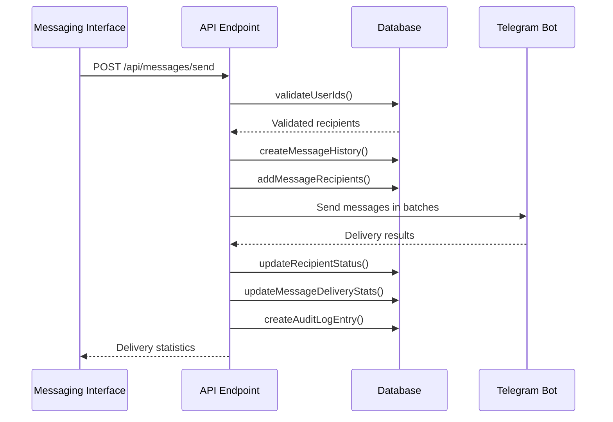
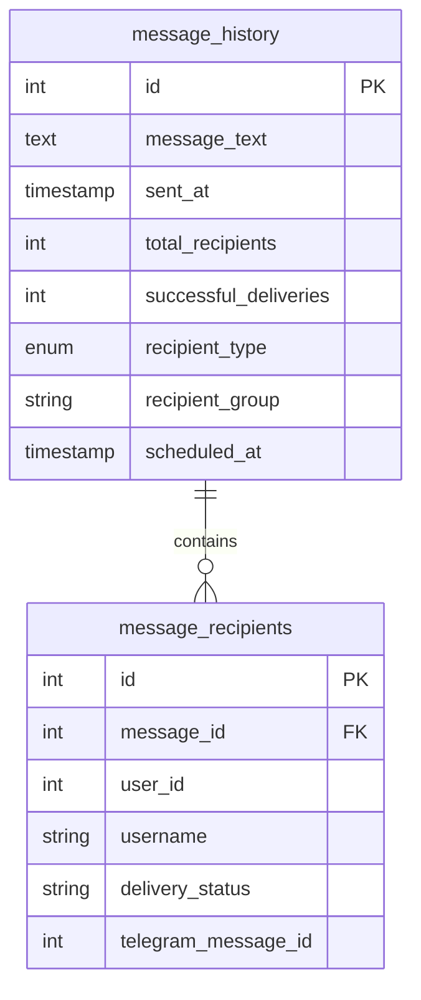

# Individual Messaging

<cite>
**Referenced Files in This Document**   
- [page.tsx](file://app/messages/send/page.tsx)
- [route.ts](file://app/api/messages/send/route.ts)
- [queries.ts](file://lib/queries.ts)
- [userCache.ts](file://lib/userCache.ts)
</cite>

## Table of Contents
1. [Introduction](#introduction)
2. [Recipient Selection](#recipient-selection)
3. [Message Composition](#message-composition)
4. [Message Sending Flow](#message-sending-flow)
5. [Validation and Error Handling](#validation-and-error-handling)
6. [Delivery Status Tracking](#delivery-status-tracking)
7. [Audit Logging](#audit-logging)
8. [Performance Considerations](#performance-considerations)
9. [Practical Examples](#practical-examples)

## Introduction
The Individual Messaging feature in hsl-dashboard enables administrators to send personalized messages to specific Telegram users through a dedicated messaging interface. This functionality allows for direct communication with users through text, video, or document messages, with support for inline buttons and message scheduling. The system integrates with the Telegram Bot API to deliver messages and tracks delivery status through database records. The messaging workflow spans from the frontend interface in `messages/send/page.tsx` to the backend API endpoint at `messages/send/route.ts`, with comprehensive validation, error handling, and audit logging throughout the process.

## Recipient Selection
The messaging interface provides multiple methods for selecting recipients. Users can search for specific Telegram users by username or first name using the search functionality, which queries the user database through the `/api/users/search` endpoint. The search is powered by a cached user index that enables fast lookups based on username and first name prefixes. Additionally, administrators can select entire user groups by choosing specific course streams (3rd_stream, 4th_stream, 5th_stream) or select all users who are not enrolled in courses. Selected recipients are stored in the component state and persist across sessions through localStorage. The system prevents duplicate selections by checking user_id before adding a user to the recipient list.

**Section sources**
- [page.tsx](file://app/messages/send/page.tsx#L52-L1004)
- [userCache.ts](file://lib/userCache.ts#L1-L214)

## Message Composition
Users can compose messages in three formats: text, video, or document. For text messages, the interface provides a textarea with HTML formatting support and a character counter showing the current length against the 4096-character limit. For media messages, users must provide a Telegram file_id for either a video or document, with a caption limit of 1024 characters. The interface includes a toggle to schedule message delivery for a future date and time, though this feature is disabled for media messages. Inline buttons can be added to messages with customizable text, URLs or callback_data, and row positioning. The message composition state is automatically saved to localStorage as a draft, allowing users to return to incomplete messages later.

**Section sources**
- [page.tsx](file://app/messages/send/page.tsx#L52-L1004)

## Message Sending Flow
The message sending process follows a structured flow from frontend to backend. When the user clicks send, the frontend validates the message and recipient selection, then constructs a request body containing the recipients, message content, and any inline buttons. This data is sent via a POST request to the `/api/messages/send` API endpoint. The backend processes the request by validating user IDs against the database, creating a message history record, and adding recipient records. If the message is scheduled, it is stored with a future timestamp and processed by the message scheduler service. For immediate delivery, the system uses the Telegram Bot API to send messages in batches of 10 with 1-second delays between batches to respect rate limits. The delivery results are recorded in the database, and a response is returned to the frontend with success and failure counts.

**Diagram sources**
- [page.tsx](file://app/messages/send/page.tsx#L259-L315)
- [route.ts](file://app/api/messages/send/route.ts#L1-L373)

## Validation and Error Handling
The system implements comprehensive validation at both frontend and backend levels. Frontend validation checks for recipient selection, message content, and scheduling constraints, providing immediate feedback to users. Backend validation verifies that all recipient user IDs exist in the database and that message content adheres to length limits (4096 characters for text, 1024 for media captions). The system specifically prevents scheduling of media messages. When sending messages through the Telegram Bot API, errors are caught and categorized: error code 403 indicates the user has blocked the bot, while 400 indicates invalid user or message parameters. Failed delivery attempts are recorded in the database with appropriate error messages. The system handles these errors gracefully, continuing to send messages to other recipients even when some deliveries fail.

**Section sources**
- [page.tsx](file://app/messages/send/page.tsx#L52-L1004)
- [route.ts](file://app/api/messages/send/route.ts#L1-L373)

## Delivery Status Tracking
Message delivery status is tracked through the message_recipients table in the database. When a message is sent, a record is created in message_history with the message content and recipient count. Corresponding records are created in message_recipients for each recipient with a "pending" status. As messages are successfully delivered through the Telegram Bot API, the delivery_status is updated to "sent" and the telegram_message_id is recorded. If delivery fails, the status is updated to "failed" without a telegram_message_id. After all delivery attempts are complete, the successful_deliveries count in message_history is updated to reflect the number of successful deliveries. This tracking system allows administrators to view delivery statistics and identify users who did not receive messages.

**Diagram sources**
- [queries.ts](file://lib/queries.ts#L675-L748)

## Audit Logging
All message sending activities are recorded in audit logs for compliance and debugging purposes. The system creates audit log entries for both immediate and scheduled message deliveries. For immediate deliveries, a "message_send_production" entry is created with details including the number of recipients, message preview, success status, and delivery statistics. For scheduled messages, a "message_scheduled" entry is created when the message is queued, and a "scheduled_message_sent" entry is created when the message is actually delivered. The audit log entries include comprehensive details such as recipient lists, error information, and message options. Currently, audit logs are written to the console, but the system is designed to support a dedicated audit_log table in production.

**Section sources**
- [route.ts](file://app/api/messages/send/route.ts#L1-L373)
- [queries.ts](file://lib/queries.ts#L968-L1003)

## Performance Considerations
The messaging system incorporates several performance optimizations for small-scale messaging. User searches are accelerated through a cached index that is rebuilt every 5 minutes, reducing database load. Message sending is processed in batches of 10 recipients with 1-second delays between batches to prevent rate limiting by the Telegram API. The system uses connection pooling for database operations to minimize connection overhead. For scheduled messages, a cron job checks for due messages every minute, processing them efficiently in batches. The frontend implements automatic draft saving to localStorage, reducing the need for users to reconstruct messages. The system is optimized for small groups of recipients rather than mass messaging, with a focus on reliability and delivery tracking over throughput.

**Section sources**
- [userCache.ts](file://lib/userCache.ts#L1-L214)
- [route.ts](file://app/api/messages/send/route.ts#L1-L373)

## Practical Examples
To send a personalized text message to a single user, an administrator would search for the user by username, compose the message in the textarea, and click send. For sending a video message to a small group, the administrator would select the recipients, choose the "Video (file_id)" format, enter the Telegram file_id for the video, optionally add a caption, and send immediately (scheduling is not available for media). To send a message with inline buttons, the administrator would add one or more buttons with text and either a URL or callback_data, position them in rows as needed, and include them in the message. In all cases, the system provides feedback on delivery success and failure counts, and the message history is available for review in the messaging interface.

**Section sources**
- [page.tsx](file://app/messages/send/page.tsx#L52-L1004)
- [route.ts](file://app/api/messages/send/route.ts#L1-L373)