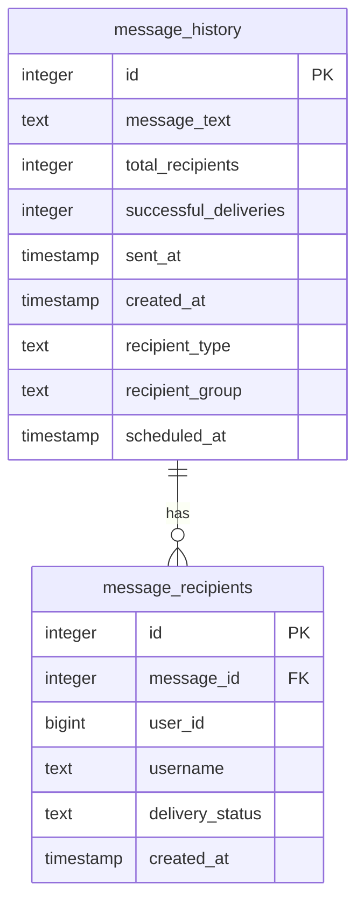
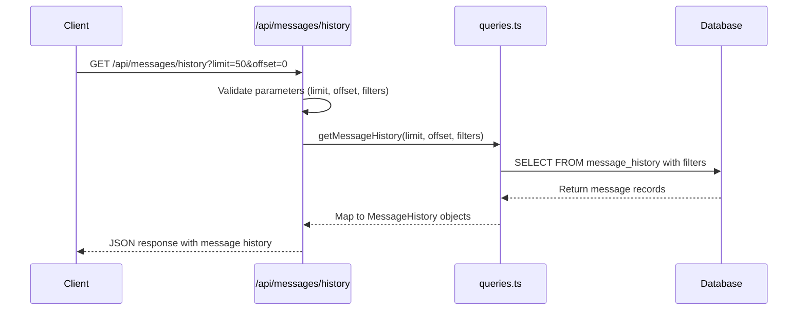
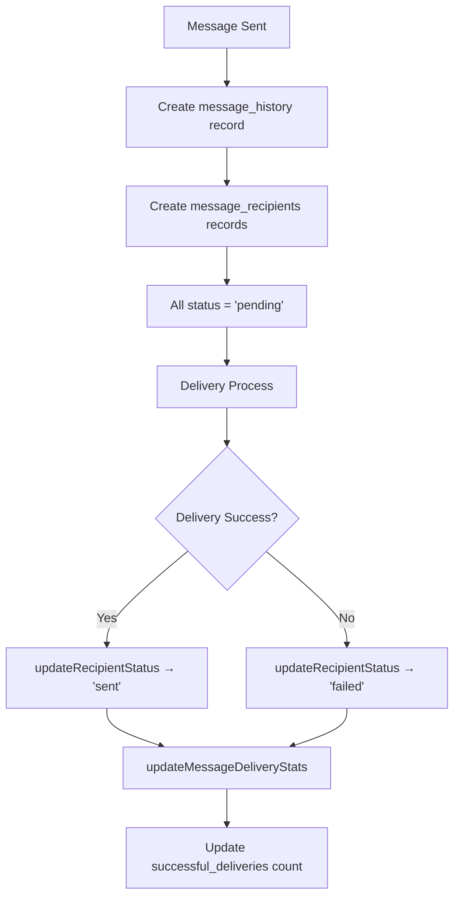
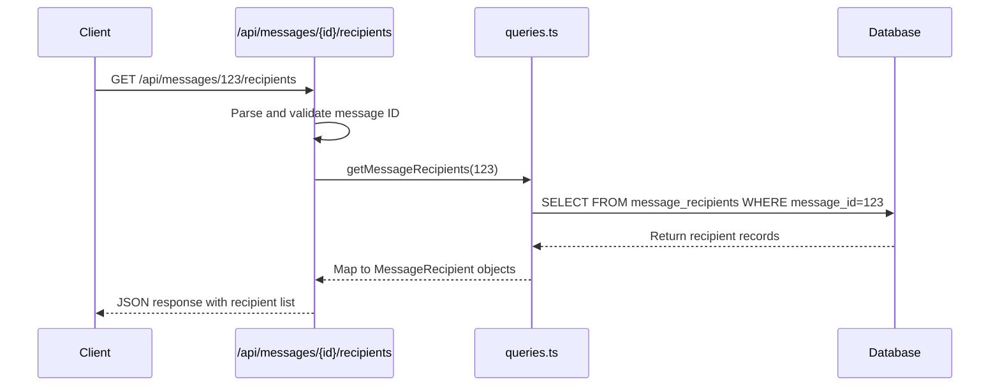

# Message History

<cite>
**Referenced Files in This Document**   
- [DATABASE_MIGRATION_LOG.md](file://DATABASE_MIGRATION_LOG.md)
- [app/api/messages/history/route.ts](file://app/api/messages/history/route.ts)
- [app/api/messages/[id]/recipients/route.ts](file://app/api/messages/[id]/recipients/route.ts)
- [lib/queries.ts](file://lib/queries.ts)
- [app/messages/history/page.tsx](file://app/messages/history/page.tsx)
</cite>

## Table of Contents
1. [Introduction](#introduction)
2. [Message History Data Structure](#message-history-data-structure)
3. [API Endpoint for Message History Retrieval](#api-endpoint-for-message-history-retrieval)
4. [Recipient-Level Tracking and Delivery Status](#recipient-level-tracking-and-delivery-status)
5. [Recipient Details API Endpoint](#recipient-details-api-endpoint)
6. [Querying and Filtering Message History](#querying-and-filtering-message-history)
7. [Data Retention and Performance Optimization](#data-retention-and-performance-optimization)
8. [Delivery Metrics and Troubleshooting](#delivery-metrics-and-troubleshooting)

## Introduction
The hsl-dashboard implements a comprehensive message history and recipient tracking system to monitor all sent and scheduled messages through its Telegram integration. This system provides full auditability of message broadcasts, detailed delivery statistics, and granular recipient-level tracking. The architecture consists of two primary database tables—`message_history` and `message_recipients`—that work in tandem to persist message metadata and delivery status. This documentation details the structure, API access patterns, and operational characteristics of this messaging system, enabling effective use for analytics, auditing, and troubleshooting delivery issues.

## Message History Data Structure

The message history system is built around two interconnected database tables that capture both aggregate message information and individual recipient delivery status. The `message_history` table serves as the primary record for each broadcast message, storing essential metadata and delivery statistics.



**Diagram sources**
- [DATABASE_MIGRATION_LOG.md](file://DATABASE_MIGRATION_LOG.md#L0-L31)
- [lib/queries.ts](file://lib/queries.ts#L75-L124)

**Section sources**
- [DATABASE_MIGRATION_LOG.md](file://DATABASE_MIGRATION_LOG.md#L0-L31)
- [lib/queries.ts](file://lib/queries.ts#L75-L124)

### Message History Record Structure
Each message history record contains the following key fields:

- **message_text**: The full content of the broadcast message (TEXT, NOT NULL)
- **total_recipients**: The total number of recipients the message was sent to (INTEGER, NOT NULL)
- **successful_deliveries**: The count of successfully delivered messages, updated dynamically (INTEGER)
- **sent_at**: Timestamp when the message was actually sent (TIMESTAMP WITH TIME ZONE)
- **created_at**: Timestamp when the message record was created (TIMESTAMP WITH TIME ZONE)
- **recipient_type**: Classification of the message as 'individual' or 'group' (TEXT)
- **recipient_group**: For group messages, specifies the target group (e.g., '3rd_stream', '4th_stream', '5th_stream') (TEXT)
- **scheduled_at**: Optional timestamp for scheduled messages (TIMESTAMP WITH TIME ZONE)

When a message is sent, the system creates a record in `message_history` via the `createMessageHistory()` function, which returns the generated message ID. This ID is then used to associate all recipients in the `message_recipients` table. For scheduled messages, the `scheduled_at` field contains the future delivery time, while `sent_at` is populated when the message is actually dispatched.

## API Endpoint for Message History Retrieval

The system exposes a RESTful API endpoint at `/api/messages/history/route.ts` that allows clients to retrieve paginated message logs with optional filtering capabilities. This endpoint implements server-side validation and parameter sanitization to ensure robust operation.



**Diagram sources**
- [app/api/messages/history/route.ts](file://app/api/messages/history/route.ts#L0-L65)
- [lib/queries.ts](file://lib/queries.ts#L750-L795)

**Section sources**
- [app/api/messages/history/route.ts](file://app/api/messages/history/route.ts#L0-L65)
- [lib/queries.ts](file://lib/queries.ts#L750-L795)

### Endpoint Implementation Details
The GET handler in `route.ts` processes incoming requests by extracting query parameters for pagination and filtering:

- **limit**: Number of records to return (1-100, default 50)
- **offset**: Number of records to skip for pagination
- **recipient_type**: Filter by 'individual' or 'group' messages
- **recipient_group**: Filter by specific recipient groups (valid values: '3rd_stream', '4th_stream', '5th_stream')

The endpoint performs comprehensive validation on all parameters, returning appropriate HTTP 400 errors for invalid inputs. After validation, it calls the `getMessageHistory()` function from `queries.ts`, which constructs a parameterized SQL query to retrieve records ordered by `sent_at` in descending order (most recent first). The results are returned as a JSON array of message history objects, with timestamps converted to ISO string format.

## Recipient-Level Tracking and Delivery Status

The `message_recipients` table provides granular tracking of delivery status for each individual recipient, enabling detailed delivery analytics and troubleshooting. This table maintains a one-to-many relationship with `message_history`, where each message can have multiple recipient records.

### Key Fields in message_recipients Table
- **message_id**: Foreign key referencing `message_history.id` with CASCADE DELETE
- **user_id**: Telegram user ID (BIGINT to match existing schema)
- **username**: Telegram username (nullable TEXT field)
- **delivery_status**: Current delivery status ('pending', 'sent', 'failed')
- **created_at**: Timestamp when the recipient record was created

The system initializes all recipient records with a 'pending' status when a message is sent. As the delivery process completes, the status is updated through the `updateRecipientStatus()` function. This function supports optional `telegram_message_id` parameter to store the actual message ID from Telegram's API, though this field is not present in the current table schema.



**Diagram sources**
- [lib/queries.ts](file://lib/queries.ts#L710-L748)
- [DATABASE_MIGRATION_LOG.md](file://DATABASE_MIGRATION_LOG.md#L33-L67)

**Section sources**
- [lib/queries.ts](file://lib/queries.ts#L710-L748)
- [DATABASE_MIGRATION_LOG.md](file://DATABASE_MIGRATION_LOG.md#L33-L67)

The `updateMessageDeliveryStats()` function automatically recalculates the `successful_deliveries` count in the `message_history` table by counting recipients with 'sent' status. This ensures that the aggregate statistics remain consistent with individual recipient statuses.

## Recipient Details API Endpoint

The system provides a dedicated API endpoint at `/api/messages/[id]/recipients/route.ts` that allows viewing the complete list of recipients for any message, including their delivery status and user metadata.



**Diagram sources**
- [app/api/messages/[id]/recipients/route.ts](file://app/api/messages/[id]/recipients/route.ts#L0-L27)
- [lib/queries.ts](file://lib/queries.ts#L797-L818)

**Section sources**
- [app/api/messages/[id]/recipients/route.ts](file://app/api/messages/[id]/recipients/route.ts#L0-L27)
- [lib/queries.ts](file://lib/queries.ts#L797-L818)

The endpoint accepts a message ID in the URL path and returns a JSON array of recipient objects containing user_id, username, and delivery_status. The frontend interface in `page.tsx` uses this endpoint to display recipient details when a user selects a specific message in the message history view. This enables administrators to inspect individual delivery outcomes and identify any delivery failures.

## Querying and Filtering Message History

The message history system supports various querying patterns for analytics and auditing purposes. Clients can retrieve message logs with pagination and apply filters to focus on specific message types or recipient groups.

### Example Query Patterns

**Retrieve recent messages with pagination:**
```
GET /api/messages/history?limit=20&offset=0
```

**Filter for individual messages only:**
```
GET /api/messages/history?recipient_type=individual
```

**Filter for messages sent to a specific course stream:**
```
GET /api/messages/history?recipient_type=group&recipient_group=3rd_stream
```

**Combine filtering with pagination:**
```
GET /api/messages/history?recipient_group=4th_stream&limit=10&offset=0
```

The frontend implementation in `page.tsx` provides a user interface with filter buttons for 'All Messages', 'Individual', and specific course streams ('3rd_stream', '4th_stream', '5th_stream'). When a filter is selected, the component constructs the appropriate URL parameters and fetches the filtered message history. The interface displays message text (truncated), send timestamp, recipient counts, and delivery statistics, allowing users to quickly assess message performance.

**Section sources**
- [app/messages/history/page.tsx](file://app/messages/history/page.tsx#L39-L86)
- [app/api/messages/history/route.ts](file://app/api/messages/history/route.ts#L0-L65)

## Data Retention and Performance Optimization

The message history system has been designed with performance and scalability considerations for handling large datasets of message records.

### Database Indexing Strategy
The system implements three strategic indexes on the `message_recipients` table to optimize query performance:

1. **idx_message_recipients_message_id**: Fast lookups by message_id for retrieving recipient lists
2. **idx_message_recipients_status**: Composite index for efficient counting of delivery statuses
3. **idx_message_recipients_user_id**: Fast user lookups for recipient analysis

These indexes ensure that both message history retrieval and recipient status queries perform efficiently even as the dataset grows. The `getMessageHistory()` function leverages the primary ordering on `sent_at` to quickly retrieve the most recent messages, which is the most common access pattern.

The system currently does not implement explicit data retention policies or automatic purging of old message records. However, the database schema and indexing strategy support efficient querying of historical data. For very large datasets, additional partitioning or archiving strategies could be implemented to maintain optimal performance.

**Section sources**
- [DATABASE_MIGRATION_LOG.md](file://DATABASE_MIGRATION_LOG.md#L67-L77)
- [lib/queries.ts](file://lib/queries.ts#L750-L795)

## Delivery Metrics and Troubleshooting

The system provides comprehensive delivery metrics that enable administrators to monitor message effectiveness and troubleshoot delivery discrepancies.

### Interpreting Delivery Metrics
Each message history record includes two key delivery metrics:
- **total_recipients**: The total number of intended recipients
- **successful_deliveries**: The count of messages successfully delivered

The difference between these values indicates the number of failed deliveries. The frontend interface visualizes these metrics using color-coded badges showing successful deliveries (green) and failed deliveries (red).

### Troubleshooting Delivery Discrepancies
When delivery failures occur, administrators can use the recipient-level tracking to diagnose issues:

1. Select the message with delivery issues in the message history interface
2. View the complete list of recipients and their delivery statuses
3. Identify specific users with 'failed' status
4. Cross-reference with user data from bookings or free lessons to determine potential causes

Common causes of delivery failures include:
- Users who have blocked the Telegram bot
- Invalid or deactivated Telegram accounts
- Temporary network issues during delivery

The system's detailed recipient tracking allows administrators to distinguish between systemic issues (many failures) and isolated cases (single failures), enabling targeted troubleshooting and follow-up actions.

**Section sources**
- [app/messages/history/page.tsx](file://app/messages/history/page.tsx#L88-L136)
- [lib/queries.ts](file://lib/queries.ts#L710-L748)