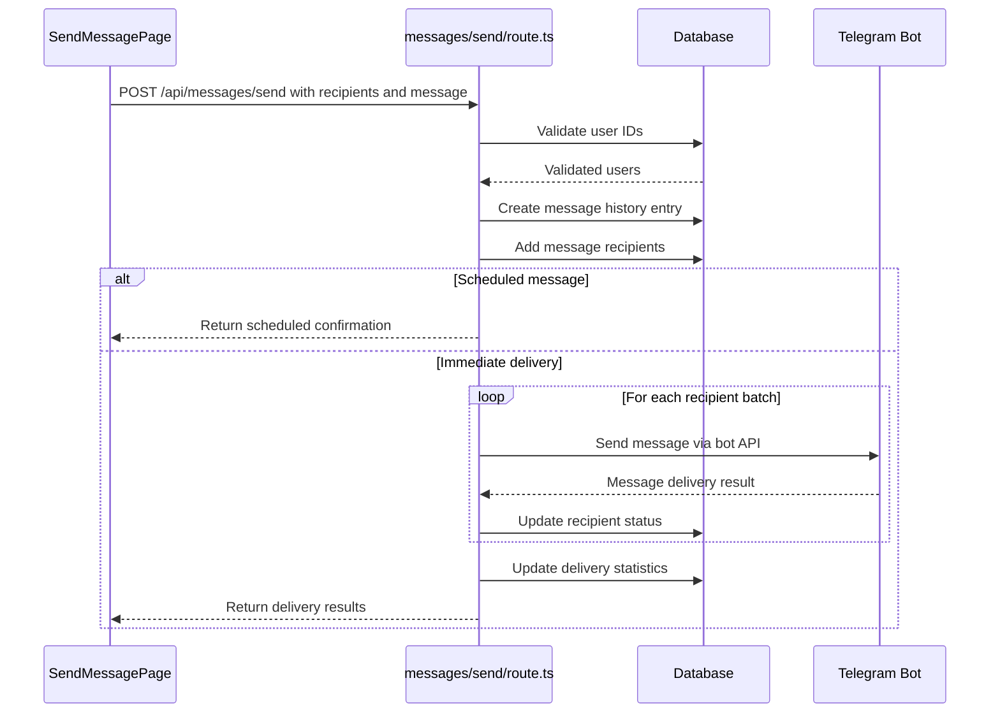
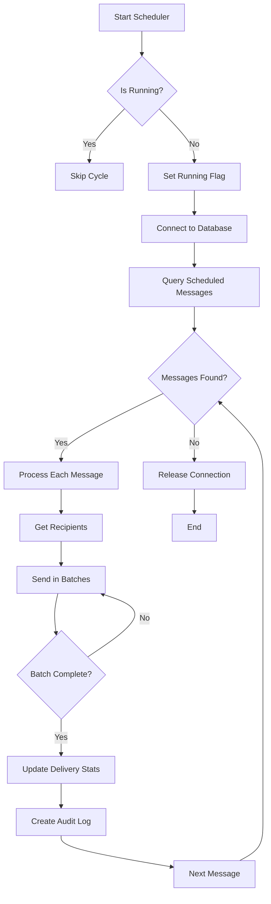
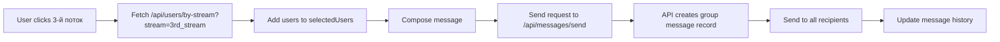
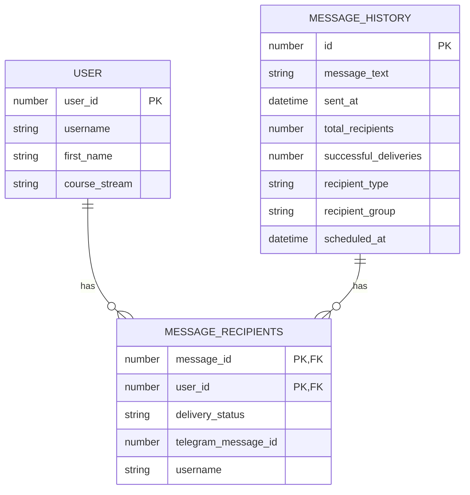

# Messaging System

<cite>
**Referenced Files in This Document**   
- [page.tsx](file://app/messages/send/page.tsx)
- [route.ts](file://app/api/messages/send/route.ts)
- [messageScheduler.ts](file://lib/messageScheduler.ts)
- [route.ts](file://app/api/messages/history/route.ts)
- [queries.ts](file://lib/queries.ts)
</cite>

## Table of Contents
1. [Introduction](#introduction)
2. [Message Sending Workflow](#message-sending-workflow)
3. [Scheduled Message Delivery](#scheduled-message-delivery)
4. [Message History and Recipient Management](#message-history-and-recipient-management)
5. [Practical Example: Sending to Course Stream](#practical-example-sending-to-course-stream)
6. [Error Handling and Rate Limiting](#error-handling-and-rate-limiting)
7. [Performance Considerations](#performance-considerations)
8. [Relationship with User Data Models](#relationship-with-user-data-models)

## Introduction
The messaging system in hsl-dashboard enables administrators to send individual and broadcast messages to users via Telegram. This system supports both immediate and scheduled message delivery, with comprehensive tracking of message history and recipient status. The implementation integrates frontend components with backend API endpoints and a scheduled task processor to provide a robust messaging solution for course administrators.

## Message Sending Workflow

The message sending workflow follows a structured path from the frontend interface through the API endpoint to Telegram integration. The process begins in the frontend component `app/messages/send/page.tsx`, which provides a user interface for composing messages, selecting recipients, and configuring message options.

When a user submits a message, the frontend sends a POST request to the API endpoint `app/api/messages/send/route.ts`. This endpoint validates the request data, including recipient information and message content, before proceeding with delivery.

The workflow involves several key steps:
1. Validation of recipients against the database
2. Creation of a message history entry
3. Storage of recipient information
4. Immediate or scheduled message delivery
5. Status tracking and audit logging

**Diagram sources**
- [page.tsx](file://app/messages/send/page.tsx#L300-L350)
- [route.ts](file://app/api/messages/send/route.ts#L50-L200)

**Section sources**
- [page.tsx](file://app/messages/send/page.tsx)
- [route.ts](file://app/api/messages/send/route.ts)

## Scheduled Message Delivery

The scheduled message delivery system is implemented in `lib/messageScheduler.ts` using the node-cron library. This service runs as a singleton instance and checks for scheduled messages every minute, ensuring timely delivery without requiring external scheduling mechanisms.

The scheduler operates by querying the database for messages with a `scheduled_at` timestamp that is in the past and has not yet been delivered. When such messages are found, the scheduler processes them by sending the message content to all designated recipients through the Telegram Bot API.

Key features of the scheduled delivery system include:
- UTC-based scheduling for consistency across time zones
- Batch processing with rate limiting considerations
- Comprehensive error handling and logging
- Audit logging for all scheduled message activities

**Diagram sources**
- [messageScheduler.ts](file://lib/messageScheduler.ts#L50-L200)

**Section sources**
- [messageScheduler.ts](file://lib/messageScheduler.ts)

## Message History and Recipient Management

The messaging system maintains comprehensive message history and recipient tracking through database operations in `lib/queries.ts`. The system stores message metadata in the `message_history` table and recipient-specific information in the `message_recipients` table.

Message history tracking includes:
- Message content and type
- Total recipient count
- Delivery statistics (successful and failed deliveries)
- Recipient type (individual or group)
- Recipient group (course stream)
- Scheduled and actual send times

Recipient management features allow administrators to:
- Track delivery status for each recipient
- Store Telegram message IDs for potential future reference
- Filter message history by recipient type and group
- Access historical messaging data through the API

The message history API endpoint `app/api/messages/history/route.ts` provides filtering capabilities based on recipient type and group, enabling administrators to retrieve specific subsets of messaging data.

**Section sources**
- [route.ts](file://app/api/messages/history/route.ts)
- [queries.ts](file://lib/queries.ts#L674-L795)

## Practical Example: Sending to Course Stream

To send a message to all users in a specific course stream, administrators can use the "Выберите поток" (Select Stream) feature in the messaging interface. For example, to send a message to all students in the 3rd stream:

1. Navigate to the messaging interface at `/messages/send`
2. Click the "3-й поток" button under "Выберите поток"
3. The system will fetch all users in the 3rd_stream from the database and add them to the recipient list
4. Compose the message content in the message editor
5. Configure any inline buttons if needed
6. Click "Send" to deliver the message immediately or schedule it for later

The system automatically classifies this as a group message based on the recipient analysis in the API endpoint, setting the `recipient_type` to 'group' and `recipient_group` to '3rd_stream' in the message history record.

**Section sources**
- [page.tsx](file://app/messages/send/page.tsx#L350-L400)
- [route.ts](file://app/api/messages/send/route.ts#L150-L200)

## Error Handling and Rate Limiting

The messaging system implements comprehensive error handling to address common issues such as message delivery failures and Telegram API rate limiting.

Delivery failures are categorized and handled appropriately:
- User blocked bot (Telegram error code 403)
- Invalid user or message (Telegram error code 400)
- Network or server errors

When a delivery failure occurs, the system updates the recipient's status to 'failed' in the database and records the error details for troubleshooting. The frontend displays a summary of successful and failed deliveries, along with specific error information for failed attempts.

To prevent rate limiting by Telegram, the system implements batch processing with delays between batches. Messages are sent in batches of 10 recipients, with a 1-second delay between batches. This approach respects Telegram's rate limits while maintaining reasonable delivery performance.

Scheduled messages are subject to additional validation, with media messages (video and document) restricted from scheduling due to implementation limitations.

**Section sources**
- [route.ts](file://app/api/messages/send/route.ts#L250-L300)
- [messageScheduler.ts](file://lib/messageScheduler.ts#L190-L230)

## Performance Considerations

The messaging system incorporates several performance optimizations to handle large recipient lists efficiently:

1. **Batch Processing**: Messages are sent in batches of 10 recipients to balance performance with Telegram's rate limits
2. **Database Optimization**: The system uses efficient queries to validate recipients and update delivery statuses
3. **Connection Management**: Database connections are properly released after use to prevent connection pool exhaustion
4. **Error Resilience**: Individual message failures do not halt the entire delivery process

For very large recipient lists, the system's performance is primarily constrained by Telegram's API rate limits. The current implementation with 1-second delays between 10-recipient batches results in approximately 600 messages per hour per bot instance.

Optimization opportunities include:
- Implementing parallel processing across multiple bot instances
- Adding queue-based processing for extremely large broadcasts
- Implementing more sophisticated rate limit adaptation based on Telegram's response headers

The system also includes audit logging for all message operations, which provides visibility into performance characteristics and delivery patterns over time.

**Section sources**
- [route.ts](file://app/api/messages/send/route.ts#L200-L250)
- [messageScheduler.ts](file://lib/messageScheduler.ts)

## Relationship with User Data Models

The messaging system is closely integrated with the user data model through the `TelegramUser` interface defined in `lib/queries.ts`. This interface includes essential user information such as user_id, username, first_name, and course_stream, which enables targeted messaging based on course enrollment.

The system accesses user data through multiple pathways:
- Direct user search via username or name
- Stream-based user selection (3rd_stream, 4th_stream, 5th_stream)
- Non-course user selection for users not enrolled in specific courses

Recipient data is stored in the `message_recipients` table with references to both the message and the user. The system maintains username information at the time of message sending, providing a historical record even if user details change later.

The integration with user data models enables sophisticated recipient targeting and reporting, allowing administrators to send messages to specific user segments and analyze delivery performance by course stream.

**Diagram sources**
- [queries.ts](file://lib/queries.ts#L76-L81)
- [queries.ts](file://lib/queries.ts#L674-L708)

**Section sources**
- [queries.ts](file://lib/queries.ts)
- [page.tsx](file://app/messages/send/page.tsx#L100-L150)