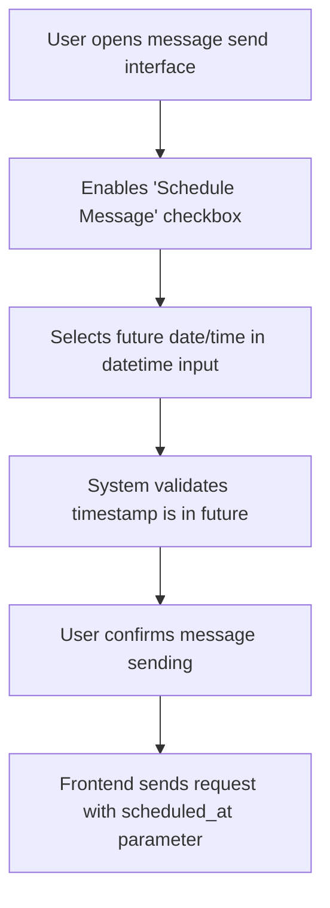
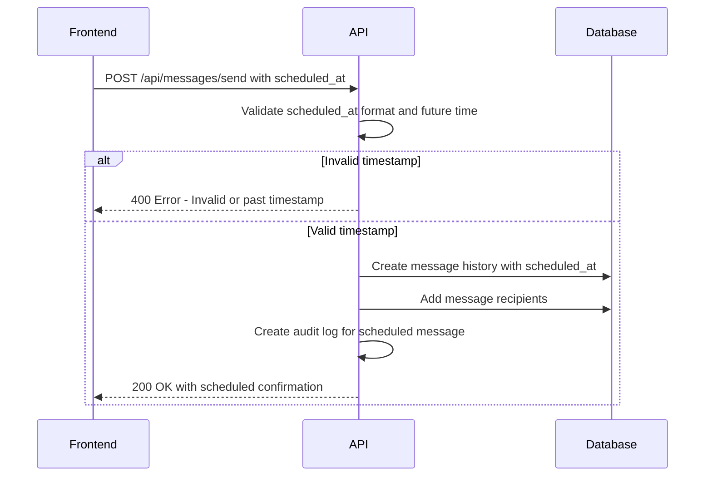
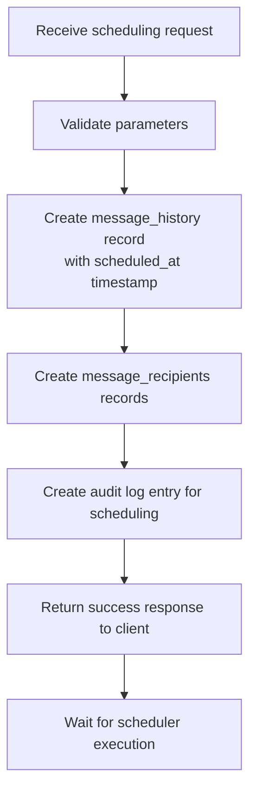
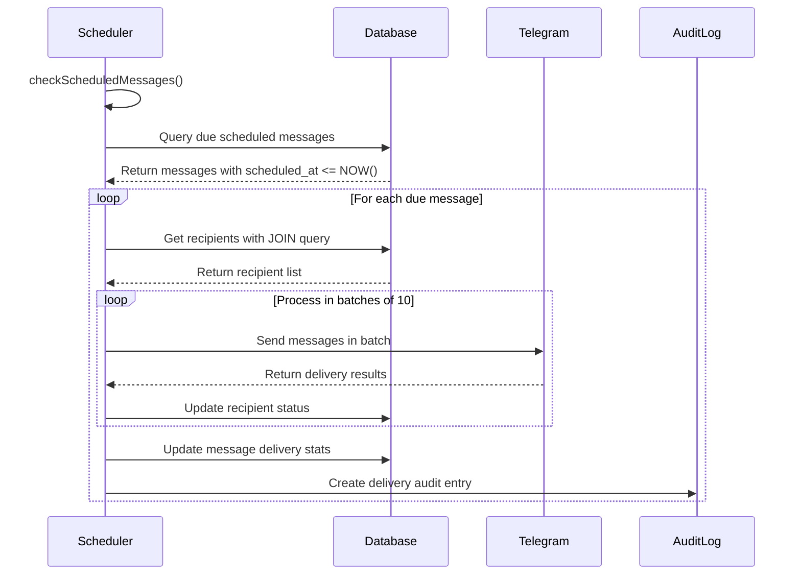
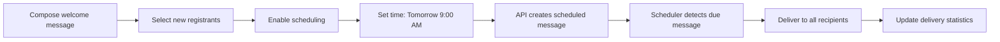

# Scheduled Messages

<cite>
**Referenced Files in This Document**   
- [page.tsx](file://app/messages/send/page.tsx)
- [route.ts](file://app/api/messages/send/route.ts)
- [messageScheduler.ts](file://lib/messageScheduler.ts)
- [queries.ts](file://lib/queries.ts)
</cite>

## Table of Contents
1. [Introduction](#introduction)
2. [Frontend Scheduling Interface](#frontend-scheduling-interface)
3. [Backend API Processing](#backend-api-processing)
4. [Message History and Early Return](#message-history-and-early-return)
5. [MessageSchedulerService Architecture](#messageschedulerservice-architecture)
6. [Scheduled Message Execution Workflow](#scheduled-message-execution-workflow)
7. [Practical Implementation Example](#practical-implementation-example)
8. [Limitations and Constraints](#limitations-and-constraints)
9. [Troubleshooting Guide](#troubleshooting-guide)

## Introduction
The hsl-dashboard implements a comprehensive scheduled message delivery system that enables users to defer message sending to a future date and time. This system integrates frontend scheduling capabilities with backend processing logic and automated execution through a cron-based scheduler service. The workflow begins with user input on the messaging interface and concludes with automated message delivery at the specified time. This documentation details the complete architecture and implementation of this scheduling functionality, covering both user-facing components and server-side processing mechanisms.

## Frontend Scheduling Interface

The scheduling functionality is implemented in the message sending interface, allowing users to specify a future date and time for message delivery. The frontend component provides validation and user feedback to ensure proper scheduling parameters.

The scheduling feature is controlled through a checkbox and datetime input field in the message composition form. When users enable the scheduling option, they must provide a future timestamp through the datetime-local input field. The interface includes client-side validation to prevent scheduling in the past.

The component maintains scheduling state through React hooks, with `isScheduled` controlling the scheduling toggle and `scheduledDateTime` storing the selected timestamp. The interface disables scheduling for media messages (video and document) as this functionality is currently limited to text messages only.



**Section sources**
- [page.tsx](file://app/messages/send/page.tsx#L123-L123)
- [page.tsx](file://app/messages/send/page.tsx#L45-L45)

## Backend API Processing

The API endpoint processes scheduling requests and performs server-side validation before creating message history entries. The scheduling logic is implemented in the route handler for message sending.

When a scheduling request is received, the API first validates the `scheduled_at` parameter if present. The validation ensures the timestamp is in valid ISO format and represents a future time. The system rejects requests with past or invalid timestamps with appropriate error messages.

For media messages, the API explicitly prohibits scheduling regardless of the frontend state, providing an additional layer of validation. This restriction is enforced in the request processing logic before any database operations occur.

The API distinguishes between immediate and scheduled messages, with scheduled messages triggering an early return after database persistence without attempting immediate delivery.



**Section sources**
- [route.ts](file://app/api/messages/send/route.ts#L1-L373)

## Message History and Early Return

The system creates message history entries with scheduling metadata and implements early return behavior when scheduling is detected. This approach separates message creation from message delivery, enabling deferred processing.

When a scheduled message is processed, the system creates a `message_history` record with the `scheduled_at` field populated with the user-specified timestamp. The record initially has zero successful deliveries, which serves as a flag for the scheduler to identify pending scheduled messages.

The API implements an early return pattern for scheduled messages. After creating the message history and recipient records, the API returns a success response to the client without attempting immediate delivery. This allows the client to confirm successful scheduling while deferring actual message transmission to the scheduler service.

The audit logging system captures scheduling events separately from delivery events, providing visibility into both the scheduling request and the eventual delivery outcome.



**Section sources**
- [route.ts](file://app/api/messages/send/route.ts#L290-L315)
- [queries.ts](file://lib/queries.ts#L675-L694)

## MessageSchedulerService Architecture

The MessageSchedulerService class implements a singleton pattern with cron-based execution to process scheduled messages. The service runs every minute in UTC to check for messages that are due for delivery.

The service follows the singleton pattern through the `getMessageScheduler()` factory function, ensuring only one instance exists throughout the application lifecycle. This prevents multiple scheduler instances from running simultaneously and potentially duplicating message deliveries.

Scheduler startup is guarded by environment variables and configuration checks. The service will not start if `SKIP_APP_INIT` or `SKIP_MESSAGE_SCHEDULER` flags are set, if `BOT_TOKEN` is not configured, or if database configuration is missing. These guards prevent unintended scheduler activation in development or testing environments.

The cron job is configured to run every minute (`* * * * *`) using UTC timezone for consistency across deployments. The job starts immediately upon creation, ensuring the first check occurs without delay.

```mermaid
classDiagram
class MessageSchedulerService {
-cronJob : CronJob | null
-bot : TelegramBot | null
-isRunning : boolean
+start() : void
+stop() : void
-getSkipReason() : string | null
-checkScheduledMessages() : Promise~void~
-sendScheduledMessage(messageData : any) : Promise~void~
}
class CronJob {
+start() : void
+stop() : void
}
MessageSchedulerService --> CronJob : "uses"
MessageSchedulerService --> TelegramBot : "uses"
MessageSchedulerService --> "Database Pool" : "uses"
```

**Diagram sources**
- [messageScheduler.ts](file://lib/messageScheduler.ts#L10-L262)
- [messageScheduler.ts](file://lib/messageScheduler.ts#L268-L277)

## Scheduled Message Execution Workflow

The scheduler service follows a systematic workflow to identify and deliver scheduled messages. The process begins with a periodic check for due messages and concludes with delivery and status updates.

The `checkScheduledMessages()` method queries the database for messages that meet three criteria: have a non-null `scheduled_at` timestamp, have a timestamp less than or equal to the current time, and have zero successful deliveries. This query uses `COALESCE` to handle potential NULL values in the `successful_deliveries` field.

For each due message, the service retrieves the complete list of pending recipients through a JOIN query that combines data from message recipients, bookings, and free lesson registrations. This query resolves user information such as usernames and first names from multiple data sources.

Message delivery occurs in batches of 10 users to respect Telegram's rate limits. The service processes each batch with a 1-second delay between batches to further mitigate rate limiting risks. Individual message delivery errors are captured and logged without stopping the entire batch process.

After delivery attempts, the service updates message delivery statistics, creates audit log entries, and releases database connections. Comprehensive logging throughout the process aids in monitoring and troubleshooting.



**Section sources**
- [messageScheduler.ts](file://lib/messageScheduler.ts#L74-L144)
- [messageScheduler.ts](file://lib/messageScheduler.ts#L146-L262)

## Practical Implementation Example

A practical example of scheduling a welcome message for new registrants demonstrates the complete workflow from user interface to automated delivery.

To schedule a welcome message, an administrator would navigate to the message sending interface, compose a text message with welcome content, and select new registrants as recipients. After enabling the scheduling option, they would set the desired delivery time, such as 9:00 AM the following day.

The frontend validates that the selected time is in the future and that the message is a text message (not media). Upon confirmation, the frontend sends a request to the API with the `scheduled_at` parameter containing the ISO timestamp of the selected time.

The API creates a message history record with the `scheduled_at` field set to the specified time and returns a confirmation to the user. The MessageSchedulerService, running every minute, detects the message when its scheduled time arrives, retrieves the recipient list, and delivers the message to all selected users.

The system provides audit trails for both the scheduling event and the delivery event, allowing administrators to verify that the message was sent as planned.



**Section sources**
- [page.tsx](file://app/messages/send/page.tsx#L123-L123)
- [route.ts](file://app/api/messages/send/route.ts#L1-L373)

## Limitations and Constraints

The scheduled message system has several important limitations and constraints that affect its functionality and usage.

Scheduled media messages (videos and documents) are not supported. The system restricts scheduling to text messages only, both in the frontend interface and backend API. This limitation exists because media message handling requires additional considerations for file availability and delivery reliability.

The scheduler runs every minute, establishing a maximum delay of 60 seconds between when a message becomes due and when it is processed. While this provides near-real-time delivery, it means messages cannot be scheduled with sub-minute precision.

The system assumes UTC timezone for scheduling and execution, which may require users to convert from their local timezones when setting delivery times. This could lead to confusion if users are not aware of the timezone being used.

Batch processing limits messages to 10 recipients per batch with 1-second delays, which may cause delays in delivering to large recipient lists. Very large messages could take several minutes to fully deliver.

**Section sources**
- [page.tsx](file://app/messages/send/page.tsx#L123-L123)
- [route.ts](file://app/api/messages/send/route.ts#L1-L373)

## Troubleshooting Guide

Common issues with the scheduled message system typically involve scheduler startup failures or delivery delays. Understanding the diagnostic information and error patterns can help resolve these issues.

If the scheduler fails to start, check the console output for messages indicating the reason. Common startup blockers include missing `BOT_TOKEN`, database configuration issues, or the presence of `SKIP_APP_INIT` or `SKIP_MESSAGE_SCHEDULER` environment variables. Ensure these configuration requirements are met in the deployment environment.

For delivery delays, verify that the scheduler is running by checking for "Message scheduler started" log messages. The system logs debug information about scheduled messages, including their timestamps and delivery status, which can help identify why a message might not be delivered.

If messages are not being delivered at the expected time, confirm that the `scheduled_at` timestamp is in the future and in valid ISO format. Also verify that the message has not already been delivered by checking the `successful_deliveries` count in the message history.

The system includes comprehensive logging at various stages of processing, including scheduler checks, message processing, and delivery attempts. These logs, identified by emoji prefixes (🔍, 📤, ✅, ❌), provide visibility into the processing pipeline and can help diagnose issues.

**Section sources**
- [messageScheduler.ts](file://lib/messageScheduler.ts#L10-L262)
- [route.ts](file://app/api/messages/send/route.ts#L1-L373)