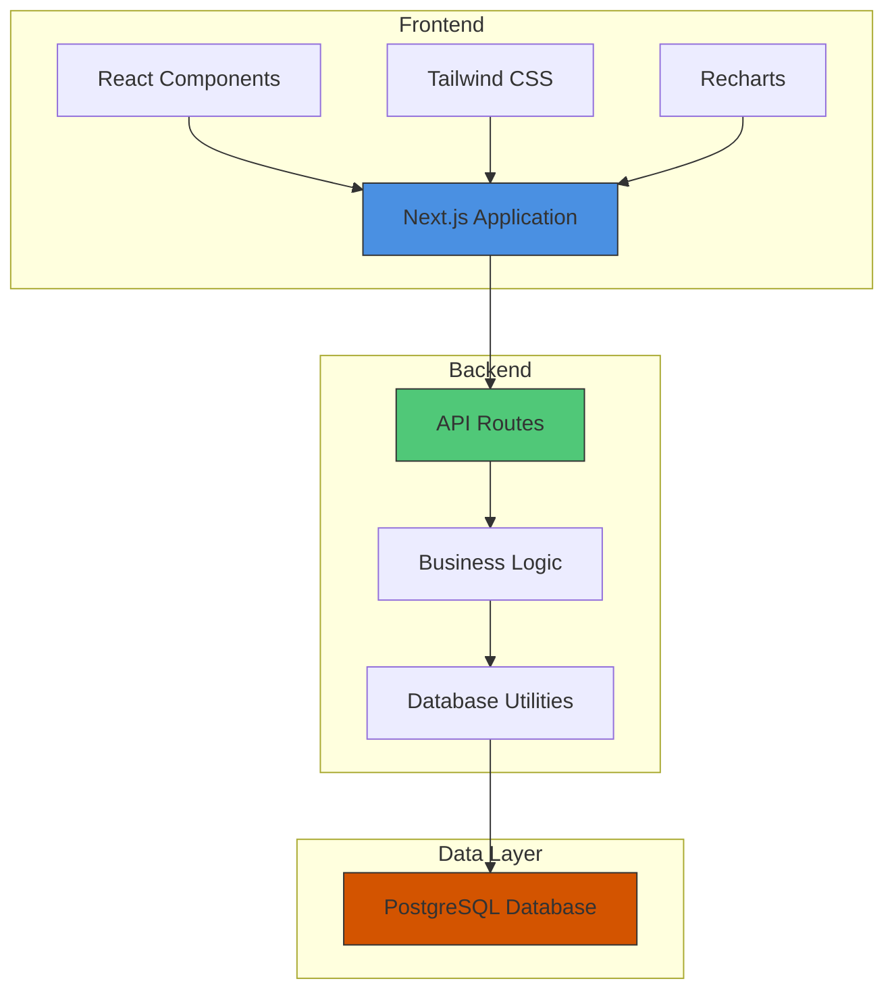
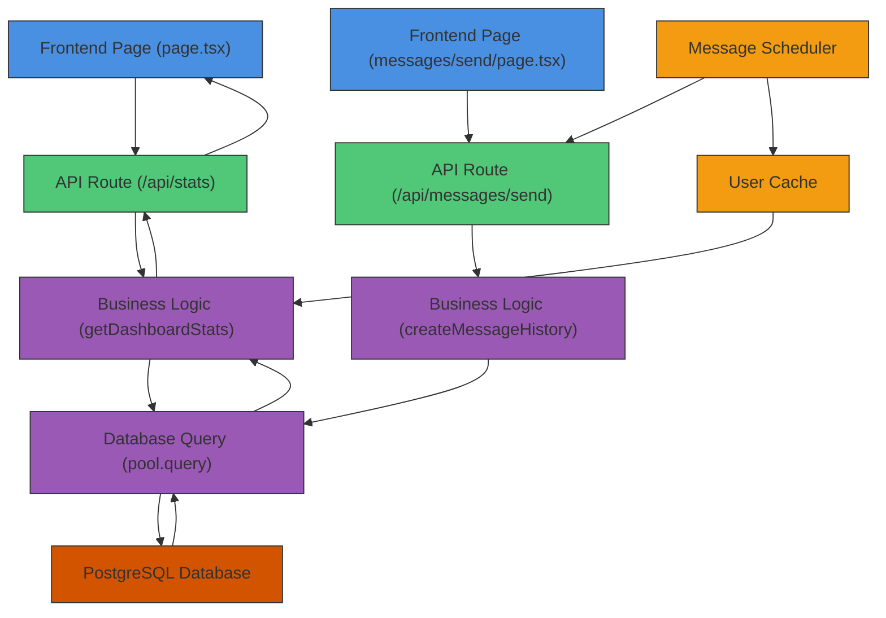
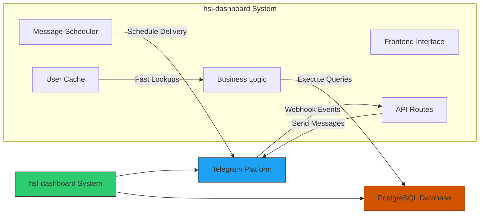

# System Overview

<cite>
**Referenced Files in This Document**   
- [page.tsx](file://app/page.tsx)
- [stats/route.ts](file://app/api/stats/route.ts)
- [user-growth/route.ts](file://app/api/user-growth/route.ts)
- [messages/send/route.ts](file://app/api/messages/send/route.ts)
- [telegram/webhook/route.ts](file://app/api/telegram/webhook/route.ts)
- [queries.ts](file://lib/queries.ts)
- [db.ts](file://lib/db.ts)
- [messageScheduler.ts](file://lib/messageScheduler.ts)
- [userCache.ts](file://lib/userCache.ts)
- [init.ts](file://lib/init.ts)
</cite>

## Table of Contents
1. [Introduction](#introduction)
2. [Core Functionalities](#core-functionalities)
3. [High-Level Architecture](#high-level-architecture)
4. [Component Relationships](#component-relationships)
5. [System Context and External Integrations](#system-context-and-external-integrations)
6. [Practical Workflows](#practical-workflows)

## Introduction

The hsl-dashboard system is a full-stack analytics and user engagement platform designed for a Telegram-based educational service. It provides comprehensive insights into user behavior, course enrollment patterns, and messaging effectiveness through an intuitive web interface built with modern technologies. The dashboard serves as a central hub for monitoring key performance indicators, tracking user growth, and automating communication with students across various course streams.

As a Next.js application, the dashboard leverages server-side rendering and API routes to deliver real-time data visualization while maintaining optimal performance. It connects to a PostgreSQL database to extract and analyze user activity, course registrations, and messaging history. The system is specifically tailored to support educational workflows such as tracking free lesson conversions, monitoring workshop enrollments, and analyzing user engagement patterns over time.

The platform enables administrators to make data-driven decisions by providing clear visual representations of metrics like registration trends, user retention, and course stream distributions. Additionally, it incorporates messaging automation capabilities that allow targeted communication with specific user segments, such as students in particular course streams or those who have not yet enrolled in paid programs.

**Section sources**
- [page.tsx](file://app/page.tsx)
- [README.md](file://README.md)

## Core Functionalities

The hsl-dashboard delivers four primary functional domains that support the operational needs of the educational platform: course analytics, user growth tracking, messaging automation, and database management.

Course analytics provide detailed insights into enrollment patterns across different course streams. The system tracks metrics such as total bookings, confirmed payments, pending registrations, and cancellations for each course. This functionality allows administrators to monitor the performance of specific course offerings and identify trends in student interest and conversion rates. The dashboard displays this information through visual components like metric cards and stream-specific statistics.

User growth tracking enables longitudinal analysis of platform adoption and engagement. By aggregating data from multiple sources including bookings, events, and free lesson registrations, the system calculates daily new user counts and cumulative user totals. This data is presented in time-series charts that reveal patterns in user acquisition over periods of up to 30 days, helping identify successful marketing campaigns or seasonal variations in enrollment.

Messaging automation provides a robust system for sending targeted communications to users via Telegram. Administrators can send messages to individual users, groups within specific course streams, or broader segments such as users who have not yet enrolled in paid courses. The system supports both immediate message delivery and scheduled messaging, with comprehensive tracking of delivery status and recipient engagement. Message history is preserved for auditing and follow-up purposes.

Database management functionality ensures data integrity and accessibility through structured API endpoints and migration tools. The system includes endpoints for testing database connectivity, retrieving schema information, and executing migrations. These features support both development operations and production monitoring, ensuring that the underlying data infrastructure remains reliable and performant.

**Section sources**
- [queries.ts](file://lib/queries.ts#L102-L140)
- [queries.ts](file://lib/queries.ts#L474-L539)
- [messages/send/route.ts](file://app/api/messages/send/route.ts)
- [db.ts](file://lib/db.ts)

## High-Level Architecture

The hsl-dashboard follows a layered architecture comprising frontend, backend API routes, business logic, and database integration components. This separation of concerns enables maintainable code organization and clear data flow patterns throughout the application.

The frontend is implemented using Next.js 15 with React 19, providing a dynamic user interface with server-side rendering capabilities. It utilizes TypeScript for type safety and Tailwind CSS for responsive styling. The UI components are organized in the `components/` directory and include data visualization elements built with Recharts, form controls, and layout components that create a cohesive user experience.

The backend consists of API routes defined within the `app/api/` directory, following Next.js App Router conventions. These routes handle HTTP requests and serve data to the frontend components. Each API endpoint corresponds to a specific functional area, such as `/api/stats` for overall dashboard metrics, `/api/user-growth` for user acquisition trends, and `/api/messages/send` for messaging operations. These routes act as the bridge between the frontend interface and the business logic layer.

Business logic is encapsulated in the `lib/` directory, which contains the core functionality of the application. This includes database queries, message scheduling services, user caching mechanisms, and initialization routines. The separation of business logic from API routes allows for better code reuse and testability, as the same functions can be invoked from multiple endpoints or background processes.

Database integration is achieved through a PostgreSQL connection managed by the Node.js `pg` driver. The system uses direct SQL queries rather than an ORM, providing fine-grained control over database operations and optimization opportunities. Connection pooling ensures efficient database resource usage, while environment variable configuration enables flexible deployment across different environments.

**Diagram sources**
- [page.tsx](file://app/page.tsx)
- [stats/route.ts](file://app/api/stats/route.ts)
- [db.ts](file://lib/db.ts)

**Section sources**
- [package.json](file://package.json)
- [next.config.ts](file://next.config.ts)
- [lib/db.ts](file://lib/db.ts)

## Component Relationships

The hsl-dashboard components interact through well-defined relationships that facilitate data flow from the database to the user interface. Pages consume data from API routes, which in turn utilize business logic functions and database utilities to retrieve and process information.

Frontend pages such as `app/page.tsx` make HTTP requests to API routes like `/api/stats` and `/api/user-growth`. These requests trigger server-side functions that execute database queries and return structured JSON responses. The page components then render this data using specialized UI components like `MetricCard`, `UserGrowthChart`, and `RecentEventsTable`. Data loading is implemented in tiers, with critical metrics loaded first followed by secondary and tertiary data to optimize perceived performance.

API routes serve as intermediaries between the frontend and business logic. For example, the `/api/messages/send` route receives message requests from the frontend, validates the input, and invokes functions from `lib/queries.ts` to create message history entries and update recipient statuses. Similarly, the `/api/user-growth` route calls the `getUserGrowthData` function to retrieve time-series user data from the database.

Business logic components in the `lib/` directory depend on database utilities for data persistence and retrieval. The `messageScheduler.ts` service uses database queries to find scheduled messages and update delivery statuses. The `userCache.ts` service periodically refreshes its in-memory cache by querying the database for user information, enabling fast lookups for messaging operations. These services are initialized through `init.ts`, which starts background processes when the application launches.

Database interactions are centralized through the `db.ts` module, which exports a connection pool instance used by all data access functions. Query functions in `queries.ts` import this pool to execute parameterized SQL statements, ensuring safe and efficient database operations. This architecture prevents direct database access from API routes, promoting code reuse and consistent error handling.

**Diagram sources**
- [page.tsx](file://app/page.tsx)
- [stats/route.ts](file://app/api/stats/route.ts)
- [messages/send/route.ts](file://app/api/messages/send/route.ts)
- [queries.ts](file://lib/queries.ts)
- [db.ts](file://lib/db.ts)
- [messageScheduler.ts](file://lib/messageScheduler.ts)
- [userCache.ts](file://lib/userCache.ts)

**Section sources**
- [page.tsx](file://app/page.tsx)
- [stats/route.ts](file://app/api/stats/route.ts)
- [messages/send/route.ts](file://app/api/messages/send/route.ts)
- [queries.ts](file://lib/queries.ts)
- [db.ts](file://lib/db.ts)

## System Context and External Integrations

The hsl-dashboard operates within a broader ecosystem that includes external integrations with Telegram and a PostgreSQL database. These connections enable the system to receive real-time user interactions and deliver automated messages while maintaining persistent storage of all platform data.

The integration with Telegram occurs through two primary mechanisms: the webhook endpoint and the Bot API. The `/api/telegram/webhook/route.ts` endpoint receives notifications from Telegram when users interact with the bot, particularly when they send videos or other media. This allows the dashboard to log and analyze user-submitted content. Simultaneously, the system uses the Telegram Bot API through the `node-telegram-bot-api` library to send outbound messages, enabling automated communication with students based on their course stream or engagement level.

Database integration is established through a connection to a PostgreSQL instance, typically hosted on Railway. The connection is configured using environment variables that specify the host, port, database name, username, and password. The system uses connection pooling to efficiently manage database resources and includes health checks through the `/api/test-db` endpoint to verify connectivity. Database schema management is supported through migration endpoints that allow schema updates to be applied programmatically.

Background services enhance the system's capabilities by enabling asynchronous operations. The message scheduler runs as a cron job that checks every minute for scheduled messages and delivers them at their designated times. This service starts automatically when the application initializes, unless disabled by configuration. User data is cached in memory to improve performance for frequently accessed operations like recipient lookups and autocomplete searches.

The system also includes debugging and monitoring endpoints that support development and operations. The `/api/debug-events` route provides detailed logging of user interactions, while various test endpoints allow developers to verify functionality without affecting production data. These integrations create a comprehensive environment where data flows seamlessly between the educational platform, messaging service, and analytics dashboard.

**Diagram sources**
- [telegram/webhook/route.ts](file://app/api/telegram/webhook/route.ts)
- [db.ts](file://lib/db.ts)
- [messageScheduler.ts](file://lib/messageScheduler.ts)
- [userCache.ts](file://lib/userCache.ts)

**Section sources**
- [telegram/webhook/route.ts](file://app/api/telegram/webhook/route.ts)
- [db.ts](file://lib/db.ts)
- [messageScheduler.ts](file://lib/messageScheduler.ts)
- [userCache.ts](file://lib/userCache.ts)
- [init.ts](file://lib/init.ts)

## Practical Workflows

The hsl-dashboard supports several practical workflows that demonstrate its value in managing an educational platform. These workflows illustrate how administrators can leverage the system's capabilities to analyze user behavior and engage with students effectively.

Sending broadcast messages to course participants follows a structured process. An administrator navigates to the messaging interface and selects a recipient group, such as all students in the "4th_stream" course. The system retrieves the user list from its cache and presents them for confirmation. After composing a message with optional buttons or media attachments, the administrator can choose to send immediately or schedule for future delivery. The system validates all recipient IDs against the database before sending, logs the message in the history, and tracks delivery status for each recipient. This workflow enables timely communication about course updates, reminders, or special offers.

Analyzing registration trends involves examining data patterns over time to understand user acquisition dynamics. Administrators can view the registration trend chart on the homepage, which displays daily free lesson sign-ups over the past 30 days. By comparing this data with marketing campaign timelines or content releases, they can identify which initiatives drive the most engagement. The system calculates conversion rates between free lesson registrations and actual attendance, providing insights into content effectiveness and student interest levels.

Monitoring course stream performance allows administrators to track enrollment across different cohorts. The dashboard displays active bookings, confirmed payments, and cancellation rates for each stream, enabling comparison of student retention between offerings. This information helps determine optimal class sizes, identify popular instructors, and plan future course schedules based on demand patterns. Administrators can drill down into specific streams to view individual student details and booking histories.

Managing user growth involves tracking both new registrations and cumulative platform adoption. The user growth chart shows daily new users alongside the running total, revealing seasonal patterns and growth milestones. By correlating this data with external factors like marketing spend or social media reach, administrators can assess the effectiveness of different acquisition channels and adjust their strategies accordingly. The system's ability to aggregate data from multiple sources ensures an accurate picture of overall platform health.

**Section sources**
- [messages/send/route.ts](file://app/api/messages/send/route.ts)
- [queries.ts](file://lib/queries.ts)
- [page.tsx](file://app/page.tsx)
- [user-growth/route.ts](file://app/api/user-growth/route.ts)