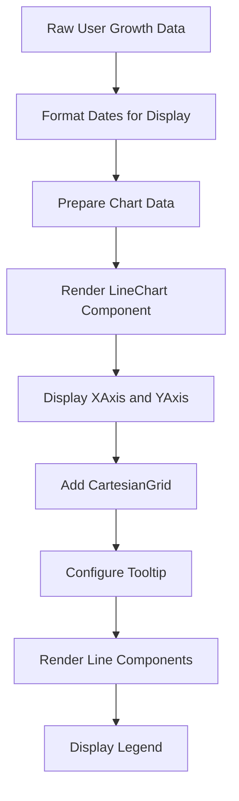

# Technology Stack

<cite>
**Referenced Files in This Document**   
- [package.json](file://package.json)
- [next.config.ts](file://next.config.ts)
- [tsconfig.json](file://tsconfig.json)
- [app/api/telegram/webhook/route.ts](file://app/api/telegram/webhook/route.ts)
- [app/api/messages/send/route.ts](file://app/api/messages/send/route.ts)
- [lib/db.ts](file://lib/db.ts)
- [lib/messageScheduler.ts](file://lib/messageScheduler.ts)
- [lib/queries.ts](file://lib/queries.ts)
- [components/UserGrowthChart.tsx](file://components/UserGrowthChart.tsx)
</cite>

## Table of Contents
1. [Core Frameworks](#core-frameworks)
2. [Key Dependencies](#key-dependencies)
3. [Configuration Files](#configuration-files)
4. [Technology Integration](#technology-integration)
5. [Practical Implementation Examples](#practical-implementation-examples)

## Core Frameworks

The hsl-dashboard application is built on a modern technology stack centered around Next.js 15.4.7, React 19.1.0, TypeScript, and Tailwind CSS v4. These technologies work together to provide a robust foundation for server-side rendering, component architecture, type safety, and responsive styling.

Next.js serves as the primary framework, enabling server-side rendering (SSR) and API routes through its App Router architecture. The application leverages Next.js's file-based routing system where API endpoints are defined in the `app/api` directory, with each route file exporting HTTP method handlers. The framework's SSR capabilities allow for dynamic content generation and improved SEO performance.

React 19.1.0 provides the component architecture for the application, enabling the creation of reusable UI components. The application follows React's client component pattern, with components using React hooks for state management and side effects. The component structure is organized in the `components` directory, featuring both UI primitives (buttons, cards, inputs) and composite components that combine these primitives into more complex interfaces.

TypeScript is used throughout the codebase to ensure type safety and improve developer experience. The application benefits from TypeScript's static type checking, which helps catch errors during development and provides better code documentation. Type interfaces are used extensively to define data structures for API responses, database queries, and component props.

Tailwind CSS v4 is employed for styling, providing a utility-first approach to CSS that enables rapid UI development. The application uses Tailwind's responsive design features and dark mode support, with styling applied directly to components through className attributes. The framework's JIT (Just-In-Time) compiler generates styles on-demand, resulting in optimized CSS output.

**Section sources**
- [package.json](file://package.json)
- [next.config.ts](file://next.config.ts)
- [tsconfig.json](file://tsconfig.json)

## Key Dependencies

The application relies on several key dependencies that extend its functionality beyond the core frameworks. These dependencies include pg 8.16.3 for PostgreSQL connectivity, Recharts 3.1.2 for data visualization, node-telegram-bot-api 0.66.0 for Telegram integration, and node-cron 3.0.3 for scheduled tasks.

The pg library provides PostgreSQL database connectivity, enabling the application to interact with its relational database. The database connection is managed through a connection pool, with environment variables used to configure the database host, port, credentials, and SSL settings. The application implements a graceful degradation strategy where API routes can continue to function during build-time tasks even when database credentials are not configured.

Recharts 3.1.2 is used for data visualization, providing React components for creating charts and graphs. The library is integrated into the application through components like UserGrowthChart and RegistrationTrendChart, which render line charts to display user growth and registration trends. Recharts components are wrapped in responsive containers to ensure proper display across different screen sizes.

The node-telegram-bot-api library enables integration with Telegram, allowing the application to send and receive messages through the Telegram Bot API. This dependency is used in both API routes and background services to facilitate message broadcasting, webhook handling, and scheduled message delivery. The bot instance is initialized with the BOT_TOKEN environment variable and configured for API usage (polling: false).

node-cron 3.0.3 is employed for scheduled task execution, specifically for processing scheduled messages. The library enables the application to run tasks at specified intervals, with the message scheduler configured to check for pending scheduled messages every minute. The cron job runs in UTC timezone to ensure consistent behavior across different deployment environments.

**Section sources**
- [package.json](file://package.json)
- [lib/db.ts](file://lib/db.ts)
- [lib/messageScheduler.ts](file://lib/messageScheduler.ts)
- [app/api/telegram/webhook/route.ts](file://app/api/telegram/webhook/route.ts)
- [app/api/messages/send/route.ts](file://app/api/messages/send/route.ts)

## Configuration Files

The application's behavior is configured through several key configuration files that control build settings, type checking, and development workflows. These files include next.config.ts, tsconfig.json, and package.json, each serving a specific purpose in the development and deployment process.

The next.config.ts file contains Next.js configuration options that customize the framework's behavior. Currently, the configuration file is minimal, exporting a default NextConfig object without specific options. This default configuration enables standard Next.js features including server-side rendering, API routes, and static site generation capabilities.

The tsconfig.json file defines TypeScript compiler options that enforce type safety and code quality standards. Key configuration settings include strict type checking, ES2017 target compilation, module resolution for bundlers, and path mapping for absolute imports. The configuration enables features like strict null checks, implicit any detection, and incremental compilation for improved build performance.

The package.json file specifies project metadata, dependencies, and scripts for development workflows. The application uses npm as its package manager, with scripts defined for development (dev), building (build), starting (start), and linting (lint). The dependencies section lists all required packages with specific version constraints, ensuring consistent dependency resolution across different environments.

**Section sources**
- [next.config.ts](file://next.config.ts)
- [tsconfig.json](file://tsconfig.json)
- [package.json](file://package.json)

## Technology Integration

The various technologies in the stack work together seamlessly to create a cohesive application architecture. The integration between Next.js API routes, React components, TypeScript types, and external dependencies enables efficient data flow and user interaction.

API routes in the `app/api` directory serve as the bridge between the frontend components and backend services. These routes handle HTTP requests, validate input data, interact with the database through the pg library, and communicate with external services like Telegram. TypeScript interfaces are used to define request and response shapes, ensuring type safety throughout the API layer.

The database integration is managed through the lib/db.ts module, which exports a PostgreSQL connection pool instance. This module handles database configuration through environment variables and provides a fallback mechanism for build-time operations when database credentials are not available. The connection pool is used by various query functions in lib/queries.ts to execute SQL statements and retrieve data.

Telegram integration is implemented through both API routes and background services. The app/api/telegram/webhook/route.ts file handles incoming webhook requests from Telegram, validating the request secret and processing message updates. The lib/messageScheduler.ts module manages outgoing message delivery, using node-cron to schedule message sending and node-telegram-bot-api to communicate with the Telegram Bot API.

**Section sources**
- [app/api/messages/send/route.ts](file://app/api/messages/send/route.ts)
- [lib/db.ts](file://lib/db.ts)
- [lib/queries.ts](file://lib/queries.ts)
- [lib/messageScheduler.ts](file://lib/messageScheduler.ts)

## Practical Implementation Examples

The technology stack is demonstrated through practical implementations in the application's codebase, showcasing how the various components work together to deliver specific functionality.

### TypeScript Interfaces in API Routes

TypeScript interfaces are used extensively in API routes to ensure type safety and provide clear documentation of data structures. For example, in the messages/send API route, interfaces define the shape of the request payload:

```typescript
interface SendMessageRequest {
  recipients: TelegramUser[];
  message: {
    type?: 'text' | 'video' | 'document';
    text?: string;
    parse_mode?: 'HTML';
    video_file_id?: string;
    document_file_id?: string;
    buttons?: Array<{
      text: string;
      url?: string;
      callback_data?: string;
      row?: number;
    }>;
  };
  scheduled_at?: string;
}
```

This interface ensures that the request data conforms to the expected structure, with TypeScript providing compile-time validation and IDE support for type checking.

### Recharts for Data Visualization

Recharts components are used to visualize user growth data in the UserGrowthChart component. The implementation demonstrates how data is transformed and presented through a line chart:



**Diagram sources**
- [components/UserGrowthChart.tsx](file://components/UserGrowthChart.tsx)
- [lib/queries.ts](file://lib/queries.ts)

The UserGrowthChart component accepts data through a TypeScript interface and processes it to format dates for better display. The chart renders two lines representing total users and new users, with custom styling and tooltip formatting to enhance readability.

### Message Scheduling with node-cron

The message scheduling functionality demonstrates the integration of multiple technologies to implement a background task system. The MessageSchedulerService class uses node-cron to execute a task every minute, checking for scheduled messages in the database and sending them through the Telegram Bot API.

The implementation includes error handling, batch processing, and audit logging to ensure reliable message delivery. The service checks for configuration prerequisites (BOT_TOKEN and database connection) before starting, and implements a singleton pattern to prevent multiple instances from running simultaneously.

**Section sources**
- [components/UserGrowthChart.tsx](file://components/UserGrowthChart.tsx)
- [lib/messageScheduler.ts](file://lib/messageScheduler.ts)
- [lib/queries.ts](file://lib/queries.ts)
- [app/api/messages/send/route.ts](file://app/api/messages/send/route.ts)