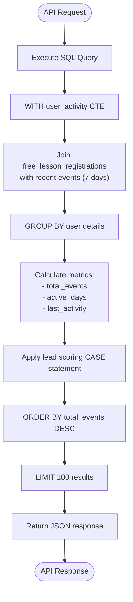
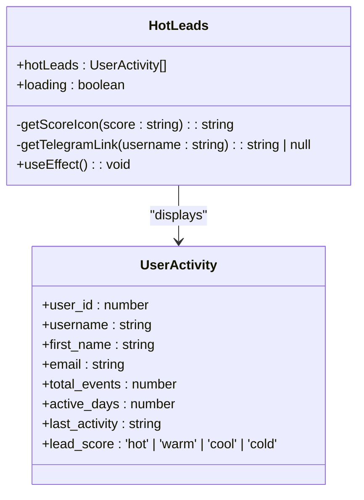
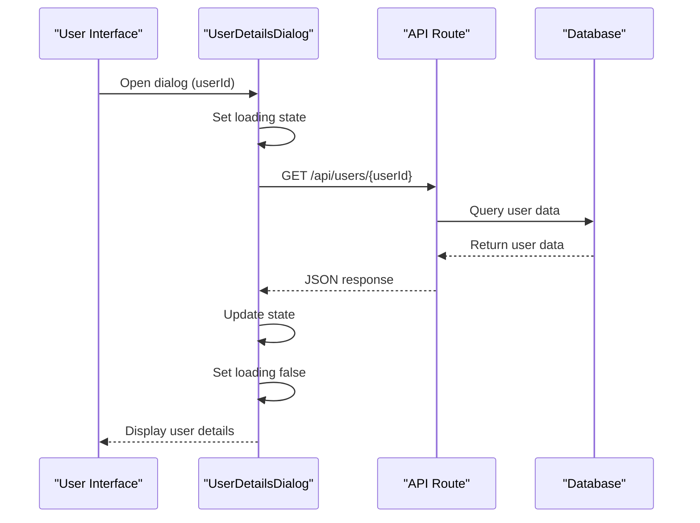
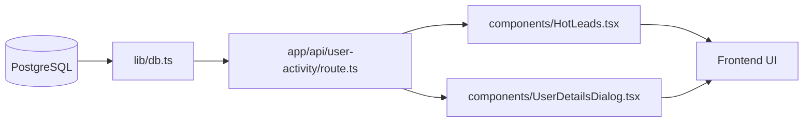

# User Activity Monitoring

<cite>
**Referenced Files in This Document**   
- [app/api/user-activity/route.ts](file://app/api/user-activity/route.ts)
- [components/HotLeads.tsx](file://components/HotLeads.tsx)
- [components/UserDetailsDialog.tsx](file://components/UserDetailsDialog.tsx)
</cite>

## Table of Contents
1. [Introduction](#introduction)
2. [Core Components](#core-components)
3. [Architecture Overview](#architecture-overview)
4. [Detailed Component Analysis](#detailed-component-analysis)
5. [Dependency Analysis](#dependency-analysis)
6. [Performance Considerations](#performance-considerations)
7. [Troubleshooting Guide](#troubleshooting-guide)
8. [Conclusion](#conclusion)

## Introduction
The user activity monitoring system in hsl-dashboard provides real-time analytics for tracking user engagement and lead scoring. This system centers around the `/api/user-activity` endpoint, which calculates key engagement metrics for users who have registered for free lessons. The implementation combines data from free lesson registrations with recent user events to generate comprehensive activity profiles. These profiles power the lead scoring system that categorizes users as 'hot', 'warm', 'cool', or 'cold' based on their interaction frequency and recency. The frontend components consume this data to provide visual indicators of user engagement, enabling the team to prioritize outreach efforts effectively.

## Core Components
The user activity monitoring system consists of three primary components: the backend API endpoint that calculates engagement metrics, the frontend component that displays hot leads, and the user details dialog that provides comprehensive activity history. The system leverages PostgreSQL for data storage and retrieval, with the API endpoint executing complex SQL queries to join free lesson registration data with recent user events. The lead scoring logic applies business rules to categorize users based on their activity patterns. The frontend components use React with TypeScript to provide an interactive interface for viewing and acting on this engagement data.

**Section sources**
- [app/api/user-activity/route.ts](file://app/api/user-activity/route.ts#L1-L51)
- [components/HotLeads.tsx](file://components/HotLeads.tsx#L1-L111)
- [components/UserDetailsDialog.tsx](file://components/UserDetailsDialog.tsx#L1-L461)

## Architecture Overview
The user activity monitoring system follows a clean separation of concerns between backend data processing and frontend presentation. The architecture consists of a Next.js API route that serves as the data source, which is consumed by React components in the frontend. The system retrieves data from the PostgreSQL database, processes it according to business rules for lead scoring, and exposes it through a RESTful API endpoint. The frontend components then fetch this data and render it with appropriate visual indicators.

```mermaid
graph TB
subgraph "Frontend"
HL[HotLeads.tsx]
UDD[UserDetailsDialog.tsx]
end
subgraph "Backend"
API[/api/user-activity]
DB[(PostgreSQL)]
end
HL --> API
UDD --> API
API --> DB
DB --> API
API --> HL
API --> UDD
```

**Diagram sources **
- [app/api/user-activity/route.ts](file://app/api/user-activity/route.ts#L1-L51)
- [components/HotLeads.tsx](file://components/HotLeads.tsx#L1-L111)
- [components/UserDetailsDialog.tsx](file://components/UserDetailsDialog.tsx#L1-L461)

## Detailed Component Analysis

### User Activity API Endpoint
The `/api/user-activity` endpoint implements the core logic for calculating user engagement metrics and lead scores. It uses a Common Table Expression (CTE) to first calculate key metrics for each user who has registered for free lessons, then applies lead scoring rules to categorize users based on their activity level.



**Diagram sources **
- [app/api/user-activity/route.ts](file://app/api/user-activity/route.ts#L1-L51)

**Section sources**
- [app/api/user-activity/route.ts](file://app/api/user-activity/route.ts#L1-L51)

### HotLeads Component Analysis
The HotLeads component displays the top user leads based on their engagement score. It fetches data from the user activity API and renders it with visual indicators that represent the lead score. The component implements loading states and error handling to provide a smooth user experience.



**Diagram sources **
- [components/HotLeads.tsx](file://components/HotLeads.tsx#L1-L111)

**Section sources**
- [components/HotLeads.tsx](file://components/HotLeads.tsx#L1-L111)

### UserDetailsDialog Component Analysis
The UserDetailsDialog component provides a comprehensive view of a user's activity history. It integrates with the user activity system by displaying detailed information about a specific user's interactions, bookings, and lesson registrations. The component uses tabs to organize different types of user data and includes functionality for refreshing the data.



**Diagram sources **
- [components/UserDetailsDialog.tsx](file://components/UserDetailsDialog.tsx#L1-L461)

**Section sources**
- [components/UserDetailsDialog.tsx](file://components/UserDetailsDialog.tsx#L1-L461)

## Dependency Analysis
The user activity monitoring system has dependencies between the API endpoint, database, and frontend components. The system relies on the PostgreSQL database for storing user activity data, with the API endpoint depending on the database connection pool. The frontend components depend on the API endpoint for data, creating a clear dependency chain from database to presentation layer.



**Diagram sources **
- [app/api/user-activity/route.ts](file://app/api/user-activity/route.ts#L1-L51)
- [components/HotLeads.tsx](file://components/HotLeads.tsx#L1-L111)
- [components/UserDetailsDialog.tsx](file://components/UserDetailsDialog.tsx#L1-L461)
- [lib/db.ts](file://lib/db.ts#L1-L53)

**Section sources**
- [app/api/user-activity/route.ts](file://app/api/user-activity/route.ts#L1-L51)
- [components/HotLeads.tsx](file://components/HotLeads.tsx#L1-L111)
- [components/UserDetailsDialog.tsx](file://components/UserDetailsDialog.tsx#L1-L461)
- [lib/db.ts](file://lib/db.ts#L1-L53)

## Performance Considerations
The user activity monitoring system implements several performance optimizations to ensure responsiveness. The API endpoint limits results to 100 records and focuses on recent activity within a 7-day window to reduce query complexity. The system uses connection pooling for database access, which improves efficiency by reusing database connections. The frontend implements loading states to provide feedback during data retrieval, and the HotLeads component only fetches the top 5 leads for display, reducing the amount of data transferred. The database schema includes appropriate indexes on user_id and created_at fields to optimize query performance.

**Section sources**
- [app/api/user-activity/route.ts](file://app/api/user-activity/route.ts#L1-L51)
- [components/HotLeads.tsx](file://components/HotLeads.tsx#L1-L111)

## Troubleshooting Guide
Common issues with the user activity monitoring system include stale activity data and incorrect lead scoring. For stale data, ensure the database connection is working properly and verify that recent events are being recorded in the events table. Check that the NOW() function in the SQL query is returning the correct current timestamp. For incorrect scoring, validate that the lead scoring logic in the CASE statement matches the business requirements. Ensure that the date filtering is correctly applied to include only events from the past 7 days. When debugging, use the /api/debug-events endpoint to inspect sample event data and verify the event types being tracked. Check the console logs for any errors in the API route or frontend components. Verify that the user_id fields match between the free_lesson_registrations and events tables to ensure proper joins.

**Section sources**
- [app/api/user-activity/route.ts](file://app/api/user-activity/route.ts#L1-L51)
- [components/HotLeads.tsx](file://components/HotLeads.tsx#L1-L111)
- [components/UserDetailsDialog.tsx](file://components/UserDetailsDialog.tsx#L1-L461)

## Conclusion
The user activity monitoring system in hsl-dashboard provides a comprehensive solution for tracking user engagement and prioritizing leads. By combining free lesson registration data with recent user events, the system generates meaningful engagement metrics that power an effective lead scoring system. The implementation demonstrates clean separation of concerns between data processing and presentation, with well-structured API endpoints and reusable frontend components. The system balances real-time analytics needs with performance considerations, providing valuable insights while maintaining responsiveness. Future enhancements could include configurable scoring rules, expanded time windows for analysis, and additional engagement metrics to further refine the lead prioritization process.