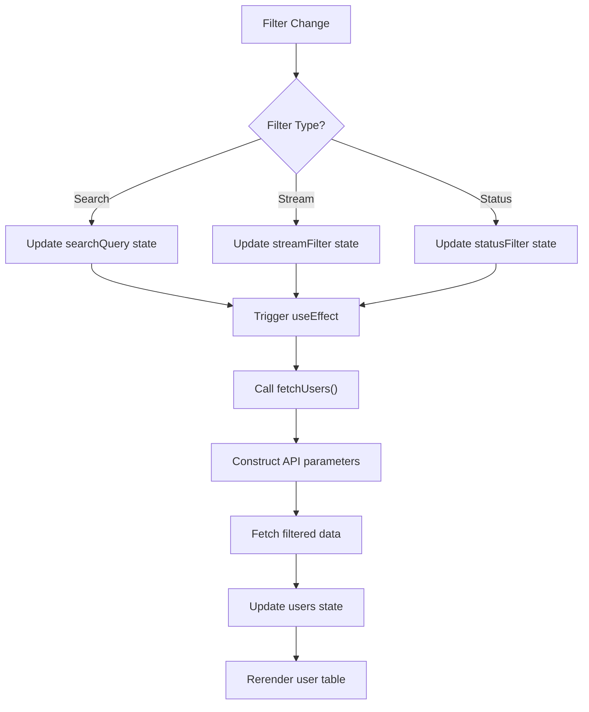
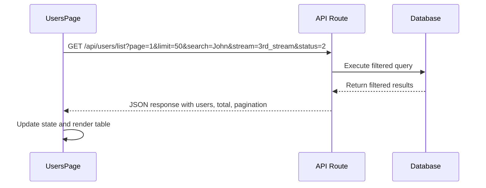

# User Filtering

<cite>
**Referenced Files in This Document**   
- [app/users/page.tsx](file://app/users/page.tsx)
- [lib/userCache.ts](file://lib/userCache.ts)
- [lib/queries.ts](file://lib/queries.ts)
- [app/api/users/list/route.ts](file://app/api/users/list/route.ts)
- [app/api/users/search/route.ts](file://app/api/users/search/route.ts)
- [app/api/users/by-stream/route.ts](file://app/api/users/by-stream/route.ts)
- [components/UserDetailsDialog.tsx](file://components/UserDetailsDialog.tsx)
</cite>

## Table of Contents
1. [Introduction](#introduction)
2. [Filtering Implementation](#filtering-implementation)
3. [State Management](#state-management)
4. [Backend Integration](#backend-integration)
5. [User Details Integration](#user-details-integration)
6. [Performance Considerations](#performance-considerations)
7. [Common Issues and Solutions](#common-issues-and-solutions)
8. [Best Practices](#best-practices)

## Introduction

The hsl-dashboard provides comprehensive user filtering capabilities through the UsersPage component, allowing administrators to efficiently manage and analyze user data. The filtering system combines stream, status, and search-based filtering to refine the displayed user list according to specific criteria. This document explains the implementation details of these filtering capabilities, focusing on how multiple filter criteria are combined and applied without requiring additional backend support beyond search functionality.

The filtering system is designed to be intuitive and responsive, providing immediate feedback as users apply different filters. It integrates seamlessly with pagination to handle large datasets efficiently while maintaining a smooth user experience. The implementation leverages both client-side state management and strategic backend calls to deliver optimal performance.

**Section sources**
- [app/users/page.tsx](file://app/users/page.tsx#L35-L459)

## Filtering Implementation

The UsersPage component implements a multi-dimensional filtering system that allows users to filter by stream, payment status, and search query simultaneously. The filtering logic is implemented through three primary state variables: `streamFilter`, `statusFilter`, and `searchQuery`. These filters work together to refine the user list displayed in the table.

Stream filtering allows administrators to view users enrolled in specific course streams (3rd_stream, 4th_stream, or 5th_stream). Status filtering enables filtering by payment status, including confirmed, pending, and cancelled bookings. Search filtering provides text-based search functionality across usernames and first names.

The filtering is applied through the `fetchUsers` function, which constructs URL parameters based on the current filter values and makes a request to the backend API. When any filter changes, the `useEffect` hook triggers a new data fetch with the updated filter criteria, ensuring the displayed user list always reflects the current filtering state.



**Diagram sources**
- [app/users/page.tsx](file://app/users/page.tsx#L75-L112)

**Section sources**
- [app/users/page.tsx](file://app/users/page.tsx#L39-L41)
- [app/users/page.tsx](file://app/users/page.tsx#L62-L72)

## State Management

The filtering system employs React's useState and useEffect hooks for effective state management. The component maintains several state variables that control the filtering behavior and UI state:

- `searchQuery`: Stores the current search text input by the user
- `streamFilter`: Tracks the selected stream filter (or "all" for no filter)
- `statusFilter`: Maintains the selected payment status filter (or "all")
- `currentPage`: Manages the current pagination page
- `users`: Holds the filtered user data to be displayed

The useEffect hook is configured to watch for changes in the three primary filter states (searchQuery, streamFilter, statusFilter). Whenever any of these values change, the hook triggers the fetchUsers function to retrieve updated data from the backend with the new filter criteria. This approach ensures that the user interface remains synchronized with the current filtering state without requiring manual refresh actions.

The state management also handles loading states and error conditions, providing appropriate visual feedback to users during data retrieval operations. Success messages are temporarily displayed when certain actions (like stream changes) are completed successfully.

```mermaid
classDiagram
class UsersPage {
+users : UserDetailInfo[]
+loading : boolean
+error : string | null
+searchQuery : string
+streamFilter : string
+statusFilter : string
+currentPage : number
+totalPages : number
+total : number
+selectedUserId : number | null
+showUserDialog : boolean
+streamChangeUserId : number | null
+showStreamChangeDialog : boolean
+successMessage : string | null
+fetchUsers(page : number, resetData : boolean) : Promise<void>
+handleRefresh() : void
+handlePageChange(page : number) : void
+handleUserClick(userId : number) : void
+handleUserDialogClose() : void
+handleStreamChangeClick(userId : number) : void
+handleStreamChangeClose() : void
+handleStreamChangeSuccess() : void
+getStatusBadge(confirmed : number | null) : JSX.Element
+getStreamBadge(stream : string | null) : JSX.Element
+formatDate(dateString? : string) : string
+formatUserName(user : UserDetailInfo) : {name : string, username : string}
}
```

**Diagram sources**
- [app/users/page.tsx](file://app/users/page.tsx#L35-L61)

**Section sources**
- [app/users/page.tsx](file://app/users/page.tsx#L35-L112)

## Backend Integration

The filtering system integrates with the backend through API routes that support multiple filter parameters. The primary endpoint at `/api/users/list` accepts query parameters for pagination, search, stream, and status filtering. When filters are applied, the frontend constructs a URL with the appropriate parameters and fetches the filtered data.

For search functionality, the system uses a dedicated caching service implemented in `UserCacheService` to provide fast, responsive search results. The cache is initialized with user data and indexed by username and first name, allowing for efficient prefix-based searches. The cache automatically refreshes every five minutes to ensure data consistency.

The backend API routes work in conjunction with the database queries to apply filters at the data retrieval level, minimizing the amount of data transferred between server and client. The `getUsers` function in `queries.ts` constructs SQL queries with appropriate WHERE clauses based on the filter parameters, ensuring efficient database operations.



**Diagram sources**
- [app/api/users/list/route.ts](file://app/api/users/list/route.ts#L1-L34)
- [lib/queries.ts](file://lib/queries.ts#L1048-L1196)
- [lib/userCache.ts](file://lib/userCache.ts#L2-L212)

**Section sources**
- [app/users/page.tsx](file://app/users/page.tsx#L62-L72)
- [app/api/users/list/route.ts](file://app/api/users/list/route.ts#L1-L34)

## User Details Integration

The filtering system integrates closely with the UserDetailsDialog component, allowing administrators to view detailed information about filtered users. When a user is selected from the filtered list, the UserDetailsDialog fetches and displays comprehensive information about that user, including their bookings, events, and free lesson registrations.

The integration maintains context between the filtered list and the detailed view, ensuring that any changes made to a user's information (such as stream changes) are reflected in the main user list when the dialog is closed. This is achieved through the `handleUserDialogClose` function, which triggers a refresh of the current page data after the dialog is closed.

The UserDetailsDialog also supports filtering within its own interface through tabbed navigation, allowing users to view different categories of information (overview, bookings, events, lessons, and editing) without leaving the detailed view. This multi-level filtering approach provides both broad list filtering and focused detail exploration.

**Section sources**
- [app/users/page.tsx](file://app/users/page.tsx#L430-L459)
- [components/UserDetailsDialog.tsx](file://components/UserDetailsDialog.tsx#L67-L460)

## Performance Considerations

The filtering implementation addresses performance considerations for handling large datasets through several strategies. Pagination limits the number of records retrieved and displayed at any given time, with a default limit of 50 users per page. This prevents performance degradation when dealing with extensive user databases.

The use of client-side filtering combined with server-side filtering ensures optimal performance. While the initial data retrieval applies filters at the database level, subsequent interactions like sorting and additional filtering could potentially be handled client-side if needed, though the current implementation favors server-side filtering for consistency.

The UserCacheService implements a 5-minute TTL (time-to-live) cache for search operations, balancing data freshness with performance. The cache is indexed by the first letter of usernames and first names, enabling efficient search operations that scale well with increasing user counts. The cache also includes pre-loaded data for common filtering scenarios, such as users by stream, reducing database load for frequent queries.

For very large datasets, additional performance optimizations could include implementing infinite scrolling instead of pagination, adding debounce to search inputs to reduce API calls during typing, or introducing more sophisticated caching strategies.

**Section sources**
- [lib/userCache.ts](file://lib/userCache.ts#L2-L212)
- [app/users/page.tsx](file://app/users/page.tsx#L10-L15)

## Common Issues and Solutions

Several common issues may arise with the filtering system, along with their corresponding solutions:

**Inconsistent filter behavior**: This can occur when the cache becomes stale or when network requests fail. The implementation addresses this by including error handling in the fetchUsers function and providing a manual refresh button to force data reloading.

**Performance with large datasets**: As user counts grow, even paginated requests may become slow. The solution implemented uses database-level filtering and indexing to minimize query times, with the cache service further improving search performance.

**Filter state persistence**: When navigating away from and returning to the UsersPage, filter states are not preserved. A potential enhancement would be to store filter states in localStorage or URL parameters to maintain user preferences across sessions.

**Complex filter combinations**: When multiple filters are applied simultaneously, the resulting dataset may be unexpectedly small or empty. The UI addresses this by clearly displaying the total count of matching users and providing feedback when no users match the current criteria.

**Section sources**
- [app/users/page.tsx](file://app/users/page.tsx#L113-L120)
- [app/users/page.tsx](file://app/users/page.tsx#L200-L216)

## Best Practices

When implementing and using the filtering system, several best practices should be followed:

**Combine filtering with search effectively**: Use search for specific user lookup and categorical filters (stream, status) for broader segmentation. This combination allows for precise targeting of user subsets.

**Leverage pagination appropriately**: Use pagination to manage data load and improve performance, but ensure that page navigation is intuitive and that users can easily move between pages.

**Provide clear visual feedback**: The implementation includes loading indicators, success messages, and clear display of filter criteria, helping users understand the current state of the interface.

**Maintain filter independence**: Each filter should operate independently, allowing users to combine them in various ways without unexpected interactions between filter types.

**Handle edge cases gracefully**: The system properly handles cases like empty search queries, invalid filter values, and network errors, providing appropriate feedback to users.

**Section sources**
- [app/users/page.tsx](file://app/users/page.tsx#L217-L252)
- [app/users/page.tsx](file://app/users/page.tsx#L320-L355)