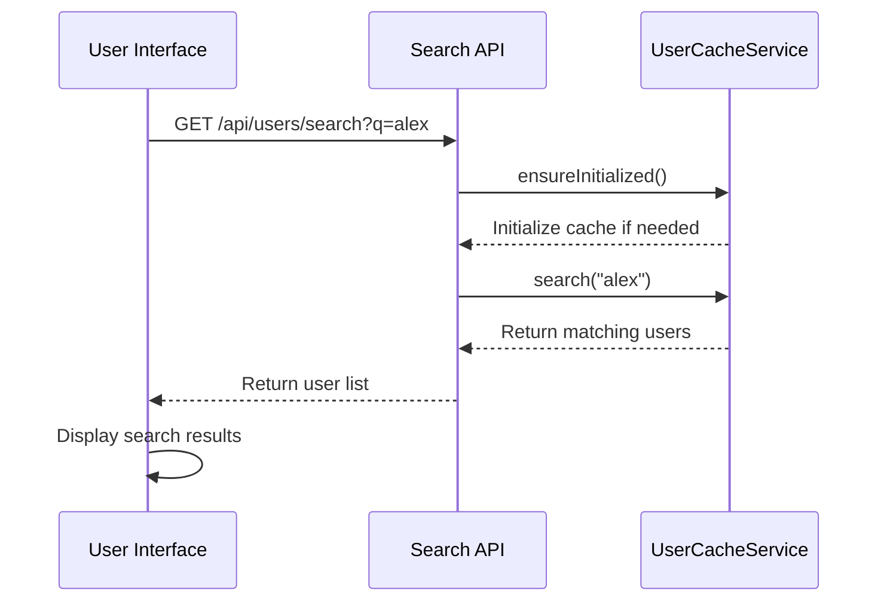
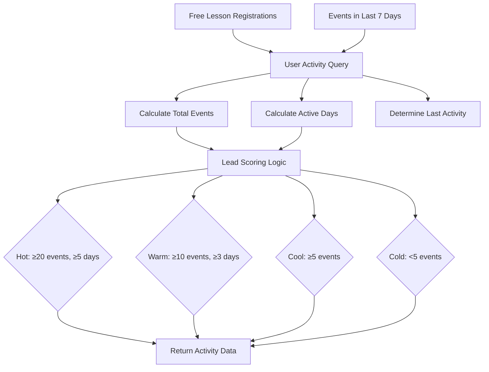
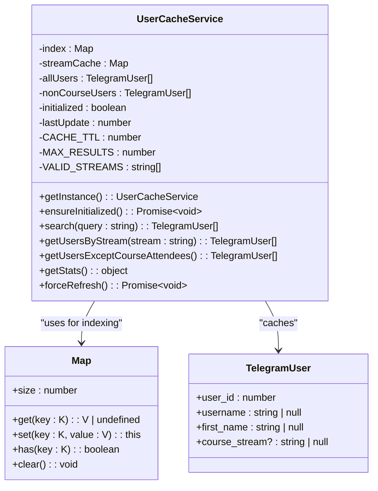
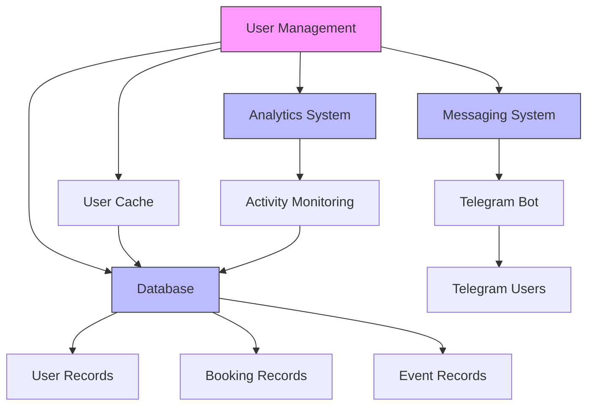

# User Management

<cite>
**Referenced Files in This Document**   
- [UserDetailsDialog.tsx](file://components/UserDetailsDialog.tsx)
- [userCache.ts](file://lib/userCache.ts)
- [search/route.ts](file://app/api/users/search/route.ts)
- [user-activity/route.ts](file://app/api/user-activity/route.ts)
- [send/route.ts](file://app/api/messages/send/route.ts)
- [page.tsx](file://app/users/page.tsx)
</cite>

## Table of Contents
1. [Introduction](#introduction)
2. [User Search Functionality](#user-search-functionality)
3. [User Activity Monitoring](#user-activity-monitoring)
4. [User Details Interface](#user-details-interface)
5. [Practical Use Cases](#practical-use-cases)
6. [Performance and Caching](#performance-and-caching)
7. [System Integrations](#system-integrations)

## Introduction
The user management system in hsl-dashboard provides comprehensive tools for searching, viewing, and managing user records within the educational platform. This system enables support staff and administrators to efficiently locate user accounts, examine detailed user profiles, monitor engagement patterns, and perform necessary administrative actions. The interface combines powerful search capabilities with detailed user information presentation and integrates with other platform systems for holistic user management.

**Section sources**
- [page.tsx](file://app/users/page.tsx#L1-L460)

## User Search Functionality
The user search functionality is implemented through the `/api/users/search` endpoint, providing instant search results as users type in the search field. The system supports searching by username or first name, with results appearing in real-time as the query is entered. The search interface includes filtering options by course stream (3rd, 4th, or 5th) and payment status (confirmed, pending, or canceled), allowing staff to narrow down results based on specific criteria. The search results display user ID, name, username, course stream, payment status, activity metrics, and last activity date in a paginated table format.



**Diagram sources**
- [search/route.ts](file://app/api/users/search/route.ts#L1-L37)
- [userCache.ts](file://lib/userCache.ts#L2-L212)
- [page.tsx](file://app/users/page.tsx#L1-L460)

**Section sources**
- [search/route.ts](file://app/api/users/search/route.ts#L1-L37)
- [page.tsx](file://app/users/page.tsx#L1-L460)

## User Activity Monitoring
The user activity monitoring system tracks user engagement and behavior across the platform, providing insights into user participation patterns. The `/api/user-activity` endpoint aggregates data from free lesson registrations and user events over the past seven days to calculate engagement metrics. The system computes a lead scoring mechanism that categorizes users as "hot," "warm," "cool," or "cold" based on their activity level and frequency of engagement. This allows staff to identify highly engaged users who may be ready for course enrollment or require additional support.



**Diagram sources**
- [user-activity/route.ts](file://app/api/user-activity/route.ts#L1-L51)

**Section sources**
- [user-activity/route.ts](file://app/api/user-activity/route.ts#L1-L51)

## User Details Interface
The UserDetailsDialog component provides a comprehensive view of user profiles with multiple tabs for different aspects of user information. When a user is selected from the search results, a modal dialog displays detailed information including user identification, booking history, event history, free lesson registrations, and editing capabilities. The interface is organized into five tabs: Overview, Bookings, Events, Lessons, and Edit. The Overview tab presents key user information and statistics, while the other tabs provide detailed historical data. The Edit tab allows authorized staff to modify user information and booking statuses.

```mermaid
classDiagram
class UserDetailsDialog {
+userId : number
+open : boolean
+onClose() : void
-user : UserDetailInfo
-bookings : UserBookingInfo[]
-events : UserEventInfo[]
-freeLessons : UserFreeLessonInfo[]
-loading : boolean
-error : string | null
-activeTab : string
+fetchUserDetails() : Promise~void~
+handleBookingUpdate() : void
+formatDate(dateString : string) : string
+formatShortDate(dateString : string) : string
+getStatusBadge(confirmed : number) : JSX.Element
+getStreamName(stream : string | null) : string
+formatUserName(user : UserDetailInfo) : {name : string, username : string}
}
class UserEditForm {
+user : UserDetailInfo
+bookings : UserBookingInfo[]
+onUpdate() : void
}
class UserBookingsTable {
+bookings : UserBookingInfo[]
+onUpdate() : void
}
UserDetailsDialog --> UserEditForm : "contains"
UserDetailsDialog --> UserBookingsTable : "contains"
UserDetailsDialog --> "API /api/users/{id}" : "fetches data"
```

**Diagram sources**
- [UserDetailsDialog.tsx](file://components/UserDetailsDialog.tsx#L67-L460)

**Section sources**
- [UserDetailsDialog.tsx](file://components/UserDetailsDialog.tsx#L67-L460)

## Practical Use Cases
Support staff use the user management system to resolve user issues and analyze engagement patterns in various scenarios. When a user contacts support with an issue, staff can quickly locate the user's account using the search functionality and open the user details dialog to view their complete history. This allows staff to understand the user's journey, identify potential issues with bookings or payments, and provide informed assistance. The system is also used to analyze engagement patterns by filtering users by activity level or course stream, helping identify trends in user behavior and inform outreach strategies. Staff can also update user information, modify booking statuses, or change course stream assignments directly through the interface.

**Section sources**
- [UserDetailsDialog.tsx](file://components/UserDetailsDialog.tsx#L67-L460)
- [page.tsx](file://app/users/page.tsx#L1-L460)

## Performance and Caching
The user management system implements a sophisticated caching strategy in userCache.ts to ensure optimal performance when searching large user databases. The UserCacheService class maintains an in-memory cache of all users with a 5-minute TTL (time-to-live), reducing database load and providing instant search results. The cache is organized with a letter-based index for usernames and first names, enabling efficient prefix matching during searches. The system also maintains separate caches for users by course stream and non-course attendees, allowing for quick filtering operations. The caching mechanism uses lazy initialization, loading data only when needed, and includes safeguards against circular dependencies through dynamic imports.



**Diagram sources**
- [userCache.ts](file://lib/userCache.ts#L2-L212)

**Section sources**
- [userCache.ts](file://lib/userCache.ts#L2-L212)

## System Integrations
The user management system integrates with other platform systems to provide comprehensive user management capabilities. It connects with the messaging system through the `/api/messages/send` endpoint, enabling direct communication with users from the user details interface. This integration allows staff to send targeted messages to individual users or groups based on their course stream or engagement level. The system also integrates with analytics components to provide insights into user behavior trends, leveraging data from the user activity monitoring system. These integrations create a cohesive ecosystem where user data can be viewed, analyzed, and acted upon within a single interface, enhancing the efficiency of support operations and user engagement initiatives.



**Diagram sources**
- [send/route.ts](file://app/api/messages/send/route.ts#L1-L373)
- [user-activity/route.ts](file://app/api/user-activity/route.ts#L1-L51)
- [userCache.ts](file://lib/userCache.ts#L2-L212)

**Section sources**
- [send/route.ts](file://app/api/messages/send/route.ts#L1-L373)
- [user-activity/route.ts](file://app/api/user-activity/route.ts#L1-L51)