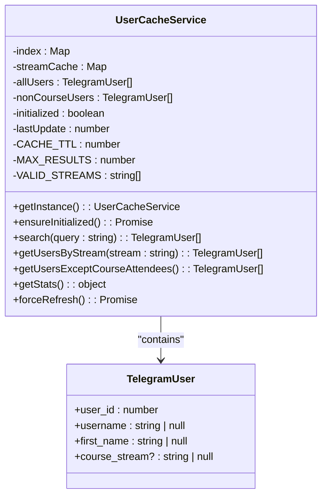
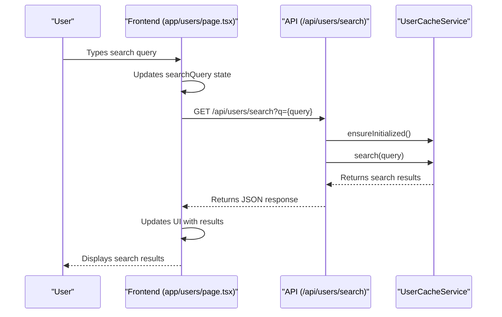

# User Search

<cite>
**Referenced Files in This Document**   
- [app/users/page.tsx](file://app/users/page.tsx)
- [app/api/users/search/route.ts](file://app/api/users/search/route.ts)
- [lib/userCache.ts](file://lib/userCache.ts)
- [app/messages/send/page.tsx](file://app/messages/send/page.tsx)
</cite>

## Table of Contents
1. [Introduction](#introduction)
2. [Search Endpoint Implementation](#search-endpoint-implementation)
3. [Caching Strategy](#caching-strategy)
4. [Frontend Integration](#frontend-integration)
5. [Search Parameters and Response Schema](#search-parameters-and-response-schema)
6. [Error Handling](#error-handling)
7. [Common Issues and Solutions](#common-issues-and-solutions)
8. [Performance Considerations](#performance-considerations)

## Introduction

The user search functionality in hsl-dashboard provides a high-performance search capability for finding users across the system. This feature enables instant search results by leveraging a cached search mechanism through the UserCacheService, which significantly reduces database load and improves response times. The search functionality is designed to query across usernames and first names from both bookings and free lesson registrations with case-insensitive matching, making it easy to locate users regardless of how their information was entered.

The implementation follows a client-server architecture where the frontend search input in app/users/page.tsx integrates seamlessly with the API route at /api/users/search. This document provides a comprehensive analysis of the implementation, detailing the caching strategy, search parameters, response schema, error handling, and performance considerations. The content is designed to be accessible to beginners while including technical depth on query optimization and performance considerations for large datasets.

## Search Endpoint Implementation

The /api/users/search endpoint is implemented as a Next.js API route that handles GET requests to search for users based on a query parameter. The endpoint is located in app/api/users/search/route.ts and serves as the primary interface for user search functionality across the application.

The implementation follows a straightforward pattern: it extracts the search query from the request parameters and returns search results from the UserCacheService. The endpoint also supports a debugging feature through the 'stats' parameter, which returns cache statistics when requested. This allows developers and administrators to monitor the cache's health and performance.

The search functionality is designed to be efficient and responsive. When a search request is received, the endpoint first ensures that the UserCacheService is initialized, which loads user data into memory if necessary. Then, it performs the search using the cached data, returning results almost instantly. This approach eliminates the need for direct database queries during search operations, significantly improving performance.

The endpoint handles edge cases gracefully, returning an empty array when no query is provided or when the query is too short. It also includes comprehensive error handling to catch and log any issues that occur during the search process, ensuring that the application remains stable even if the search functionality encounters problems.

**Section sources**
- [app/api/users/search/route.ts](file://app/api/users/search/route.ts#L1-L36)

## Caching Strategy

The caching strategy in lib/userCache.ts is designed to provide instant search results while minimizing database load. The UserCacheService implements a sophisticated caching mechanism that pre-loads user data from both bookings and free lesson registrations into memory, creating an optimized index for fast lookups.

The cache is implemented as a singleton service with a 5-minute TTL (time-to-live), ensuring that user data remains fresh while preventing stale data from being served for extended periods. When the cache is accessed, it automatically initializes if it hasn't been loaded yet or if it has expired, loading data from the database and building an optimized search index.

The indexing strategy is particularly efficient, creating a Map where keys are the first letters of usernames and first names, and values are arrays of users whose usernames or first names start with that letter. This approach significantly reduces the search space for any given query, as the system only needs to examine users whose usernames or first names start with the same letter as the search query.

The cache also includes additional functionality beyond search, such as storing users by course stream and users who haven't paid for courses. This multi-purpose caching approach reduces the number of database queries needed for various features across the application, further improving overall performance.

**Diagram sources **
- [lib/userCache.ts](file://lib/userCache.ts#L2-L214)

**Section sources**
- [lib/userCache.ts](file://lib/userCache.ts#L2-L214)

## Frontend Integration

The user search functionality is integrated into the frontend through the search input in app/users/page.tsx, which provides a seamless user experience for searching and filtering users. The implementation uses React's useState and useEffect hooks to manage the search state and trigger searches as the user types.

The search integration follows a reactive pattern, where changes to the search query trigger an immediate search request to the /api/users/search endpoint. This provides instant feedback to users as they type, making it easy to find specific users quickly. The search is debounced to prevent excessive API calls, ensuring that the application remains responsive even with frequent typing.

The frontend implementation includes several user experience enhancements, such as a loading indicator that shows when a search is in progress and error handling that displays meaningful messages if the search fails. The search results are displayed in a clean, organized manner, with user information presented clearly and concisely.

Additionally, the search functionality is integrated with other features in the application, such as the ability to filter users by stream or payment status. This allows users to combine search with other filtering criteria to quickly find the exact users they're looking for.

**Diagram sources **
- [app/users/page.tsx](file://app/users/page.tsx#L35-L112)
- [app/api/users/search/route.ts](file://app/api/users/search/route.ts#L1-L36)

**Section sources**
- [app/users/page.tsx](file://app/users/page.tsx#L35-L112)

## Search Parameters and Response Schema

The /api/users/search endpoint accepts a single required parameter, 'q', which represents the search query. The query must be at least one character long to return results. Additionally, the endpoint supports an optional 'stats' parameter that, when set to 'true', returns cache statistics instead of search results.

The search is case-insensitive and matches against both usernames and first names from users in both bookings and free lesson registrations. The search algorithm uses a prefix matching approach, returning users whose usernames or first names start with the search query. This provides a natural and intuitive search experience, as users typically type the beginning of a name or username when searching.

The response schema for successful searches is a JSON array of TelegramUser objects, each containing the user's ID, username, first name, and course stream (if applicable). The results are limited to a maximum of 50 users, as defined by the MAX_RESULTS constant in the UserCacheService.

When the 'stats' parameter is used, the response schema changes to include detailed cache statistics, such as the total number of users cached, the size of the search index, the number of users in each course stream, and the cache's initialization status and last update time. This information is valuable for debugging and monitoring the cache's performance.

The response is always returned with a 200 status code for successful requests, even when no results are found (in which case an empty array is returned). This consistent response format makes it easy for frontend code to handle search results without needing to check for different status codes.

**Section sources**
- [app/api/users/search/route.ts](file://app/api/users/search/route.ts#L1-L36)
- [lib/userCache.ts](file://lib/userCache.ts#L112-L143)

## Error Handling

The user search functionality includes comprehensive error handling to ensure reliability and provide meaningful feedback when issues occur. The error handling is implemented at multiple levels, from the API endpoint to the frontend integration.

In the API endpoint (app/api/users/search/route.ts), all operations are wrapped in a try-catch block that catches any errors that occur during the search process. When an error is caught, it is logged to the console with detailed information, and a 500 status code response is returned with an error message. This prevents unhandled exceptions from crashing the server and provides a consistent error response format.

The UserCacheService includes additional error handling within its data loading methods. Each database query is wrapped in a try-catch block that logs the error and returns an empty array if the query fails. This graceful degradation ensures that the search functionality remains available even if there are temporary issues with the database connection.

On the frontend, the search functionality includes error handling that displays user-friendly messages when searches fail. The error state is managed using React's useState hook, and error messages are displayed prominently to alert users that something went wrong. This immediate feedback helps users understand that their search didn't fail due to their input but rather due to a system issue.

The error handling also includes specific logic for different types of errors, such as network errors when the API request fails or validation errors when the search query is too short. This allows the application to provide more specific guidance to users about how to resolve the issue.

**Section sources**
- [app/api/users/search/route.ts](file://app/api/users/search/route.ts#L1-L36)
- [app/messages/send/page.tsx](file://app/messages/send/page.tsx#L131-L175)

## Common Issues and Solutions

Several common issues can arise with the user search functionality, primarily related to cache initialization, incomplete search results, and performance under heavy load. Understanding these issues and their solutions is crucial for maintaining a reliable and responsive search experience.

One common issue is cache initialization delays, where the first search after a cache expiration takes longer than subsequent searches. This occurs because the cache needs to load data from the database and build the search index. The solution is to implement lazy loading, where the cache is initialized only when needed, and to optimize the database queries used to load user data.

Another issue is incomplete search results, which can occur if the cache fails to load all users or if there are timing issues between data updates and cache refreshes. This can be addressed by ensuring that the cache loading process is robust and includes proper error handling, as well as by implementing a mechanism to force refresh the cache when necessary.

Performance issues can arise when the user base grows significantly, as the cache initialization process may take longer with more data. This can be mitigated by optimizing the database queries, implementing pagination for the initial data load, and considering sharding the cache by user attributes such as first letter of the username.

A specific issue that may occur is related to the search index not being updated when new users are added or existing users are modified. Since the cache has a 5-minute TTL, changes to user data may not be immediately reflected in search results. The solution is to implement a cache invalidation mechanism that updates the cache when user data changes, or to provide an admin interface to manually refresh the cache.

**Section sources**
- [lib/userCache.ts](file://lib/userCache.ts#L2-L214)
- [app/api/users/search/route.ts](file://app/api/users/search/route.ts#L1-L36)

## Performance Considerations

The user search functionality is designed with performance as a primary consideration, employing several strategies to ensure fast response times and minimal impact on system resources. The caching mechanism is the cornerstone of this performance optimization, eliminating the need for direct database queries during search operations.

The cache's 5-minute TTL strikes a balance between data freshness and performance, preventing excessive database load while ensuring that user data remains reasonably up-to-date. The indexing strategy further enhances performance by reducing the search space for any given query, allowing the system to quickly narrow down potential matches based on the first letter of the search query.

For large datasets, the implementation includes several optimizations to maintain performance. The search results are limited to 50 users, preventing excessive memory usage and network transfer times. The database queries used to populate the cache are optimized to retrieve only the necessary fields and to use efficient JOIN operations where applicable.

The lazy loading approach ensures that the cache is only initialized when needed, reducing memory usage when the search functionality is not actively being used. This is particularly important in a serverless environment where resources are allocated dynamically based on demand.

Additional performance considerations include the use of efficient data structures, such as Maps for the search index, which provide O(1) lookup times. The implementation also minimizes the amount of data transferred between the server and client by only including essential user information in the search results.

For future scalability, the system could be enhanced with additional performance optimizations, such as implementing a more sophisticated caching strategy that updates the cache incrementally rather than reloading all data at once, or using a distributed cache for high-availability deployments.

**Section sources**
- [lib/userCache.ts](file://lib/userCache.ts#L2-L214)
- [app/api/users/search/route.ts](file://app/api/users/search/route.ts#L1-L36)